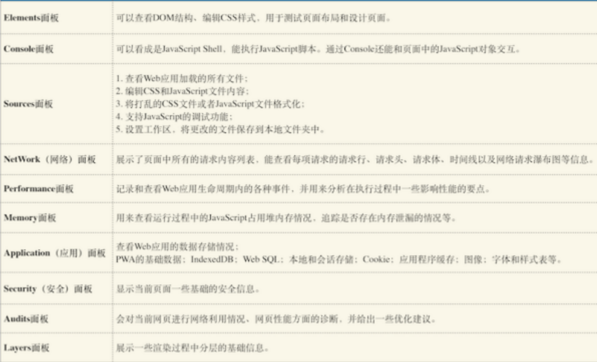
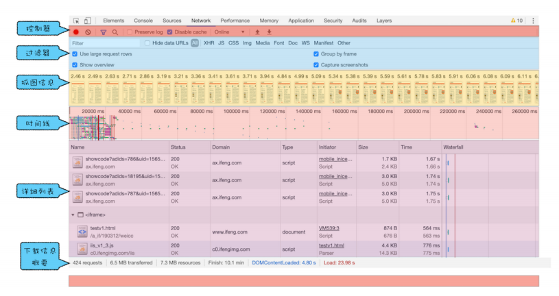
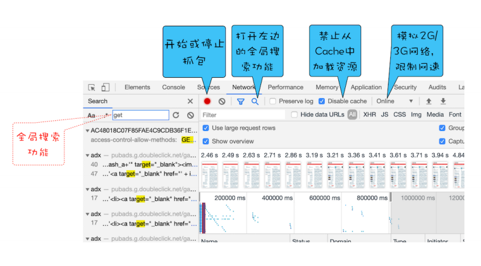
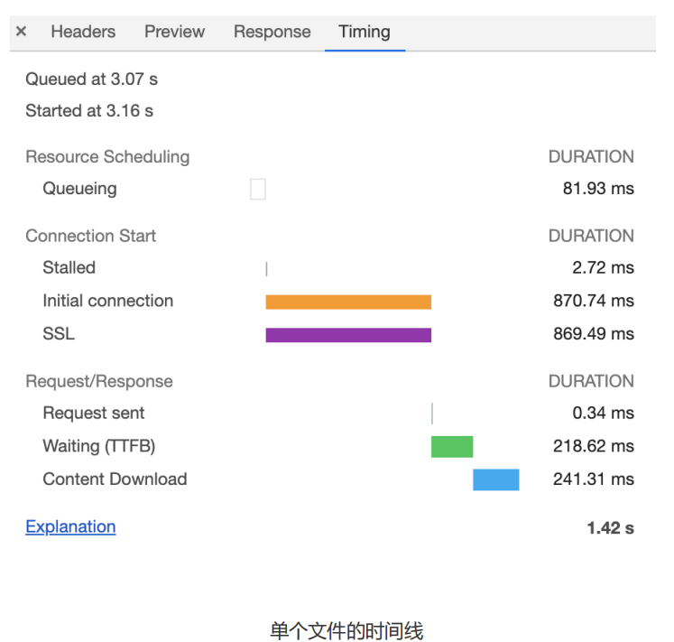

## 1、Chrome 开发者工具

### 1.1 网络面板

**控制器**

**过滤器**：筛选文件类型

**抓图信息**：分析用户等待页面加载时间内所看到的内容，分析用户实际的体验情况

**时间线**：展示 HTTP、HTTPS、WebSocket 加载的状态和时间的一个关系，用于直观感受页面的加载过程

**详细列表**：记录了每个资源从发起请求到完成请求这中间所有过程的状态，以及最终请求完成的数据信息

- Queuing：排队时间

  - 首先，页面中的资源是有优先级的，比如 CSS、HTML、JavaScript 等都是页面中的核心文件，所以优先级最高；而图片、视频、音频这类资源就不是核心资源，优先级就比较低。通常当后者遇到前者时，就需要“让路”，进入待排队状态。

  - 其次，我们前面也提到过，浏览器会为每个域名最多维护 6 个 TCP 连接，如果发起一个HTTP 请求时，这 6 个 TCP 连接都处于忙碌状态，那么这个请求就会处于排队状态。**优化：域名分片、HTTP2。**

  - 最后，网络进程在为数据分配磁盘空间时，新的 HTTP 请求也需要短暂地等待磁盘分配结束。

- Stalled：停滞

- Proxy Negotiation：代理协商

- Initial connection/SSL：建立连接

- Request sent：发送请求

- Waiting(TTFB)：第一字节时间，服务器响应

  - 服务器生成页面数据的时间过久。对于动态网页来说，服务器收到用户打开一个页面的请求时，首先要从数据库中读取该页面需要的数据，然后把这些数据传入到模板中，模板渲染后，再返回给用户。服务器在处理这个数据的过程中，可能某个环节会出问题。优化：增加各种缓存的技术。

  - 网络的原因。比如使用了低带宽的服务器，或者本来用的是电信的服务器，可联通的网络用户要来访问你的服务器，这样也会拖慢网速。优化：CDN 来缓存一些静态文件。

  - 发送请求头时带上了多余的用户信息。比如一些不必要的 Cookie 信息，服务器接收到这些 Cookie 信息之后可能需要对每一项都做处理，这样就加大了服务器的处理时长。优化：减少一些不必要的 Cookie 数据信息。

- Content Download：接收数据
  - 字节数太多。优化：减少文件大小，比如压缩、去掉源码中不必要的注释等。

**下载信息概要**

- DOMContentLoaded，这个事件发生后，说明页面已经构建好 DOM 了，这意味着构建 DOM 所需要的 HTML 文件、JavaScript 文件、CSS 文件都已经下载完成了

- Load，说明浏览器已经加载了所有的资源（图像、样式表等）

