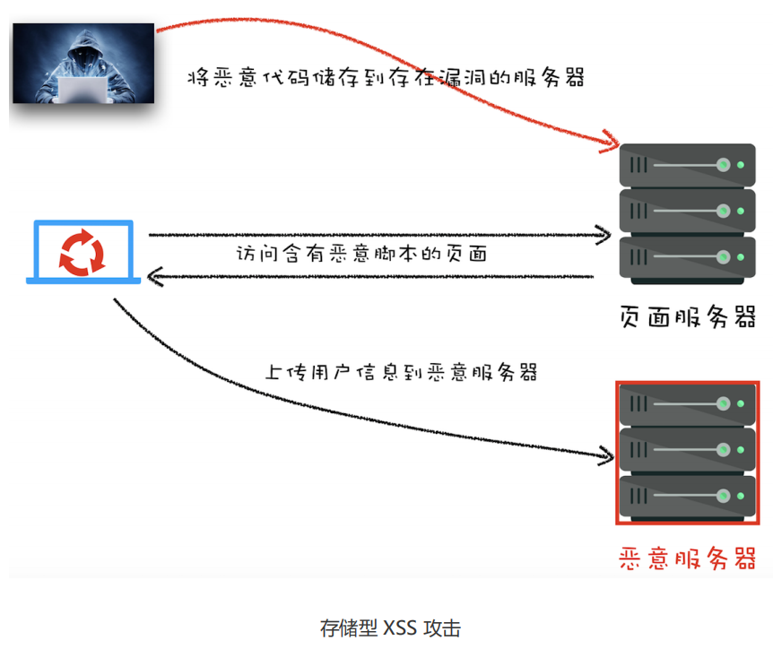
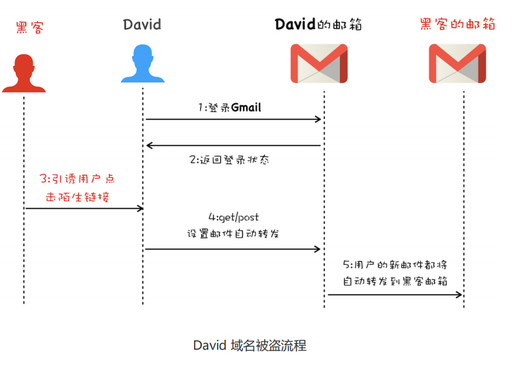

## 1、Web 页面安全

### 1.1 同源策略

如果两个 URL 的**协议、域名和端口**都相同，我们就称这两个 URL 同源。同源策略主要表现：

- DOM：限制了来自不同源的 JavaScript 脚本对当前 DOM 对象读和写的操作

- Web 数据：限制了不同源的站点读取当前站点的 Cookie、`IndexDB`、`LocalStorage` 等数据

- 网络：限制了通过 `XMLHttpRequest` 等方式将站点的数据发送给不同源的站点

目前的页面安全策略原型。总结起来，它具备以下三个特点：

1. 页面中可以引用第三方资源，不过这也暴露了很多诸如 `XSS `的安全问题，因此又在这种开放的基础之上引入了 `CSP` 来限制其自由程度。

2. 使用 `XMLHttpRequest `和 `Fetch` 都是无法直接进行跨域请求的，因此浏览器又在这种严格策略的基础之上引入了`跨域资源共享策略`，让其可以安全地进行跨域操作。

3. 两个不同源的 DOM 之间进行通信，于是浏览器中又引入了跨文档消息机制，可以通过 `window.postMessage` 的 JavaScript 接口来和不同源的 DOM 进行通信。

### 1.2 XSS 攻击

常见的三种 XSS 攻击模式

- 存储型 XSS 攻击

  

- 反射型 XSS 攻击

  Web 服务器不会存储反射型 XSS 攻击的恶意脚本，这是和存储型XSS 攻击不同的地方。

- 基于 DOM 的 XSS攻击

  基于 DOM 的 XSS 攻击是不牵涉到页面 Web 服务器的。具体来讲，黑客通过各种手段将恶意脚本注入用户的页面中，比如通过网络劫持在页面传输过程中修改 HTML 页面的内容。

  属于前端的安全漏洞

有三种防范策略

- 第一种是通过服务器对输入的内容进行过滤或者转码
- 第二种是充分利用好 CSP
  - 限制加载其他域下的资源文件，这样即使黑客插入了一个 JavaScript 文件，这个JavaScript 文件也是无法被加载的；
  - 禁止向第三方域提交数据，这样用户数据也不会外泄；
  - 禁止执行内联脚本和未授权的脚本；
  - 还提供了上报机制，这样可以帮助我们尽快发现有哪些 XSS 攻击，以便尽快修复问题。
- 第三种是使用 HttpOnly 来保护重要的 Cookie 信息。

### 1.3 CSRF

CSRF 攻击就是黑客利用了用户的登录状态，并通过第三方的站点来做一些坏事

和 XSS 不同的是，CSRF 攻击不需要将恶意代码注入用户的页面，仅仅是利用服务器的漏洞和用户的登录状态来实施攻击

CSRF 攻击的三个必要条件：

- 第一个，目标站点一定要有 CSRF 漏洞；
- 第二个，用户要登录过目标站点，并且在浏览器上保持有该站点的登录状态；
- 第三个，需要用户打开一个第三方站点，可以是黑客的站点，也可以是一些论坛。要让服务器避免遭受到 CSRF 攻击，通常有以下几种途径。

防范：

1. 充分利用好 Cookie 的 SameSite 属性
2. 验证请求的来源站点。Referer 是 HTTP 请求头中的一个字段，记录了该 HTTP 请求的来源地址。
3. CSRF Token