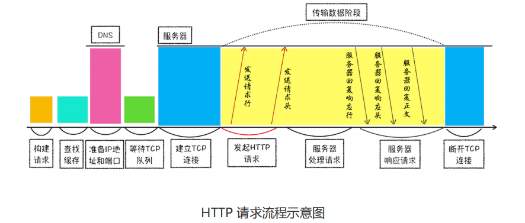
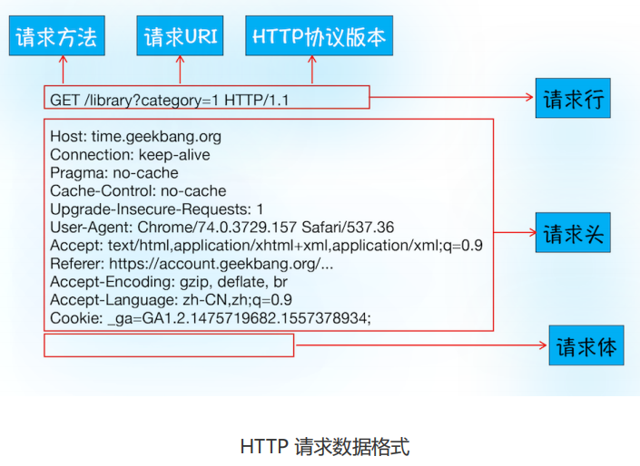
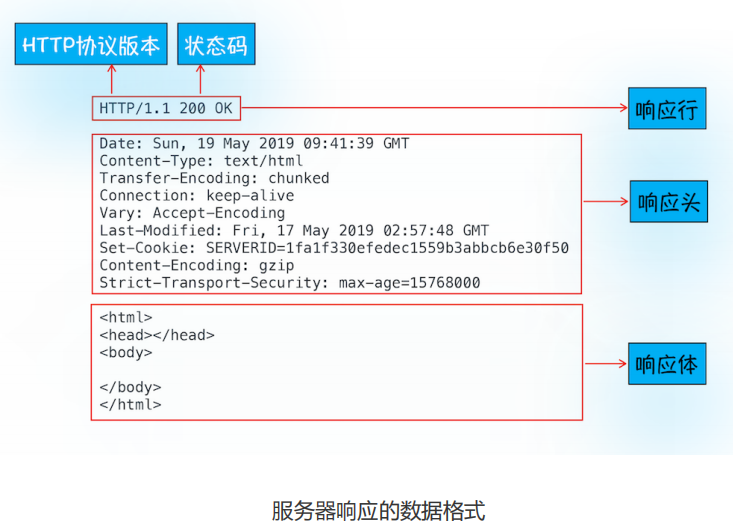
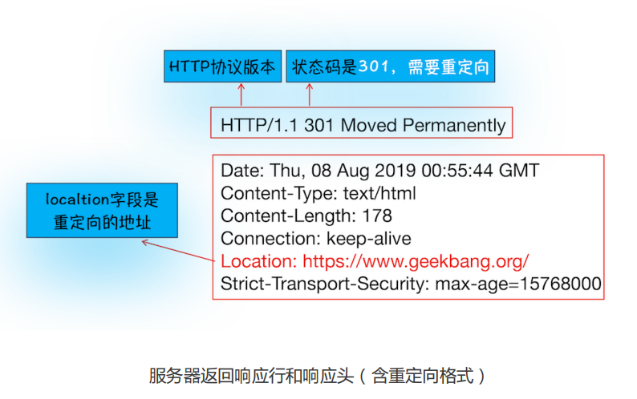
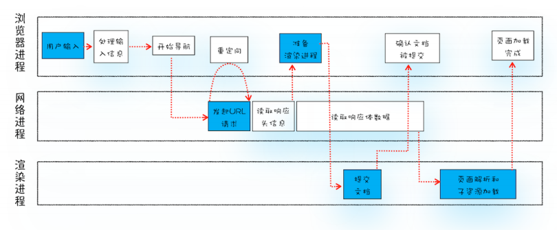
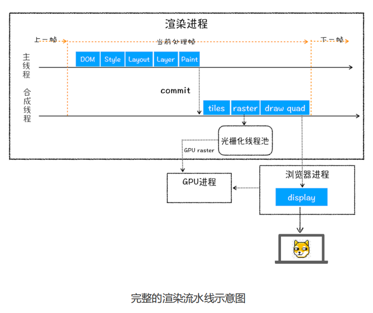
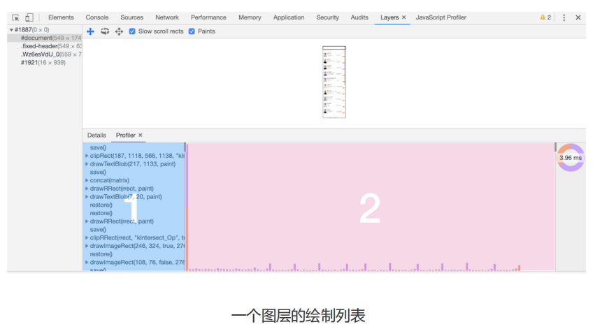
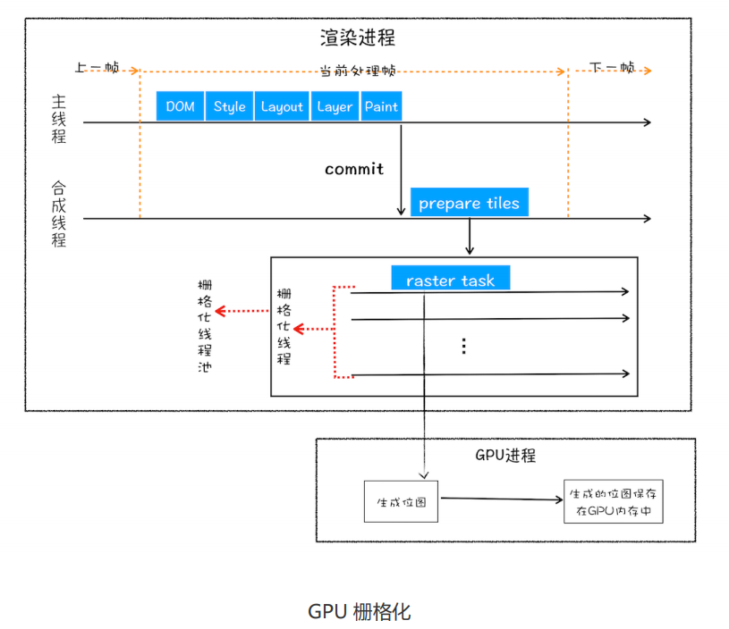
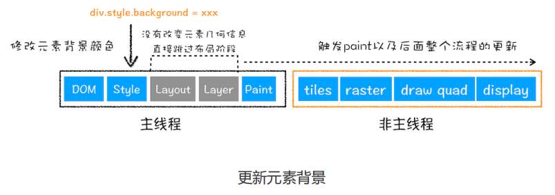

## 1、宏观视角下的浏览器

### 1.1 Chrome 进程架构

- **浏览器进程**：主要负责界面显示、用户交互、子进程管理，同时提供存储等功能。

- **渲染进程**：核心任务是将 `HTML`、`CSS `和 `JavaScript` 转换为用户可以与之交互的网页，排版引擎 `Blink` 和 `JavaScript 引擎 V8` 都是运行在该进程中，默认情况下，**Chrome 会为每个 Tab 标签创建一个渲染进程**。出于安全考虑，渲染进程都是运行在沙箱模式下。

- **`GPU` 进程**：Chrome 刚开始发布的时候是没有 `GPU` 进程的。而 `GPU` 的使用初衷是为了实现 `3D CSS` 的效果，只是随后网页、Chrome 的 `UI` 界面都选择采用 `GPU` 来绘制，这使得 `GPU` 成为浏览器普遍的需求。

- **网络进程**：主要负责页面的网络资源加载。

- **插件进程**：主要是负责插件的运行，因插件易崩溃，所以需要通过插件进程来隔离，以保证插件进程崩溃不会对浏览器和页面造成影响。

### 1.2 TCP协议

通过 `IP` 地址信息把数据包发送给指定的电脑。

 `UDP` 通过端口号把数据包分发给正确的程序，`UDP` 不能保证数据可靠性，但是传输速度却非常快。

`TCP`（`Transmission Control Protocol`，传输控制协议）是一种面向连接的、可靠的、基于字节流的传输层通信协议。相对于 `UDP`，`TCP` 有下面两个特点:

- 对于数据包丢失的情况，TCP 提供重传机制；

- TCP 引入了数据包排序机制，用来保证把乱序的数据包组合成一个完整的文件。

- **首先，建立连接阶段**。这个阶段是通过“三次握手”来建立客户端和服务器之间的连接。`TCP` 提供面向连接的通信传输。**面向连接**是指在数据通信开始之前先做好两端之间的准备工作。所谓**三次握手**，是指在建立一个 TCP 连接时，客户端和服务器总共要发送三个数据包以确认连接的建立。

- **其次，传输数据阶段**。在该阶段，**接收端需要对每个数据包进行确认操作**，也就是接收端在接收到数据包之后，需要发送确认数据包给发送端。所以当发送端发送了一个数据包之后，在规定时间内没有接收到接收端反馈的确认消息，则判断为数据包丢失，并触发发送端的重发机制。同样，一个大的文件在传输过程中会被拆分成很多小的数据包，这些数据包到达接收端后，接收端会按照 TCP 头中的序号为其**排序**，从而保证组成完整的数据。

- **最后，断开连接阶段**。数据传输完毕之后，就要终止连接了，涉及到最后一个阶段“四次挥手”来保证双方都能断开连接。

### 1.3 HTTP请求流程

**浏览器端发起 HTTP 请求流程**

**1. 构建请求**

   

**2. 查找缓存**

   浏览器是通过响应头中的 `Cache-Control` 字段来设置是否缓存该资源。

   

**3. 准备 `IP` 地址和端口**

   HTTP 的内容是通过 TCP 的传输数据阶段来实现。

   浏览器会请求 `DNS` 返回域名对应的 `IP`。如果某个域名已经解析过了，那么浏览器会缓存解析的结果，以供下次查询时直接使用。

**4. 等待 TCP 队列**

   同一个域名同时最多只能建立 6 个 TCP 连接。

**5. 建立 TCP 连接**

**6. 发送 HTTP 请求**

**服务器端处理 HTTP 请求流程**

**1. 返回请求**

   

**2. 断开连接**

   通常情况下，一旦服务器向客户端返回了请求数据，它就要关闭 TCP 连接。

   请求头设置`Connection:Keep-Alive` ，**保持 TCP 连接可以省去下次请求时需要建立连接的时间，提升资源加载速度**。

**重定向**

**登录状态保持**

### 1.4 URL 到页面展示流程

**主要流程**

- 首先，用户从浏览器进程里**输入请求信息**；

- 然后，网络进程**发起 URL 请求**；

- 服务器响应 URL 请求之后，浏览器进程就又要开始**准备渲染进程**了；

- 渲染进程准备好之后，需要先向渲染进程提交页面数据，我们称之为**提交文档**阶段；
- 渲染进程接收完文档信息之后，便开始**解析页面和加载子资源**，完成页面的渲染。

**详细步骤**

**1. 用户输入**

地址栏会判断输入的关键字是搜索内容，还是请求的 URL

- 搜索内容，地址栏会使用浏览器默认的搜索引擎，来合成新的带搜索关键字的URL。
- 内容符合 URL 规则，地址栏会根据规则，把这段内容加上协议，合成为完整的 URL。

当浏览器刚开始加载一个地址之后，标签页上的图标便进入了加载状态。但此时图中页面显示的依然是之前打开的页面内容。因为

需要等待提交文档阶段，页面内容才会被替换。

**2. URL 请求过程**
浏览器进程会通过**进程间通信（`IPC`）**把 URL请求发送至网络进程，网络进程接收到 URL 请求后，发起 URL 请求流程。

- 首先，网络进程会查找**本地缓存**是否缓存了该资源。如果有缓存资源，那么直接返回资源给浏览器进程；

- 如果在缓存中没有查找到资源，那么直接进入网络请求流程。

  - 请求前的第一步是要进行 `DNS` 解析，以获取请求域名的服务器 `IP` 地址。（如果请求协议是 `HTTPS`，那么
    还需要建立 `TLS` 连接）

  - 接下来就是利用 `IP` 地址和服务器建立 `TCP` 连接。

  - 连接建立之后，浏览器端会构建请求行、请求头等信息，并把和该域名相关的 Cookie 等数据附加到请求头中，然后向服务器发送构建的请求信息。

  - 服务器接收到请求信息后，会根据请求信息生成响应数据，并发给网络进程。

  - 等网络进程接收了响应行和响应头之后，就开始解析响应头的内容了。HTTP 头中一`Content-Type` 告诉浏览器服务器返回的响应体数据类型

    - `Content-Type:application/octet-stream`判断为下载类型，该请求会被提交给浏览器的下载管理器，同时该 URL 请求的导航流程就此结束。

    - `Content-type:text/html`判断为HTML，浏览器会继续进行导航流程，准备渲染进程了。

**3. 准备渲染进程**

相同站点：拥有相同的协议和根域名。

Chrome 会为**不同站点**的每个页面分配一个渲染进程（process-per-site-instance）。

**4.** **提交文档**

“文档”是指 URL 请求的响应体数据。

- “提交文档”的消息是由浏览器进程发出的，渲染进程接收到“提交文档”的消息后，会和网络进程建立传输数据的“**管道**”；

- 等文档数据传输完成之后，渲染进程会返回“**确认提交**”的消息给浏览器进程；

- 浏览器进程在收到“确认提交”的消息后，会**更新浏览器界面状态**，包括了安全状态、地址栏的 URL、前进后退的历史状态，并更新 Web 页面。

**5.** **渲染阶段**

文档被提交后，渲染进程便开始页面解析和子资源加载了。

页面生成完成后，渲染进程会发送一个消息给浏览器进程，浏览器接收到消息后，会停止标签图标上的加载动画。

### 1.5 渲染流程

1. 渲染进程将 **HTML 内容**转换为能够读懂的**DOM 树**结构。

2. 渲染引擎将 **`CSS` 样式表**转化为浏览器可以理解的**`styleSheets`**，计算出 DOM 节点的样式。

3. 创建**布局树**，并计算元素的布局信息。

4. 对布局树进行分层，并生成**分层树**。

5. 为每个图层生成**绘制列表**，并将其提交到合成线程。

6. **合成线程**将图层分成**图块**，并在**光栅化线程池**中**将图块转换成位图**。

7. 合成线程发送绘制图块命令**`DrawQuad`**给浏览器进程。

8. **浏览器进程**根据 `DrawQuad` 消息**生成页面**，并**显示**到显示器上。

**A 构建 DOM 树**

浏览器无法直接理解和使用 HTML，所以需要将HTML 转换为浏览器能够理解的结构——DOM 树。

**document 就是 DOM 结构**，DOM 和 HTML 内容几乎是一样的，但是和 HTML 不同的是，**DOM 是保存在内存中树状结构**。

可以通过 JavaScript 来查询或修改其内容。(`document.getElementsByTagName("p")[0].innerText = "black"`)

输入：HTML

处理过程：由HTML 解析器解析

输出：DOM 树

**B 样式计算**

计算出 DOM 节点中每个元素的具体样式

1. 把 `CSS` 转换为浏览器能够理解的结构

   当渲染引擎接收到 `CSS` 文本时，会执行一个转换操作，将 `CSS` 文本转换为浏览器可以理解的结构——`styleSheets`，该结构同时具备了查询和修改功能。

   

   

2. 转换样式表中的属性值，使其标准化

   要将所有值转换为渲染引擎容易理解的、标准化的计算值

   

3. 计算出 DOM 树中每个节点的具体样式

   根据继承规则和层叠规则计算出每个`dom`节点样式

   

   

输入：`CSS`和DOM 树

处理过程：遵守 `CSS` 的继承和层叠两个规则

输出：每个 DOM 节点的样式，保存在 `ComputedStyle` 的结构内

**C 布局阶段**

计算出 DOM 树中可见元素的几何位置

1. 创建布局树

   遍历 DOM 树中的所有可见节点，并把这些节点加到布局中，不可见的节点会被布局树忽略掉，额外地构建一棵只包含可见元素布局树

2. 布局计算

   计算布局树节点的坐标位置

输入：布局树

处理过程：删除不必要节点、计算每个元素的几何坐标位置

输出：布局树

**D 分层**

渲染引擎还需要为**特定的节点**生成专用的图层，并生成一棵对应的图层树（`LayerTree`）

并不是布局树的每个节点都包含一个图层，如果一个节点没有对应的层，那么这个节点就从属于父节点的图层

特定的节点

- 拥有层叠上下文属性的元素(定位属性的元素、定义透明属性的元素、使用 `CSS` 滤镜的元素等)会被提升为单独的一层

  

- 需要剪裁（overflow）的地方也会被创建为图层

输入：布局树

处理过程：定位属性的元素、定义透明属性的元素、使用 `CSS` 滤镜的元素、overflow等元素有图层

输出：`LayerTree`

**E 绘制**

把一个图层的绘制拆分成很多小的**绘制指令**，然后再把这些指令按照顺序组成一个待绘制列表

Chrome 的“开发者工具”，选择“Layers”标签，可以可视化页面的分层情况和绘制列表

**F 分块和栅格化（raster）操作**

绘制操作是由渲染引擎中的**合成线程**来完成。当图层的绘制列表准备好之后，主线程会把该绘制列表**提交（commit）**给合成线程。

1. **合成线程会将图层划分为图块（tile）**，这些图块的大小通常是 `256x256`或者 `512x512`

   **视口**（`viewport`）：屏幕可见区域

2. **合成线程会按照视口附近的图块通过栅格化优先生成位图**。

   栅格化，是指将图块转换为位图。图块是栅格化执行的最小单位。

   渲染进程维护了一个栅格化的线程池，所有的图块栅格化都是在线程池内执行。

**F 合成和显示**

- 一旦所有图块都被光栅化，**合成线程**就会生成一个绘制图块的命令—— `DrawQuad` ，然后将该命令提交给**浏览器进程**。

- 浏览器进程里面有一个叫 viz 的组件，用来接收合成线程发过来的 `DrawQuad` 命令，然后根据  `DrawQuad`  命令，将其页面内容绘制到内存中，最后再将内存显示在屏幕上。

**相关概念**

1 更新了元素的几何属性（重排）

通过 JavaScript 或者 `CSS` 修改元素的几何位置属性，例如改变元素的宽度、高度等，浏览器会触发重新布局，解析之后的一系列子阶段，这个过程就叫**重排**。

重排需要更新完整的渲染流水线，开销最大。

2 更新元素的绘制属性（重绘）

修改了元素的背景颜色，那么布局阶段将不会被执行，因为并没有引起几何位置的变换，所以就直接进入了绘制阶段，然后执行之后的一系列子阶段，这个过程就叫**重绘**。

重绘省去了布局和分层阶段，执行效率会比重排操作要高一些。

3 直接合成阶段

使用了 `CSS`  的 transform 来实现动画效果，这可以避开重排和重绘阶段，直接在非主线程上执行合成动画操作。这样的效率是最高的，因为是在非主线程上合成，并没有占用主线程的资源，另外也避开了布局和绘制两个子阶段，所以**相对于重绘和重排，合成能大大提升绘制效率**。

