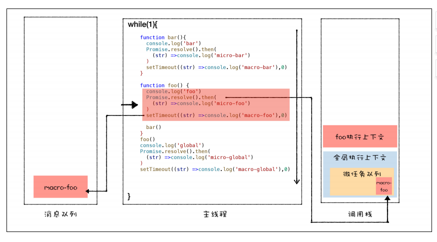

## 1、消息队列和事件循环

- 如果有一些确定好的任务，可以使用一个单线程来按照顺序处理这些任务，这是第一版线程模型。
- 要在线程执行过程中接收并处理新的任务，就需要引入循环语句和事件系统，这是第二版线程模型。
- 如果要接收其他线程发送过来的任务，就需要引入消息队列，这是第三版线程模型。
- 如果其他进程想要发送任务给页面主线程，那么先通过 IPC 把任务发送给渲染进程的 IO 线程，IO 线程再把任务发送给页面主线程。
- 消息队列机制并不是太灵活，为了适应效率和实时性，引入了微任务。


## 2、`WebAPI`——`setTimeout`

### 2.1 浏览器怎么实现 setTimeout

要执行一段异步任务，需要先将任务添加到消息队列中

**在 Chrome 中除了正常使用的消息队列（延迟队列）之外，还有另外一个消息队列，这个队列中维护了需要延迟执行的任务列表**，包括了定时器和 Chromium 内部一些需要延迟执行的任务

当通过 JavaScript 调用 setTimeout 设置回调函数的时候，渲染进程将会创建一个回调任务，包含了回调函数 showName、当前发起时间、延迟执行时间。创建好回调任务之后，再将该任务添加到延迟执行队列中。

处理完消息队列中的一个任务之后，就开始执行 `ProcessDelayTask` 函数。`ProcessDelayTask` 函数会根据发起时间和延迟时间计算出到期的任务，然后依次执行这些到期的任务。等到期的任务执行完成之后，再继续下一个循环过程。

```js
void ProcessTimerTask(){
  // 从 delayed_incoming_queue 中取出已经到期的定时器任务
  // 依次执行这些任务
}

TaskQueue task_queue；
void ProcessTask();
bool keep_running = true;
void MainTherad(){
  for(;;){
    // 执行消息队列中的任务
    Task task = task_queue.takeTask();
    ProcessTask(task);

    // 执行延迟队列中的任务
    ProcessDelayTask()

    if(!keep_running) // 如果设置了退出标志，那么直接退出线程循环
        break; 
  }
}
```

### 2.2 使用 `setTimeout` 的一些注意事项

1. 如果当前任务执行时间过久，会影延迟到期定时器任务的执行
2. 如果 `setTimeout` 存在嵌套调用，那么系统会设置最短时间间隔为 4 毫秒
3. 未激活的页面，`setTimeout` 执行最小间隔是 1000 毫秒
4. 延时执行时间有最大值2147483647 毫秒（大约 24.8 天），超出就会导致定时器会被立即执行
5. 使用 `setTimeout` 设置的回调函数中的 this 不符合直觉

## 3、`WebAPI`——`XMLHttpRequest`

### 3.1 同步回调 VS 系统调用栈

将一个函数作为参数传递给另外一个函数，那作为参数的这个函数就是回调函数。

```js
// 同步回调
let callback = function(){
    console.log('i am do homework')
}
function doWork(cb) {
    console.log('start do work')
    cb()
    console.log('end do work')
}
doWork(callback)

// 异步回调
let callback = function(){
    console.log('i am do homework')
}
function doWork(cb) {
    console.log('start do work')
    setTimeout(cb,1000)   
    console.log('end do work')
}
doWork(callback)
```

每个任务在执行过程中都有自己的调用栈（系统调用栈）

同步回调就是在当前主函数的上下文中执行回调函数

异步回调是指回调函数在主函数之外执行，一般有两种方式：

- 第一种是把异步回调函数封装成一个宏任务，添加到消息队列尾部，当循环系统执行到该任务的时候执行回调函数；
- 第二种是把异步函数添加到微任务队列中，这样就可以在当前任务的末尾处执行微任务了。

### 3.2 `XMLHttpRequest` 运作机制


```js
function GetWebData(URL){
    /**
     * 1: 新建 XMLHttpRequest 请求对象
     */
    let xhr = new XMLHttpRequest()

    /**
     * 2: 注册相关事件回调处理函数 
     */
    xhr.onreadystatechange = function () {
        switch(xhr.readyState){
          case 0: // 请求未初始化
            console.log(" 请求未初始化 ")
            break;
          case 1://OPENED
            console.log("OPENED")
            break;
          case 2://HEADERS_RECEIVED
            console.log("HEADERS_RECEIVED")
            break;
          case 3://LOADING  
            console.log("LOADING")
            break;
          case 4://DONE
            if(this.status == 200||this.status == 304){
                console.log(this.responseText);
                }
            console.log("DONE")
            break;
        }
    }

    xhr.ontimeout = function(e) { console.log('ontimeout') }
    xhr.onerror = function(e) { console.log('onerror') }

    /**
     * 3: 打开请求
     */
    xhr.open('Get', URL, true);// 创建一个 Get 请求, 采用异步


    /**
     * 4: 配置参数
     */
    xhr.timeout = 3000 // 设置 xhr 请求的超时时间
    xhr.responseType = "text" // 设置响应返回的数据格式
    xhr.setRequestHeader("X_TEST","time.geekbang")

    /**
     * 5: 发送请求
     */
    xhr.send();
}
```

第一步：创建 `XMLHttpRequest` 对象。

第二步：为 `xhr` 对象注册回调函数。

第三步：配置基础的请求信息。

第四步：发起请求。

一切准备就绪之后，就可以调用`xhr.send`来发起网络请求了。渲染进程会将请求发送给网络进程，然后网络进程负责资源的下载，等网络进程接收到数据之后，就会利用 `IPC` 来通知渲染进程；渲染进程接收到消息之后，会将` xhr` 的回调函数封装成任务并添加到消息队列中，等主线程循环系统执行到该任务的时候，就会根据相关的状态来调用对应的回调函数。

-  如果网络请求出错了，就会执行 `xhr.onerror`； 
-  如果超时了，就会执行` xhr.ontimeou`t； 
-  如果是正常的数据接收，就会执行 `onreadystatechang` 来反馈相应的状态。 

## 4、宏任务和微任务

### 4.1 宏任务

时间粒度比较大，执行的时间间隔是不能精确控制，不太符合高实时性的需求

**每个宏任务在执行时，V8都会重新创建栈**

- 渲染事件（如解析 DOM、计算布局、绘制）；
- 用户交互事件（如鼠标点击、滚动页面、放大缩小等）；
- JavaScript 脚本执行事件；
- 网络请求完成、文件读写完成事件。

### 4.2 微任务

JavaScript 中之所以要引入微任务（Promise、Generator、await/async），主要是由于主线程执行消息队列中宏任务的时间颗粒度太粗了，无法胜任一些对精度和实时性要求较高的场景，那么**微任务可以在实时性和效率之间做一个有效的权衡**。

- 微任务和宏任务是绑定的，V8 会为每个宏任务维护一个微任务队列。
- 微任务的执行时长会影响到当前宏任务的时长。

微任务产生的时机

-  第一种方式是使用 `MutationObserver` 监控某个 DOM 节点，然后再通过 JavaScript 来修改这个节点，或者为这个节点添加、删除部分子节点，当 DOM 节点发生变化时，就会产生 DOM 变化记录的微任务。 
-  第二种方式是使用 Promise，当调用 `Promise.resolve()` 或者 `Promise.reject()` 的时候，也会产生微任务。 

执行微任务队列的时机

-  在当前宏任务中的 JavaScript 快执行完成时，也就在 JavaScript 引擎准备退出全局执行上下文并清空调用栈的时候，JavaScript 引擎会检查全局执行上下文中的微任务队列，然后按照顺序执行队列中的微任务。 
-  如果在执行微任务的过程中，产生了新的微任务，同样会将该微任务添加到微任务队列中，**V8** **引擎一直循环执行微任务队列中的任务，直到队列为空才算执行结束**。 





### 4.3 监听 DOM 变化方法演变

-  Mutation Event，DOM 有变动时就会立刻触发相应的事件，这种方式属于同步回调 
- `MutationObserver`，将响应函数改成异步调用，可以不用在每次 DOM 变化都触发异步调用，而是等多次 DOM 变化后，**一次触发异步调用**，并且还会使用一个数据结构来记录这期间所有的 DOM 变化 
- 通过**异步**操作解决了同步操作的**性能问题**；
- 通过**微任务**解决了**实时性的问题**。

## 5、微任务——Promise


Promise 通过回调函数延迟绑定和回调函数返回值穿透的技术，解决了循环嵌套。


Promise 对象的错误具有“冒泡”性质，会一直向后传递，直到被 `onReject` 函数处理或 catch 语句捕获为止。具备了这样“冒泡”的特性后，就不需要在每个 Promise 对象中单独捕获异常了。

### 5.1 执行顺序

```js
function executor(resolve, reject) {
    resolve(100)
}
let demo = new Promise(executor)

function onResolve(value){
    console.log(value)
}
demo.then(onResolve)
```

Promise 的构造函数会调用 Promise 的参数 executor 函数。然后在 executor 中执行了 resolve，resolve 函数也是在 `V8` 内部实现的，执行 resolve 函数，会触发 `demo.then` 设置的回调函数`onResolve`

### 5.2 实现 Promise

```js
function Bromise(executor) {
    var onResolve_ = null
    var onReject_ = null
    // 模拟实现 resolve 和 then，暂不支持 rejcet
    this.then = function (onResolve, onReject) {
        onResolve_ = onResolve
    };
    function resolve(value) { // promise内部定义resolve
          setTimeout(()=>{
            onResolve_(value) // 执行then
           },0)
    }
    executor(resolve, null); // 把resolve传递出去，并运行executor函数，executor函数内运行resolve
}

function executor(resolve, reject) {
    resolve(100)
}
// 将 Promise 改成我们自己的 Bromsie
let demo = new Bromise(executor)

function onResolve(value){
    console.log(value)
}
demo.then(onResolve)
```

## 6、`async`/await

生成器 VS 协程

生成器函数是一个带星号函数，而且是可以暂停执行和恢复执行的。

协程是一种比线程更加轻量级的存在，可以把协程看成是跑在线程上的任务，一个线程上可以存在多个协程，但是在线程上同时只能执行一个协程，协程不是被操作系统内核所管理，而完全是由程序所控制（也就是在用户态执行）。

