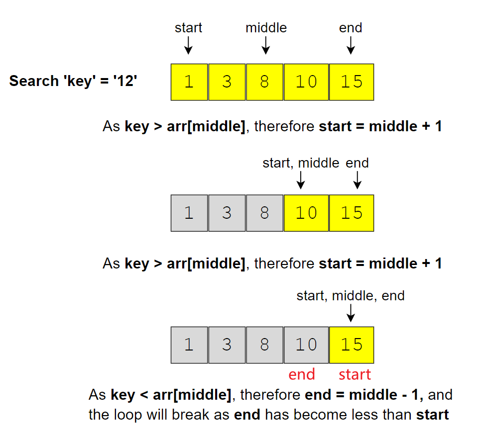

## 基础

### 版本一：左闭右闭区间 [left, right]


```js
/**
 * @param {number[]} nums
 * @param {number} target
 * @return {number}
 */
var search = function(nums, target) {
    // right是数组最后一个数的下标，num[right]在查找范围内，是左闭右闭区间
    let mid, left = 0, right = nums.length - 1;
    // 当left=right时，由于nums[right]在查找范围内，所以要包括此情况
    while (left <= right) {
        // 位运算 + 防止大数溢出
        mid = left + ((right - left) >> 1);
        // 如果中间数大于目标值，要把中间数排除查找范围，所以右边界更新为mid-1；如果右边界更新为mid，那中间数还在下次查找范围内
        if (nums[mid] > target) {
            right = mid - 1;  // 去左面闭区间寻找
        } else if (nums[mid] < target) {
            left = mid + 1;   // 去右面闭区间寻找
        } else {
            return mid;
        }
    }
    return -1;
};
```

### 版本二：左闭右开区间 [left, right)


```js
/**
 * @param {number[]} nums
 * @param {number} target
 * @return {number}
 */
var search = function(nums, target) {
    // right是数组最后一个数的下标+1，nums[right]不在查找范围内，是左闭右开区间
    let mid, left = 0, right = nums.length;    
    // 当left=right时，由于nums[right]不在查找范围，所以不必包括此情况
    while (left < right) {
        // 位运算 + 防止大数溢出
        mid = left + ((right - left) >> 1);
        // 如果中间值大于目标值，中间值不应在下次查找的范围内，但中间值的前一个值应在；
        // 由于right本来就不在查找范围内，所以将右边界更新为中间值，如果更新右边界为mid-1则将中间值的前一个值也踢出了下次寻找范围
        if (nums[mid] > target) {
            right = mid;  // 去左区间寻找
        } else if (nums[mid] < target) {
            left = mid + 1;   // 去右区间寻找
        } else {
            return mid;
        }
    }
    return -1;
};
```

## 题目

==有序数组可以可考虑二分法，边界情况要考虑==

**2 Order-agnostic Binary Search (easy)**

找到有序（升序or降序）数组中值等于key的index

```js
// 通过比较数组首尾判断升序or降序，在移动start/end进行区分
let isAscending = arr[start] < arr[end];
```

### 3 Ceiling of a Number (medium)

找到升序数组中**大于等于**给定key的index

==如果数组中没有找到key，最后start会比key大，end会比key小==

**leetcode：**[35] 搜索插入位置  [69] x 的平方根  [367] 有效的完全平方数



```js
// key在数组范围，但是没有相等，最后start是刚好大于key
return start;

// 如果是找到有序数组中小于等于给定key的index
return end;
```

### 4 Next Letter (medium)

找到有序数组中大于（没有等于）给定key的值，等于后循环要走下去，如果没有就返回数组第一个值

==mid等于target循环还继续，start走最后start刚好大于key，end走最后end刚好小于key==

**leetcode：**[278] 第一个错误的版本

```js
function search_next_letter(letters, key) {
    const n = letters.length;
    // 给定key小于第一个字母，返回第一个字母 || key大于最后一个字母，根据循环返回第一个字母
    if (key < letters[0] || key >= letters[n - 1]) {
        return letters[0];
    }
    let start = 0, end = n - 1, mid;
    while (start <= end) {
        mid = Math.floor((end - start) / 2 + start);
        // 找刚好大于key的位置，key大于等于mid时，start都要增加
        if (key >= letters[mid]) { 
            start = mid + 1;
        } else {
            end = end - 1;
        }
    }
    return letters[start];
    // return letters[start % n];
    // [0, 1, 2, 3, 4] key>=4 start都是5 start%n就是0
}
```

5 Number Range (medium)

数组里面有重复，找到重复的范围

==左右边界的查找是类似的，封装成函数==

**leetcode：**34 在排序数组中查找元素的第一个和最后一个位置

```js
// 两个函数处理，主函数调用二分函数
let result = [-1, -1];
result[0] = binary_search_range(arr, key, false);

// 二分函数，在key等于targrt时做处理
// keyIndex记录key的位置，start/end是边界
keyIndex = mid; // 只有找到key情况下keyIndex才会变，初始化-1
if (findMaxIndex) { // 找左边false，右边true
    start = mid + 1; // search ahead to find the last index of 'key'
} else {
    end = mid - 1; // search behind to find the first index of 'key'
}
```

### 6 Search in a Sorted Infinite Array (medium)

数组长度无限制

```js
const search_in_infinite_array = function (reader, key) {
    // 先找到合适的边界
    let start = 0, end = 1, newStart;
    while (reader.get(end) < key) {
        newStart = end + 1;
        end += (end - start + 1) * 2;
        // 逐渐增大边界
        start = newStart;
    }
    return binary_search_infinite(reader, key, start, end);
}
```

### 7 Minimum Difference Element (medium)

有序数组中找到与key差值最小的值

```js
if (key <= arr[0]) {
    return arr[0];
}
const n = arr.length;
if (key >= arr[n - 1]) {
    return arr[n - 1];
}

// 没有找到与key相等的mid，end<key<start，比较哪边差值比较少
if ((arr[start] - key) < (key - arr[end])) {
    return arr[start];
}
```

**leetcode：**[658] 找到 K 个最接近的元素：给定一个 **排序好** 的数组 `arr` ，两个整数 `k` 和 `x` ，从数组中找到最靠近 `x`（两数之差最小）的 `k` 个数。返回的结果必须要是按升序排好的。

解决：先找到刚好大于key的start（参考4 Next Letter ），然后循环k返回符合条件的结果

```js
var findClosestElements = function (arr, k, x) {
    let right = binarySearch(arr, x);
    let left = right - 1;
    while (k-- > 0) {
        // 处理边界
        if (left < 0) {
            right++;
        } else if (right >= arr.length) {
            left--;
        // 整数 a 比整数 b 更接近 x 需要满足|a - x| == |b - x| 且 a < b
        } else if (x - arr[left] <= arr[right] - x) {
            left--;
        } else {
            right++;
        }
    }
    const ans = [];
    for (let i = left + 1; i < right; i++) {
        ans.push(arr[i]);
    }
    return ans;
}
```

### 8 Bitonic Array Maximum (easy)

单调递增数组增到最大值后然后单调递减，找到最大值

==mid有可能是要找的值，就不应该被舍弃，此时循环条件结束是start < end==

mid与mid+1比较，处于第一段mid+1>mid，mid不可能是最大值，start = mid + 1

但是处于第二段mid>mid+1，mid有可能是最大值，end=mid

**收束到结束**

```js
const find_max_in_bitonic_array = function (arr) {
    let start = 0, end = arr.length - 1, mid;
    // start===end时两者斗收缩到最大值，但是由于end=mid，while(start<=end)循环不会结束
    while (start < end) { 
        mid = Math.floor((end - start) / 2 + start);
        if (arr[mid] > arr[mid + 1]) { // 处于第二段
            end = mid; 
        } else { // 处于第一段
            start = mid + 1;
        }
    }
    return arr[start];
}
```

Bitonic Array中找key

```js
// 先找到最大值，然后把数组分成两部分
function search_bitonic_array(arr, key) {
    const maxIndex = find_max(arr);
    const keyIndex = binary_search_bitonic(arr, key, 0, maxIndex);
    if (keyIndex !== -1) {
        return keyIndex;
    }
    return binary_search_bitonic(arr, key, maxIndex + 1, arr.length - 1);
}

// 分前后两部分
if (arr[start] < arr[end]) { // 升序
    if (key < arr[mid]) {
        end = mid - 1;
    } else {
        start = mid + 1;
    }
} else {
    if (key > arr[mid]) {
        end = mid - 1;
    } else {
        start = mid + 1;
    }
}
```

### 10 Search in Rotated Array (medium)

**leetcode：**[33] 搜索旋转排序数组 [81] 搜索旋转排序数组 II [153] 寻找旋转排序数组中的最小值 [154] 寻找旋转排序数组中的最小值 II

在旋转数组中找到旋转点

==mid会和左右会和左右两边比较，mid可以舍弃==

**在mid做处理**

```js
// 找到旋转数组中最小值，数组中唯一比前面的值小
function count_rotations(arr) {
    let start = 0, end = arr.length - 1, mid;
    while (start <= end) {
        mid = Math.floor((end - start) / 2 + start);
        // 情况1：mid>mid+1
        if (mid < end && arr[mid] > arr[mid + 1]) {
            return mid + 1;
        }
        // 情况2：mid-1>mid
        if (mid > start && arr[mid] < arr[mid - 1]) {
            return mid;
        }
        // 移动start or end
        if (arr[start] < arr[mid]) { // 保证start--mid都是排好序的
            start = mid + 1;
        } else {
            end = mid - 1;
        }
    }
    return 0;
}
```

存在重复

```js
// 处理相同
if (arr[start] === arr[mid] && arr[mid] === arr[end]) {
    if (arr [start] > arr[start + 1]) {
        return start + 1;
    }
    start +=1;
    if (arr[end -1] > arr[end]) {
        return end;
    }
    end -= 1;
} else if (arr[start] < arr[mid] || (arr[start] === arr[mid] && arr[mid] > arr[end])) { // 增加判断
    start = mid + 1;
} else {
    end = mid - 1;
}
```

在旋转数组（递增数组任意值翻转）中找到key

```js
function search_rotated_array(arr, key) {
    let start = 0, end = arr.length - 1, mid;
    while (start <= end) {
        mid = Math.floor((end - start) / 2 + start);
        if (key === arr[mid]) {
            return mid;
        }
        // 分前后两部分，总有一侧是排序的
        if (arr[start] < arr[mid]) {
            if (key >= arr[start] && key < arr[mid]) {
                end = mid - 1;
            } else {
                start = mid + 1;
            }
        } else {
            if (key <= arr[end] && key > arr[mid]) {
                start = mid + 1;
            } else {
                end = mid - 1;
            }
        }
    }
    return -1;
}
```

存在重复

```js
// 如果存在重复，缩小范围
if (arr[start] === arr[mid] && arr[mid === arr[end]]) {
    start += 1;
    end -= 1;
} else if (arr[start] < arr[mid]) { // 分前后两部分，总有一侧是排序的
    if (key >= arr[start] && key < arr[mid]) {
        end = mid - 1;
    } else {
        start = mid + 1;
    }
} else {
    if (key <= arr[end] && key > arr[mid]) {
        start = mid + 1;
    } else {
        end = mid - 1;
    }
}
```

### [540] 有序数组中的单一元素

利用奇偶判断

```js
// 移动start end——重复2两次，mid偶数mid + 1比较，mid奇数与mid - 1比较
const isOddNumber = mid % 2;
if (isOddNumber) {
    if (nums[mid] === nums[mid - 1]) {
        start = mid + 1;
    } else {
        end = mid; // mid有可能就是要找的值
    }
} else {
    if (nums[mid] === nums[mid + 1]) {
        start = mid + 1;
    } else {
        end = mid;
    }
}
```