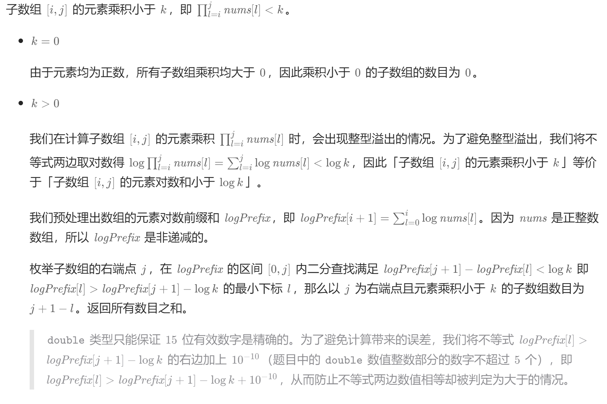
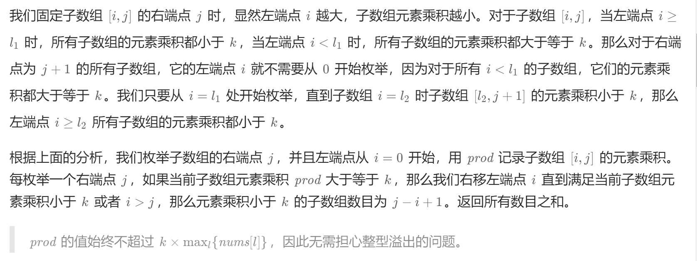
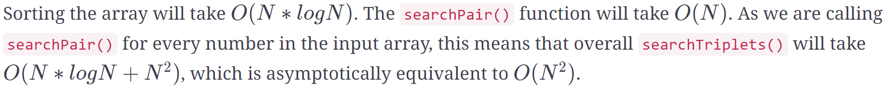
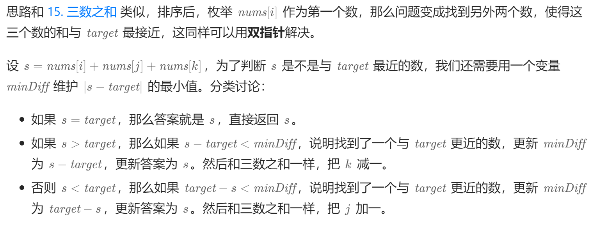
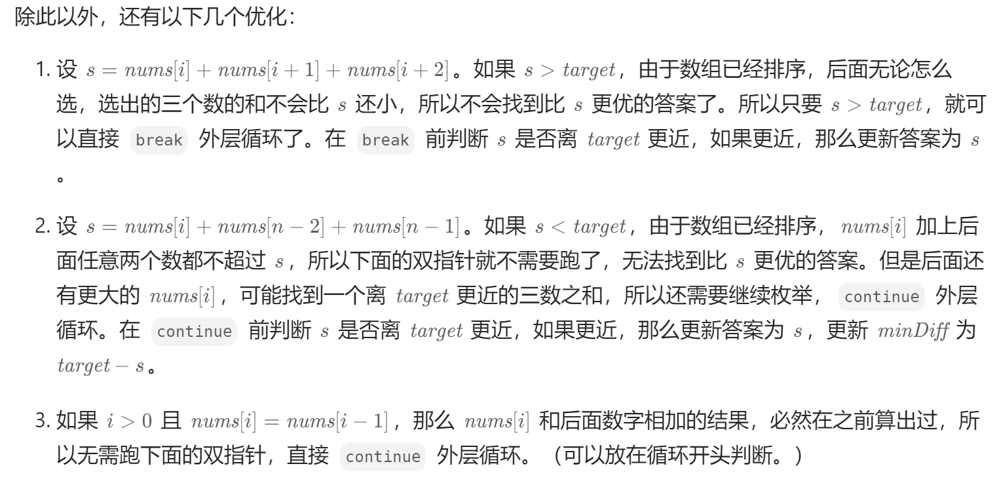
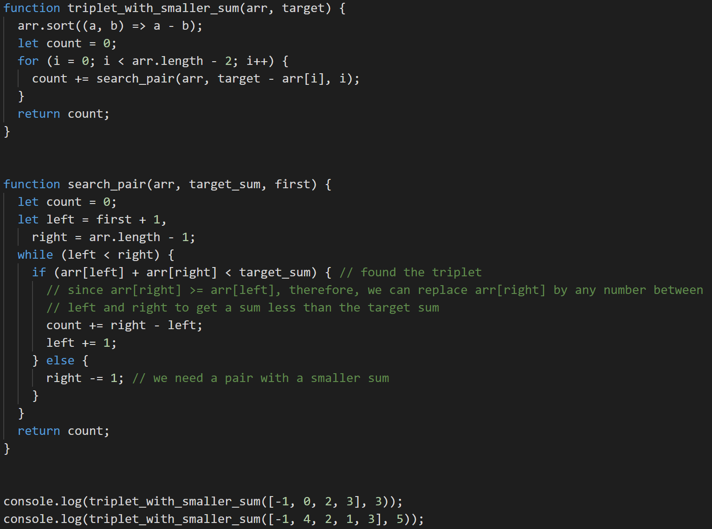
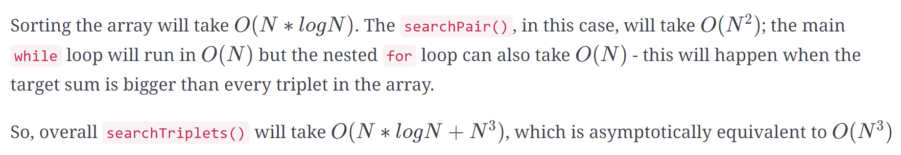

## 基础

deal with sorted arrays (or `LinkedLists`) and need to find a set of elements that fulfill certain constraints

有序数组or链表中找到符合条件的子序列

### 快慢指针

数组问题中比较常见的快慢指针技巧，是让你**原地修改数组**。

数组中另一大类快慢指针的题目就是「滑动窗口算法」

#### 27 移除元素

**Example 1:**

```
Input: [3, 2, 3, 6, 3, 10, 9, 3], Key=3
Output: 4
Explanation: The first four elements after removing every 'Key' will be [2, 6, 10, 9].
```

**Example 2:**

```
Input: [2, 11, 2, 2, 1], Key=2
Output: 2
Explanation: The first two elements after removing every 'Key' will be [11, 1].
```

给你一个数组 `nums` 和一个值 val，你需要 原地 移除所有数值等于 val 的元素，并返回移除后数组的新长度。

定义快慢指针

- 快指针：寻找新数组的元素 ，新数组就是不含有目标元素的数组
- 慢指针：指向更新 新数组下标的位置


```js
//时间复杂度：O(n)
//空间复杂度：O(1)
var removeElement = (nums, val) => {
    let k = 0; // 慢指针
    for(let i = 0;i < nums.length;i++){ // i快指针
        if(nums[i] != val){
            nums[k++] = nums[i] // 当不等于val更新快慢指针，等于只更新快指针
        }
    }
    return k;
};
```

#### 283 移动零

```js
// 和27类似，只是移除元素是0，然后后面补零
var moveZeroes = function(nums) {
    // 去除 nums 中的所有 0，返回不含 0 的数组长度
    var p = removeElement(nums, 0);
    // 将 nums[p..] 的元素赋值为 0
    for (; p < nums.length; p++) {
        nums[p] = 0;
    }
};

// 方案2，27是不在意后面的元素，可以理解为原地删除，283是讲究后面的顺序，可以理解为原地修改
let slow = 0;
for (let fast = 0; fast < nums.length; fast++) {
    if(nums[fast] !== 0) {
        // 因为要要移动0到末尾，fast和slow交换位置
        let item = nums[fast];
        nums[slow] = nums[fast];
        nums[fast] = item;
        slow++;
    }
} 
return nums;
```

#### 26 删除排序数组中的重复项

**Example 1:**

```
Input: [2, 3, 3, 3, 6, 9, 9]
Output: 4
Explanation: The first four elements after removing the duplicates will be [2, 3, 6, 9].
```

**Example 2:**

```
Input: [2, 2, 2, 11]
Output: 2
Explanation: The first two elements after removing the duplicates will be [2, 11].
```

**题解**

27 传入value在原数组中删除和value相同元素，fast和value比较

26 在原数组中删除重复项，fast和fast-1比较，或者理解成slow和fast比较


```js
// 方案1 理解成slow和fast比较
var removeDuplicates = function(nums) {
	let slow = 0;
    for (let fast = 0; fast < nums.length; fast++) {
        if (nums[fast] !== nums[slow]) {
            nums[++slow] = nums[fast];
        }
    }
    // slow是index下标，真实长度要+1
    return slow + 1; 
};

// 方案2 为了fast可以和fast-1比较，fast从1开始，slow和fast统一，也是从1开始
var removeDuplicates = function(nums) {
    let slow = 1;
    for (let fast = 1; fast < nums.length; fast++) {
        if(nums[fast - 1] !== nums[fast]) {
            nums[slow++] = nums[fast];
        }
    }
    return slow;
}
```

**复杂度**

- Time Complexity ：*O*(*N*)
- Space Complexity ：*O*(*1*)

#### 844 比较含退格的字符串

**从后面开始遍历**，因为字母是否删除和后面的#相关，只有直到后面有多少#才知道前面有多少字母要删除

```js
var backspaceCompare = function(S, T) {
	let i = S.length - 1,
    j = T.length - 1,
    skipS = 0, // 保存跳过#数量
    skipT = 0;
    while(j >= 0 || i >= 0) {
        // S 循环
        while(i >= 0){
            if(S[i] === '#'){
                skipS++;
                i--;
            } else if (skipS > 0){
                skipS--;
                i--;
            } else break;
        }

        // T 循环
        while(j >= 0) {
            if(T[j] === '#') {
                skipT++;
                j--;
            } else if(skipS > 0) {
                skipT--;
                i--;
            } else break;
        }

        // 如果S和T相同，那么字串也是相同的
        if(S[i] !== T[j]) return false;
        i--;
        j--;
    }
    return true; 
}
```

#### 713 乘积小于 K 的子数组

给你一个整数数组 `nums` 和一个整数 `k` ，请你返回子数组内所有元素的乘积严格小于 `k` 的连续子数组的数目。

**Example 1:**

```
Input: [2, 5, 3, 10], target=30 
Output: [2], [5], [2, 5], [3], [5, 3], [10]
Explanation: There are six contiguous subarrays whose product is less than the target.
```

**Example 2:**

```
Input: [8, 2, 6, 5], target=50 
Output: [8], [2], [8, 2], [6], [2, 6], [5], [6, 5] 
Explanation: There are seven contiguous subarrays whose product is less than the target.
```

**解法**

- 和259 较小的三数之和类似
- 二分查找



- 滑动窗口

  数组是降序排列，left/right开始下标为0，right随着循环不断增加，直到`num[left]*num[right]`乘积大于target，此时移动left




**复杂度**

- Time Complexity ：

  

- Space Complexity ：*O*(*N*)


### 左右指针

#### 977 有序数组的平方

**Example 1:**

```
Input: [-2, -1, 0, 2, 3]
Output: [0, 1, 4, 4, 9]
```

**Example 2:**

```
Input: [-3, -1, 0, 1, 2]
Output: [0 1 1 4 9]
```

方法

```js
var sortedSquares = function(nums) {
// 两头中肯定有最大的，所以新数组从尾部开始 倒叙存放到新数组 // i-- left++ right--
    let newArray = new Array(nums.length),
    left = 0, right = nums.length - 1;
    for (let i = nums.length - 1; i >= 0; i--) {
        if(nums[left] * nums[left] >= nums[right] * nums[right]) {
            newArray[i] = nums[left] * nums[left];
            left++;
        } else {
            newArray[i] = nums[right] * nums[right];
            right--;
        }
    }
    return newArray;
};
```

**复杂度**

- Time Complexity ：*O*(*N*)
- Space Complexity ：*O*(*N*)

#### 167. 两数之和 II - 输入有序数组

Given an array of sorted numbers and a target sum, find a pair in the array whose sum is equal to the given target.

**Example 1:**

```
Input: [1, 2, 3, 4, 6], target=6
Output: [1, 3]
Explanation: The numbers at index 1 and 3 add up to 6: 2+4=6
```

**Example 2:**

```
Input: [2, 5, 9, 11], target=11
Output: [0, 2]
Explanation: The numbers at index 0 and 2 add up to 11: 2+9=11
```

**暴力法**：从左到右遍历，选定左边，因为数组排序，可以通过二分查找右边，`O(N∗logN)`

**双指针**


- 如果两个指针的和大于`taget`，右边指针--
- 如果两个指针的和小于`taget`，左边边指针++

**Hash**

- key为数组的值，value为数组下标
- 遍历数组，查找hash中是否有符合，没有把当前值放进hash，有的话返回结果

**复杂度**

- Time Complexity ：*O*(*N*)
- Space Complexity ：*O*(*N*)

#### 15. 三数之和

**Example 1:**

```
Input: [-3, 0, 1, 2, -1, 1, -2]
Output: [-3, 1, 2], [-2, 0, 2], [-2, 1, 1], [-1, 0, 1]
Explanation: There are four unique triplets whose sum is equal to zero.
```

**Example 2:**

```
Input: [-5, 2, -1, -2, 3]
Output: [[-5, 2, 3], [-2, -1, 3]]
Explanation: There are two unique triplets whose sum is equal to zero.
```

解法

- 数组排序后，可以转换成两数之和，`X+Y+Z=0 --> Y+Z=−X`，target就是`−X`
- 注意跳过相同值的数

**复杂度**

- Time Complexity 

  

- Space Complexity ：*O*(*N*)

#### 16 最接近的三数之和

**Example 1:**

```
Input: [-2, 0, 1, 2], target=2
Output: 1
Explanation: The triplet [-2, 1, 2] has the closest sum to the target.
```

**Example 2:**

```
Input: [-3, -1, 1, 2], target=1
Output: 0
Explanation: The triplet [-3, 1, 2] has the closest sum to the target.
```

**Example 3:**

```
Input: [1, 0, 1, 1], target=100
Output: 3
Explanation: The triplet [1, 1, 1] has the closest sum to the target.
```

解法

- 三数之和的变形，需要额外参数记录最小差值





**复杂度**

- Time Complexity ：*O*(*N*<sup>2</sup>)
- Space Complexity ：*O*(*N*)

#### 259 较小的三数之和

**Example 1:**

```
Input: [-1, 0, 2, 3], target=3 
Output: 2
Explanation: There are two triplets whose sum is less than the target: [-1, 0, 3], [-1, 0, 2]
```

**Example 2:**

```
Input: [-1, 4, 2, 1, 3], target=5 
Output: 4
Explanation: There are four triplets whose sum is less than the target: 
   [-1, 1, 4], [-1, 1, 3], [-1, 1, 2], [-1, 2, 3]
```

解法；

- 和三数之和类似，但是相同的值不用去重
- 而且小于的值都是正确的，二分查找时，`arr[left] + arr[right] < target`，left++，但是right可以取`[left, right]`，所以`count +=right - left`



**复杂度**

- Time Complexity ：

  

- Space Complexity ：*O*(*N*)

#### 75 颜色分类

给定一个包含红色、白色和蓝色、共 `n` 个元素的数组 `nums` ，**[原地](https://baike.baidu.com/item/原地算法)**对它们进行排序，使得相同颜色的元素相邻，并按照红色、白色、蓝色顺序排列。

我们使用整数 `0`、 `1` 和 `2` 分别表示红色、白色和蓝色。

必须在不使用库内置的 sort 函数的情况下解决这个问题。

**Example 1:**

```
Input: [1, 0, 2, 1, 0]
Output: [0 0 1 1 2]
```

**Example 2:**

```
Input: [2, 2, 0, 1, 2, 0]
Output: [0 0 1 2 2 2 ]
```

解法：

- [Heapsort](https://en.wikipedia.org/wiki/Heapsort) *O*(*N*∗*l*o*g*N)
- 把0放在left指针左边，把2放在right指针右边


#### 18 四数之和

给你一个由 `n` 个整数组成的数组 `nums` ，和一个目标值 `target` 。请你找出并返回满足下述全部条件且**不重复**的四元组 `[nums[a], nums[b], nums[c], nums[d]]` （若两个四元组元素一一对应，则认为两个四元组重复）


581 最短无序连续子数组


125 验证回文串

151 反转字符串中的单词

680 验证回文串 II


**1 二分查找**

**2 两数之和**

**3 反转数组**

344 反转字符串

**4 回文串判断**

5  最长回文子串


剑指 Offer 57. 和为s的两个数字	

剑指 Offer II 006. 排序数组中两个数字之和


