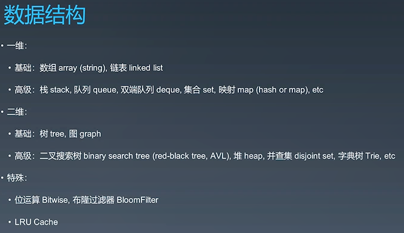
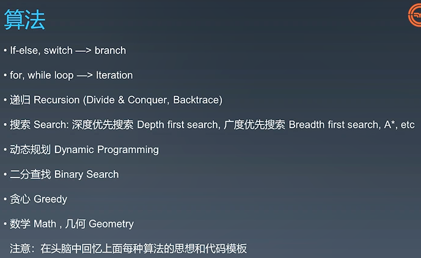
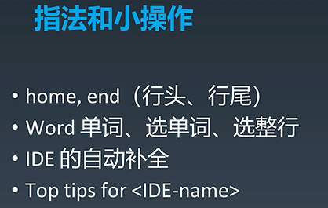

## 1、精通一个领域

- chunk it up 切碎知识点，把庞大的领域知识变成知识脑图

  [数据结构脑图](http://naotu.baidu.com/file/b832f043e2ead159d584cca4efb19703?token=7a6a56eb2630548c)

  [算法脑图](http://naotu.baidu.com/file/0a53d3a5343bd86375f348b2831d3610?token=5ab1de1c90d5f3ec)

  

  

- deliberate practicing 刻意练习，弱项更要加强练习

  - 切题四件套
    - clarification，理解题目
    - possible solutions，把所有可能的解过一把，比较时间空间复杂度，找到最优解法
    - coding，多写
    - test cases，多举测试样例
  - 五遍刷题法，至少五遍
    - 第一遍，第一次接触
      - 5分钟，最多15分钟：读题+思考
      - 没有思路直接看解法，通常很多解法，比较解法优劣（全部语言top3+js top3）
      - 背诵、默写好的解法
    - 第二遍
      - 马上自己写
      - 多种解法比较、体会-->优化
    - 第三遍，一天后
      - 对于某些解法不熟悉，要加强练习
    - 第四遍，一周后
      - 对于不熟悉题目，要加强练习
    - 第五遍，面试前一两周恢复性训练

- feedback 反馈，看高票题解

2、code style

3、快捷键

