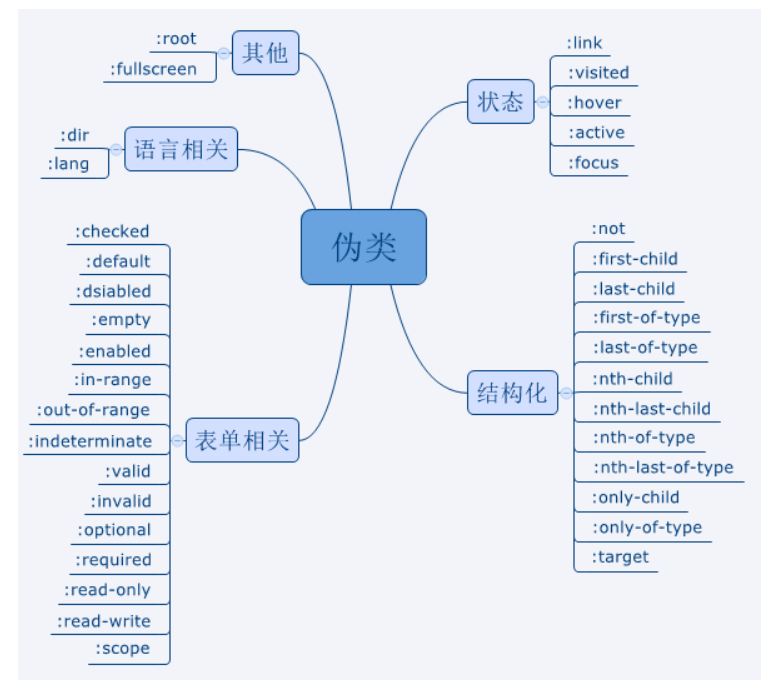
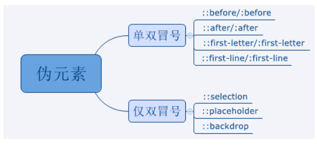

## 1、background

`background:bg-color bg-image position/bg-size bg-repeat bg-origin bg-clip bg-attachment initial|inherit;`

background-color：指定要使用的背景颜色

background-position：指定背景图像的位置

| 值                                  | 描述                                                         |
| :---------------------------------- | :----------------------------------------------------------- |
| left/right/center top/center/bottom | 如果仅指定一个关键字，其他值将会是"center"                   |
| *x% y%*                             | 第一个值是水平位置，第二个值是垂直。左上角是0％0％。右下角是100％100％。如果仅指定了一个值，其他值将是50％。 。默认值为：0％0％ |
| *xpos ypos*                         | 第一个值是水平位置，第二个值是垂直。左上角是0。单位可以是像素（0px0px）或任何其他 [CSS单位](https://www.runoob.com/try/css-units.html)。如果仅指定了一个值，其他值将是50％。你可以混合使用％和positions |

background-size：指定背景图片的大小

| 值         | 描述                                                         |
| :--------- | :----------------------------------------------------------- |
| length     | 设置背景图片高度和宽度。第一个值设置宽度，第二个值设置的高度。如果只给出一个值，第二个是设置为 **auto**(自动) |
| percentage | 将计算相对于背景定位区域的百分比。第一个值设置宽度，第二个值设置的高度，各个值之间以空格 隔开指定高和宽，以逗号 **,** 隔开指定多重背景。如果只给出一个值，第二个是设置为"auto(自动)" |
| cover      | 此时会保持图像的纵横比并将图像缩放成将完全覆盖背景定位区域的最小大小。 |
| contain    | 此时会保持图像的纵横比并将图像缩放成将适合背景定位区域的最大大小。 |

background-repeat：指定如何重复背景图像

background-origin：指定背景图像的定位区域

background-clip：指定背景图像的绘画区域

background-attachment：设置背景图像是否固定或者随着页面的其余部分滚动

background-image：指定要使用的一个或多个背景图像

background-blend-mode：义了背景层的混合模式（图片与颜色）

## 2、border

border

- border-width：定边框的宽度

- border-style：指定边框的样式

- border-color：指定边框的颜色

border-image

- border-image-source
- border-image-slice
- border-image-width
- border-image-outset 
- border-image-repeat

border-radius：设置元素的外边框圆角

border-collapse：设置表格的边框是否被合并为一个单一的边框

border-spacing：设置相邻单元格的边框间的距离

## 3、object-fit

object-fit：对图片进行剪切，保留原始比例：

| 值         | 描述     |
| :--------- | :--------------------------------------------------- |
| fill       | 默认，不保证保持原有的比例，内容拉伸填充整个内容容器。       |
| contain    | 保持原有尺寸比例。内容被缩放。                             |
| cover      | 保持原有尺寸比例。但部分内容可能被剪切。                     |
| none       | 保留原有元素内容的长度和宽度，也就是说内容不会被重置。       |
| scale-down | 保持原有尺寸比例。内容的尺寸与 none 或 contain 中的一个相同，取决于它们两个之间谁得到的对象尺寸会更小一些。 |

object-position：根据容器大小重置图片的大小，并设置图片的位置

| 值         | 描述                                                         |      |
| :--------- | :----------------------------------------------------------- | ---- |
| *position* | 第一个值为 x 坐标位置的值，第二个值为 y 坐标位置的值。表示的方式有：`object-position: 50% 50%; object-position: right top; object-position: left bottom; object-position: 250px 125px;` |      |

## 4、动画

| 属性                        | 含义        |
| ------------------------- | -----------------------------------------|
| animation（动画）  | 用于设置动画属性，他是一个简写的属性，包含6个属性         |
| transition（过渡） | 用于设置元素的样式过度，和animation有着类似的效果，但细节上有很大的不同 |
| transform（变形）  | 用于元素进行旋转、缩放、移动或倾斜，和设置样式的动画并没有什么关系，就相当于color一样用来设置元素的“外表” |
| translate（移动）  | translate只是transform的一个属性值，即移动。|

**transition**：设置元素当过渡效果

transition产生动画的条件是transition设置的property发生变化。

| 值                         | 描述                              |
| -------------------------- | --------------------------------- |
| transition-property        | 规定设置过渡效果的 CSS 属性的名称 |
| transition-duration        | 规定完成过渡效果需要多少秒或毫秒  |
| transition-timing-function | 规定速度效果的速度曲线            |
| transition-delay           | 定义过渡效果何时开始              |

**animation**：transition扩展

animation是由多个transition的效果叠加，并且可操作性更强

| 值              | 描述                                                         |
| --------------- | ------------------------------------------------------------ |
| name            | 用来调用@keyframes定义好的动画，与@keyframes定义的动画名称一致 |
| duration        | 指定元素播放动画所持续的时间                                 |
| timing-function | 规定速度效果的速度曲线，是针对每一个小动画所在时间范围的变换速率 |
| delay           | 定义在浏览器开始执行动画之前等待的时间，值整个animation执行之前等待的时间 |
| iteration-count | 定义动画的播放次数，可选具体次数或者无限(infinite)           |
| direction       | 设置动画播放方向：normal(按时间轴顺序),reverse(时间轴反方向运行),alternate(轮流，即来回往复进行),alternate-reverse(动画先反运行再正方向运行，并持续交替运行) |
| play-state      | 控制元素动画的播放状态，通过此来控制动画的暂停和继续，两个值：running(继续)，paused(暂停) |
| fill-mode       | 控制动画结束后，元素的样式，有四个值：none(回到动画没开始时的状态)，forwards(动画结束后动画停留在结束状态)，backwords(动画回到第一帧的状态)，both(根据animation-direction轮流应用forwards和backwards规则)，注意与iteration-count不要冲突(动画执行无限次) |

## 5、css单位

相对长度单位指定了一个长度相对于另一个长度的属性。对于不同的设备相对长度更适用。

| 单位 | 描述                                                         |
| :--- | :----------------------------------------------------------- |
| em   | 它是描述相对于应用在当前元素的字体尺寸，所以它也是相对长度单位。一般浏览器字体大小默认为16px，则2em == 32px； |
| ex   | 依赖于英文字母小 x 的高度                                    |
| ch   | 数字 0 的宽度                                                |
| rem  | rem 是根 em（root em）的缩写，rem作用于非根元素时，相对于根元素字体大小；rem作用于根元素字体大小时，相对于其出初始字体大小。 |
| vw   | viewpoint width，视窗宽度，1vw=视窗宽度的1%                  |
| vh   | viewpoint height，视窗高度，1vh=视窗高度的1%                 |
| vmin | vw和vh中较小的那个。                                         |
| vmax | vw和vh中较大的那个。                                         |

绝对长度单位是一个固定的值，它反应一个真实的物理尺寸。绝对长度单位视输出介质而定，不依赖于环境（显示器、分辨率、操作系统等）。

| 单位 | 描述                                     |
| :--- | :--------------------------------------- | 
| cm   | 厘米                                     |
| mm   | 毫米                                     |
| in   | 英寸 (1in = 96px = 2.54cm)               |
| px * | 像素 (1px = 1/96th of 1in)               |
| pt   | point，大约1/72英寸； (1pt = 1/72in)     | 
| pc   | pica，大约 12pt，1/6英寸； (1pc = 12 pt) |

## 6、选择器

| 选择器                                                       | 示例             | 示例说明                                                     | CSS  |
| :----------------------------------------------------------- | :--------------- | :----------------------------------------------------------- | :--- |
| [.*class*](https://www.runoob.com/cssref/sel-class.html)     | .intro           | 选择所有class="intro"的元素                                  | 1    |
| [#*id*](https://www.runoob.com/cssref/sel-id.html)           | #firstname       | 选择所有id="firstname"的元素                                 | 1    |
| [*](https://www.runoob.com/cssref/sel-all.html)              | *                | 选择所有元素                                                 | 2    |
| *[element](https://www.runoob.com/cssref/sel-element.html)*  | p                | 选择所有`
`元素                                            | 1    |
|                                                              | div.intro        | 交集选择器是为了找两个或多个选择器的交集,用法就是把两个选择器放在一起,法语"选择器A选择器B" |      |
| *[element,element](https://www.runoob.com/cssref/sel-element-comma.html)* | div,p            | 选择所有`
`元素和`
`元素                               | 1    |
| [*element* *element*](https://www.runoob.com/cssref/sel-element-element.html) | div p            | 选择`
`元素内的所有`
`元素                             | 1    |
| [*element*>*element*](https://www.runoob.com/cssref/sel-element-gt.html) | div>p            | 选择所有父级是 `
` 元素的 `
` 元素                     | 2    |
| [*element*+*element*](https://www.runoob.com/cssref/sel-element-pluss.html) | div+p            | 选择所有紧跟在 `
` 元素之后的第一个 `
` 元素           | 2    |
| [[*attribute*\]](https://www.runoob.com/cssref/sel-attribute.html) | [target]         | 选择所有带有target属性元素                                   | 2    |
| [[*attribute*=*value*\]](https://www.runoob.com/cssref/sel-attribute-value.html) | [target=-blank]  | 选择所有使用target="-blank"的元素                            | 2    |
| [[*attribute*~=*value*\]](https://www.runoob.com/cssref/sel-attribute-value-contains.html) | [title~=flower]  | 选择标题属性包含单词"flower"的所有元素                       | 2    |
| [[*attribute*\|=*language*\]](https://www.runoob.com/cssref/sel-attribute-value-lang.html) | [lang\|=en]      | 选择 lang 属性等于 **en**，或者以 **en-** 为开头的所有元素   | 2    |
| [*element1*~*element2*](https://www.runoob.com/cssref/sel-gen-sibling.html) | p~ul             | 选择p元素之后的每一个ul元素                                  | 3    |
| [[*attribute*^=*value*\]](https://www.runoob.com/cssref/sel-attr-begin.html) | a[src^="https"]  | 选择每一个src属性的值以"https"开头的元素                     | 3    |
| [[*attribute*$=*value*\]](https://www.runoob.com/cssref/sel-attr-end.html) | a[src$=".pdf"]   | 选择每一个src属性的值以".pdf"结尾的元素                      | 3    |
| [[*attribute**=*value*\]](https://www.runoob.com/cssref/sel-attr-contain.html) | a[src*="runoob"] | 选择每一个src属性的值包含子字符串"runoob"的元素              | 3    |

