## 1、选择器

todo

https://juejin.cn/post/6844904147414712334#heading-41

https://juejin.cn/post/7136087057542086693#heading-0

https://github.com/chokcoco/iCSS/issues/57

文档结构选择器
| 选择器                                                       | 示例             | 示例说明                                                     | CSS  |
| :----------------------------------------------------------- | :--------------- | :----------------------------------------------------------- | :--- |
|`div.intro`      | 交集选择器是为了找两个或多个选择器的交集,用法就是把两个选择器放在一起,法语"选择器A选择器B" |      |
| *[element,element](https://www.runoob.com/cssref/sel-element-comma.html)* | div,p            | 选择所有`<div>`元素和`<p>`元素                               | 1    |
| [*element* *element*](https://www.runoob.com/cssref/sel-element-element.html) | div p            | 选择`<div>`元素内的所有`<p>`元素                             | 1    |
| [*element*>*element*](https://www.runoob.com/cssref/sel-element-gt.html) | div>p            | 选择所有父级是 `<div>` 元素的 `<p>` 元素                     | 2    |
| [*element*+*element*](https://www.runoob.com/cssref/sel-element-pluss.html) | div+p            | 选择所有紧跟在 `<div>` 元素之后的第一个 `<p>` 元素           | 2    |

属性选取器
| 选择器 | 示例             | 示例说明 | CSS  |
| :----------------------------------------------------------- | :--------------- | :----------------------------------------------------------- | :--- |
| [[*attribute*\]](https://www.runoob.com/cssref/sel-attribute.html) | [target]         | 选择所有带有target属性元素                                   | 2    |
| [[*attribute*=*value*\]](https://www.runoob.com/cssref/sel-attribute-value.html) | [target=-blank]  | 选择所有使用target="-blank"的元素                            | 2    |
| [[*attribute*~=*value*\]](https://www.runoob.com/cssref/sel-attribute-value-contains.html) | [title~=flower]  | 选择标题属性包含单词"flower"的所有元素                       | 2    |
| [[*attribute*\|=*language*\]](https://www.runoob.com/cssref/sel-attribute-value-lang.html) | [lang\|=en]      | 选择 lang 属性等于 **en**，或者以 **en-** 为开头的所有元素   | 2    |
| [*element1*~*element2*](https://www.runoob.com/cssref/sel-gen-sibling.html) | p~ul             | 选择p元素之后的每一个ul元素                                  | 3    |
| [[*attribute*^=*value*\]](https://www.runoob.com/cssref/sel-attr-begin.html) | a[src^="https"]  | 选择每一个src属性的值以"https"开头的元素                     | 3    |
| [[*attribute*$=*value*\]](https://www.runoob.com/cssref/sel-attr-end.html) | a[src$=".pdf"]   | 选择每一个src属性的值以".pdf"结尾的元素                      | 3    |
| [[*attribute**=*value*\]](https://www.runoob.com/cssref/sel-attr-contain.html) | a[src*="runoob"] | 选择每一个src属性的值包含子字符串"runoob"的元素              | 3    |

伪类选择器


伪元素选择器


## 2、`css`单位

相对长度单位指定了一个长度相对于另一个长度的属性。对于不同的设备相对长度更适用。

| 单位 | 描述                                                         |
| :--- | :----------------------------------------------------------- |
| em   | 它是描述相对于应用在当前元素的字体尺寸，所以它也是相对长度单位。一般浏览器字体大小默认为`16px`，则`2em == 32px`； |
| ex   | 依赖于英文字母小 x 的高度                                    |
| ch   | 数字 0 的宽度                                                |
| rem  | rem 是根 em（root em）的缩写，rem作用于非根元素时，相对于根元素字体大小；rem作用于根元素字体大小时，相对于其出初始字体大小。 |
| vw   | viewpoint width，视窗宽度，`1vw=视窗宽度的1%`                |
| vh   | viewpoint height，视窗高度，`1vh=视窗高度的1%`               |
| vmin | vw和vh中较小的那个。                                         |
| vmax | vw和vh中较大的那个。                                         |

绝对长度单位是一个固定的值，它反应一个真实的物理尺寸。绝对长度单位视输出介质而定，不依赖于环境（显示器、分辨率、操作系统等）。

| 单位 | 描述                                       |
| :--- | :----------------------------------------- |
| cm   | 厘米                                       |
| mm   | 毫米                                       |
| in   | `英寸 (1in = 96px = 2.54cm)`               |
| px   | `像素 (1px = 1/96th of 1in)`               |
| pt   | `point，大约1/72英寸； (1pt = 1/72in)`     |
| pc   | `pica，大约 12pt，1/6英寸； (1pc = 12 pt)` |

## 3、background

简写语法

- 官方推荐顺序为： background: background-color，background-image，background-repeat，background-attachment，background-position;
- 不强制要求书写顺序

**background-color：指定要使用的背景颜色**

**background-position：指定背景图像的位置**

| 值                                  | 描述                                                         |
| :---------------------------------- | :----------------------------------------------------------- |
| left/right/center top/center/bottom | 如果仅指定一个关键字，其他值将会是"center"                   |
| *x% y%*                             | 第一个值是水平位置，第二个值是垂直。左上角是0％ 0％。右下角是100％ 100％。如果仅指定了一个值，其他值将是50％。 **默认值为：0％ 0％** |
| *xpos ypos*                         | 第一个值是水平位置，第二个值是垂直。左上角是0。单位可以是像素（`0px 0px`）或任何其他 [`CSS`单位](https://www.runoob.com/try/css-units.html)`。如果仅指定了一个值，其他值将是50％。你可以混合使用％和positions |


**background-size：指定背景图片的大小**

| 值         | 描述                                                         |
| :--------- | :----------------------------------------------------------- |
| length     | 设置背景图片高度和宽度。第一个值设置宽度，第二个值设置的高度。如果只给出一个值，第二个是设置为 **auto**(自动) |
| percentage | 将计算相对于背景定位区域的百分比。第一个值设置宽度，第二个值设置的高度，各个值之间以空格 隔开指定高和宽，以逗号 **,** 隔开指定多重背景。如果只给出一个值，第二个是设置为"auto(自动)" |
| cover      | 此时会保持图像的纵横比并将图像缩放成将完全覆盖背景定位区域的最小大小。 |
| contain    | 此时会保持图像的纵横比并将图像缩放成将适合背景定位区域的最大大小。 |

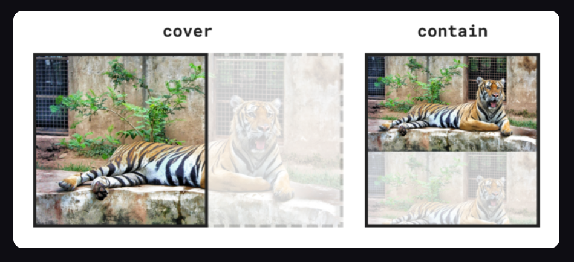

**background-repeat：指定如何重复背景图像**

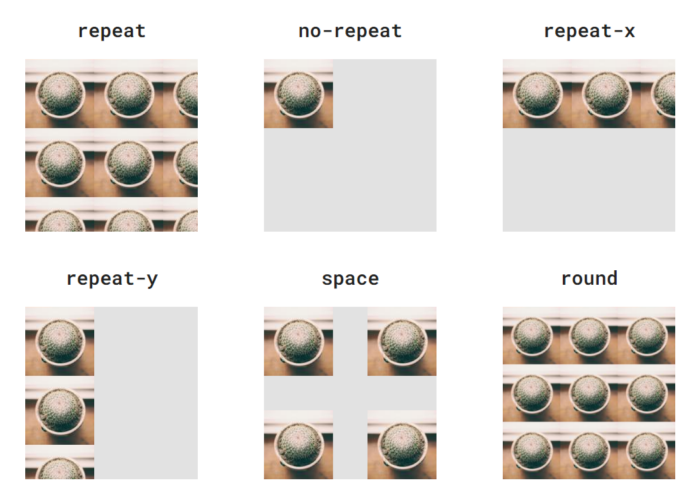

**background-origin：设置背景图像显示的原点**

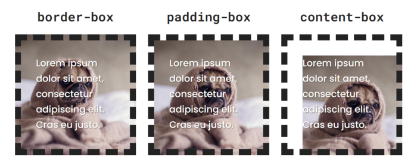

**background-clip：设置背景图像向外剪裁的区域**

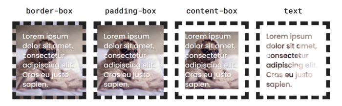

**background-attachment：设置背景图像是否固定或者随着页面的其余部分滚动**

- `background-attachment: fixed` 背景固定
- `background-attachment: scroll` 背景随页面滚动而滚动（默认）

**background-image：指定要使用的一个或多个背景图像**

- 如果属性值比背景图片的个数要少，那么没有对应的值的图片样式以第一个值为准；
- 背景图片的层级按着从左往右，依次减小。当然，层级最低的还是 `background-color`；
- 线性渐变 `background-image: linear-gradient(#fff, #000)` :
- 径向渐变 `background-image: radial-gradient(#fff, #000)` :
- 角向渐变 `background-image: conic-gradient(#fff, #000)` :

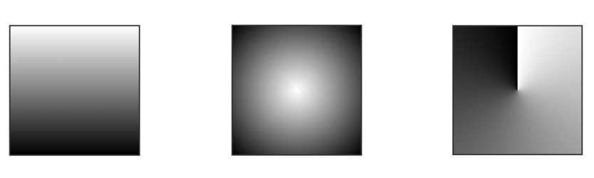

**background-blend-mode：义了背景层的混合模式（图片与颜色）**

todo

https://github.com/chokcoco/iCSS/issues/16     

https://github.com/chokcoco/iCSS/issues/84

## 4、border

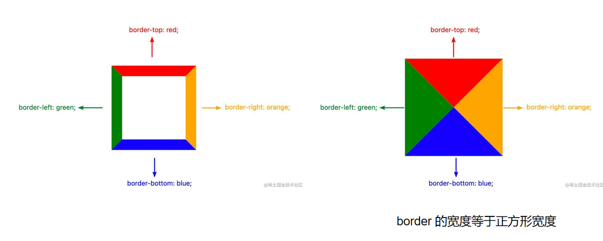

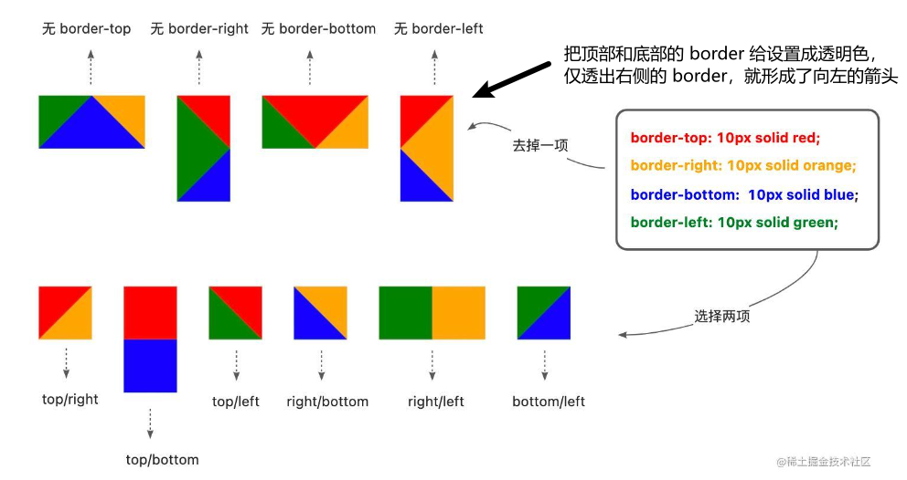

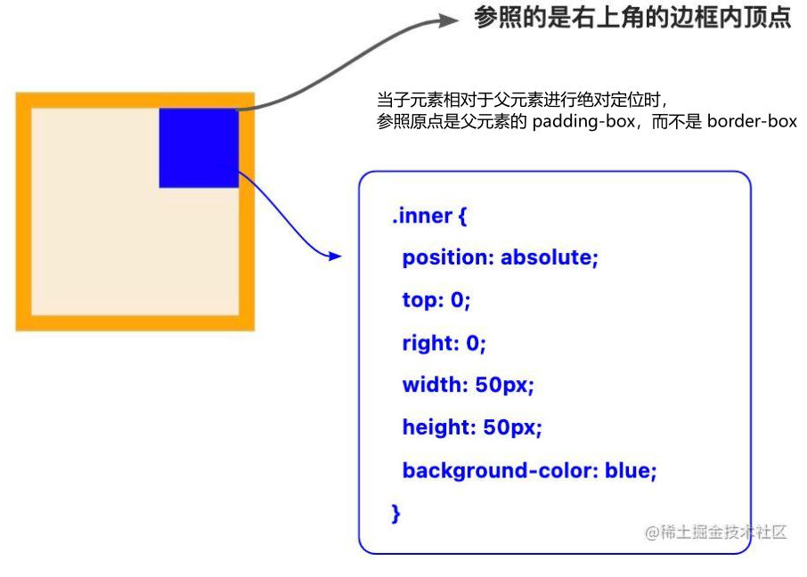

**border**

- border-width：定边框的宽度

- border-style：指定边框的样式

  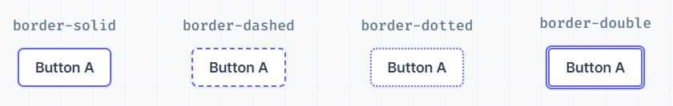

- border-color：指定边框的颜色

- border-bottom border-top border-left border-right

**border-image**

- border-image-source：声明元素的边框图片（border-image）的资源

- border-image-slice：将使用 border-image-source 引用的图像划分为多个区域。这些区域组成了一个元素的边框图像

  

- border-image-width：图像边界的宽度

- border-image-outset：定义边框图像可超出边框盒的大小

- border-image-repeat：用于设置图像边界是否应重复（repeat）、拉伸（stretch）或铺满（round）

**border-radius：设置元素的外边框圆角**

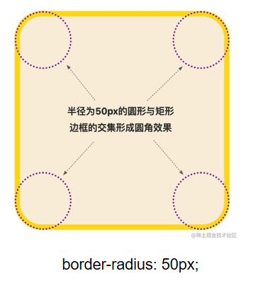

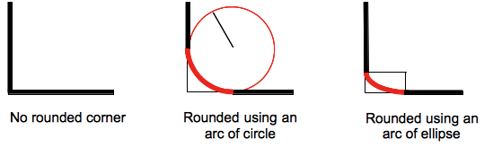

```css
border-radius: 1em/5em;

/* 等价于： */
border-top-left-radius:     1em 5em;
border-top-right-radius:    1em 5em;
border-bottom-right-radius: 1em 5em;
border-bottom-left-radius:  1em 5em;
```

重复

- 1个值表示所有圆角都是这样
- 2个值表示左上和右下按照前一个值，右上和左下按照后一个值
- 3个值表示应用在左上、右上、右下的圆角，而左下的圆角的值等于右上圆角的值

**border-collapse：设置表格的边框是否被合并为一个单一的边框**

**border-spacing：设置相邻单元格的边框间的距离**

## 5、裁剪

### 5.1 overflow

| 值      | 描述                                                         |
| :------ | :----------------------------------------------------------- |
| visible | 默认值。内容不会被修剪，会呈现在元素框之外。                 |
| hidden  | 内容会被修剪，并且其余内容是不可见的。overflow-x: hidden 或者 overflow-y: hidden，表现形式都和 overflow: hidden 一致，是全方位的裁剪。overflow-x/y 设置为 hidden 时, overflow-y/x 会变成 auto, 即使设置为 visible、 |
| clip    | **不会创建 `BFC`**，能够实现一个方向允许溢出，一个方向实现裁剪。 |
| scroll  | 如果需要，内容将被裁减以适应边距（padding）盒。无论是否实际裁剪了任何内容，浏览器总是显示滚动条，以防止滚动条在内容改变时出现或者消失。 |
| auto    | 如果内容被修剪，则浏览器会显示滚动条以便查看其余的内容。     |
| inherit | 规定应该从父元素继承 overflow 属性的值。                     |

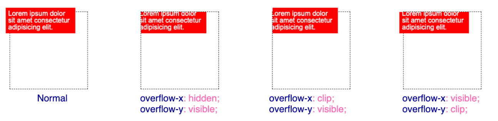

todo

7.2 `clip-path`

7.3 `contain: paint`

https://github.com/chokcoco/iCSS/issues/90

## 6、动画

| 属性               | 含义                                                         |
| ------------------ | ------------------------------------------------------------ |
| animation（动画）  | 用于设置动画属性，他是一个简写的属性，包含6个属性            |
| transition（过渡） | 用于设置元素的样式过度，和animation有着类似的效果，但细节上有很大的不同 |
| transform（变形）  | 用于元素进行旋转、缩放、移动或倾斜，和设置样式的动画并没有什么关系，就相当于color一样用来设置元素的“外表” |
| translate（移动）  | translate只是transform的一个属性值，即移动。                 |

### 3.1 transition

设置元素当过渡效果

transition产生动画的条件是transition设置的property发生变化。

| 值                         | 描述                              |
| -------------------------- | --------------------------------- |
| transition-property        | 规定设置过渡效果的 CSS 属性的名称 |
| transition-duration        | 规定完成过渡效果需要多少秒或毫秒  |
| transition-timing-function | 规定速度效果的速度曲线            |
| transition-delay           | 定义过渡效果何时开始              |

### 3.2 `animation`

`transition`扩展

animation是由多个transition的效果叠加，并且可操作性更强

| 值              | 描述                                                         |
| --------------- | ------------------------------------------------------------ |
| name            | 用来调用@keyframes定义好的动画，与@keyframes定义的动画名称一致 |
| duration        | 指定元素播放动画所持续的时间                                 |
| timing-function | 规定速度效果的速度曲线，是针对每一个小动画所在时间范围的变换速率 |
| delay           | 定义在浏览器开始执行动画之前等待的时间，值整个animation执行之前等待的时间 |
| iteration-count | 定义动画的播放次数，可选具体次数或者无限(infinite)           |
| direction       | 设置动画播放方向：normal(按时间轴顺序),reverse(时间轴反方向运行),alternate(轮流，即来回往复进行),alternate-reverse(动画先反运行再正方向运行，并持续交替运行) |
| play-state      | 控制元素动画的播放状态，通过此来控制动画的暂停和继续，两个值：running(继续)，paused(暂停) |
| fill-mode       | 控制动画结束后，元素的样式，有四个值：none(回到动画没开始时的状态)，forwards(动画结束后动画停留在结束状态)，`backwords`(动画回到第一帧的状态)，both(根据animation-direction轮流应用forwards和backwards规则)，注意与iteration-count不要冲突(动画执行无限次) |

### 3.3 transform

todo https://juejin.cn/post/6844903874579578887

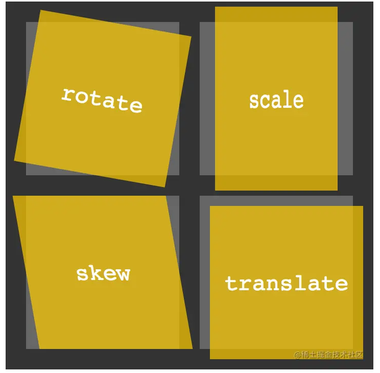

- 移动（translate）
  - translate()
  - translate3d()
  - translateX()
  - translateY()
  - translateZ()
- 缩放（scale）
  - scale()
  - scale3d()
  - scaleX()
  - scaleY()
  - scaleZ()
- 旋转（rotate）
  - rotate()
  - rotate3d()
  - rotateX()
  - rotateY()
  - rotateZ()
- 倾斜（skew）
  - skew()
  - skewX()
  - skewY()
- 矩阵函数
  - matrix()
  - matrix3d()
- 视域函数
  - perspective()


## 7、object-fit

object-fit：对图片进行剪切，保留原始比例：

| 值         | 描述     |
| :--------- | :--------------------------------------------------- |
| fill       | 默认，不保证保持原有的比例，内容拉伸填充整个内容容器。       |
| contain    | 保持原有尺寸比例。内容被缩放。                             |
| cover      | 保持原有尺寸比例。但部分内容可能被剪切。                     |
| none       | 保留原有元素内容的长度和宽度，也就是说内容不会被重置。       |
| scale-down | 保持原有尺寸比例。内容的尺寸与 none 或 contain 中的一个相同，取决于它们两个之间谁得到的对象尺寸会更小一些。 |

object-position：根据容器大小重置图片的大小，并设置图片的位置

| 值         | 描述                                                         |      |
| :--------- | :----------------------------------------------------------- | ---- |
| *position* | 第一个值为 x 坐标位置的值，第二个值为 y 坐标位置的值。表示的方式有：`object-position: 50% 50%; object-position: right top; object-position: left bottom; object-position: 250px 125px;` |      |

## 8、position

absolute：绝对定位，相对于 static 定位以外的第一个父元素进行定位。

fixed：固定定位，相对于浏览器窗口进行定位。

relative：相对定位，相对于其正常位置进行定位。

static：默认值。没有定位，元素出现在正常的流中（忽略 top, bottom, left, right 或者 z-index 声明）。

sticky：粘性定位，该定位基于用户滚动的位置。它的行为就像 `position:relative;` 而当页面滚动超出目标区域时，它的表现就像 `position:fixed;`，它会固定在目标位置。

## 9、@media

媒体类型：描述了设备的类别。媒体类型是可选的，默认是`all`类型。

1. `all` 所有设备上都加载。
2. `print` 在打印预览模式下在屏幕上查看的分页材料和文档中加载。
3. `screen` 电脑屏幕，平板电脑，智能手机等，中加载。
4. `speech` 屏幕阅读器等发声设备中加载。

逻辑运算符

- and 操作符用于将多个媒体查询规则组合成单条媒体查询， 当每个查询规则**都为真**时则该条媒体查询为真。

- only运算符仅在整个查询匹配时才用于应用样式，并且对于防止较早的浏览器应用所选样式很有用。 当不使用only时，旧版本的浏览器会将`screen and (max-width: 500px)`简单地解释为`screen`， 忽略查询的其余部分，并将其样式应用于所有屏幕。 如果使用only运算符，则还**必须指定媒体类型**。

- 逗号用于将多个媒体查询合并为一个规则。 逗号分隔列表中的每个查询都与其他查询分开处理。 因此，如果列表中的任一个查询为true，则整个media语句均返回true。

- not运算符用于否定媒体查询，如果不满足这个条件则返回true，否则返回false。 如果出现在以逗号分隔的查询列表中，它将仅否定应用了该查询的特定查询。 如果使用not运算符，则还**必须指定媒体类型**。

媒体功能：根据属性判断当前使用 `css` 所在的设备，或是浏览环境的具体特征。

1. `height` 输出设备中的页面可见区域高度。
2. `width` 输出设备中的页面可见区域宽度。
3. `max-aspect-ratio` 输出设备的屏幕可见宽度与高度的最大比率。
4. `max-device-aspect-ratio` 输出设备的屏幕可见宽度与高度的最大比率。
5. `max-device-height` 输出设备的屏幕可见的最大高度。
6. `max-device-width` 输出设备的屏幕最大可见宽度。
7. `max-height` 输出设备中的页面最大可见区域高度。
8. `max-width` 输出设备中的页面最大可见区域宽度。
9. `min-height` 输出设备中的页面最小可见区域高度。
10. `min-width` 输出设备中的页面最小可见区域宽度。

```css
/** 多种条件组合：限定媒体类型为 screen，且限定设备可见区域尺寸[320px,480px],且分辨率是每英寸点数为 150 **/
@media only screen
  and (min-width: 320px)
  and (max-width: 480px)
  and (resolution: 150dpi) {
    body { line-height: 1.4; }
}
```


