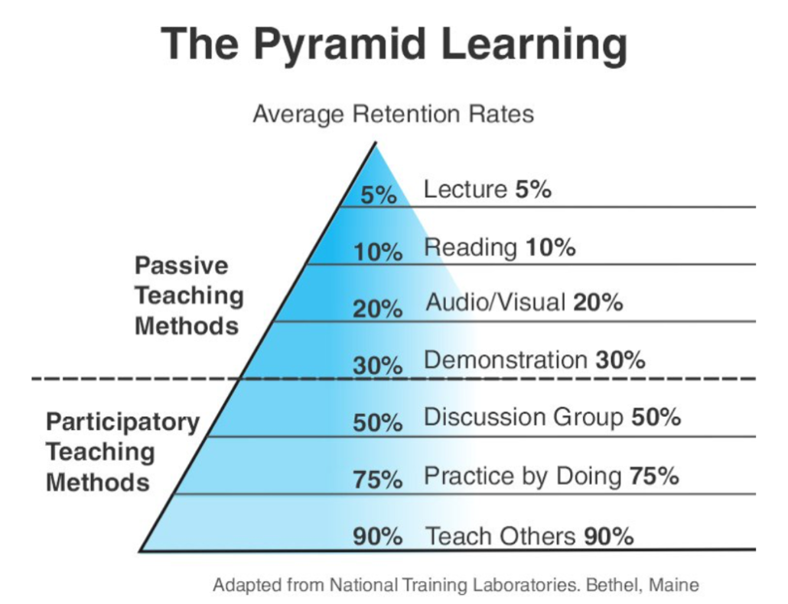

**问题--学习--总结--表达**

## 1 端正学习态度

### 1.1 主动学习和被动学习

人的学习分为「被动学习」和「主动学习」两个层次。

- **被动学习**：如听讲、阅读、视听、演示，学习内容的平均留存率为 5%、10%、20% 和 30%。
- **主动学习**：如通过讨论、实践、教授给他人，会将原来被动学习的内容留存率从 5% 提升到 50%、75% 和 90%。

**所以，学习不是努力读更多的书，盲目追求阅读的速度和数量，这会让人产生低层次的勤奋和成长的感觉，这只是在使蛮力。要思辨，要践行，要总结和归纳，否则，你只是在机械地重复某件事，而不会有质的成长的。**

### 1.2 浅度学习和深度学习

进行深度学习关键。

- **高质量的信息源和第一手的知识**。
- 注重基础和原理
- **把知识连成地图，将自己的理解反述出来**。
- **不断地反思和思辨，与不同年龄段的人讨论**。
- **举一反三，并践行之，把知识转换成技能**。

换言之，学习有三个步骤。

- **知识采集**。信息源是非常重要的，**获取信息源头、破解表面信息的内在本质、多方数据印证**，是这个步骤的关键。
- **知识缝合**。所谓缝合就是把信息组织起来，成为结构体的知识。这里，**连接记忆，逻辑推理，知识梳理**是很重要的三部分。
- **技能转换**。通过**举一反三、实践和练习**，以及**传授教导**，把知识转化成自己的技能。这种技能可以让你进入更高的阶层。

### 1.3 学习观念

学习不仅仅是为了找到答案，而更是为了**找到方法**。学习是为了找到通往答案的路径和方法，是为了拥有无师自通的能力。
学习不仅仅是为了知道，而更是为了**思考和理解**。一旦理解和掌握了这些本质的东西，你就会发现，整个复杂多变的世界在变得越来越简单。你就好像找到了所有问题的最终答案似的，一通百通了。

## 2 深度，归纳和坚持实践

### 2.1 系统地学习

1. **这个技术出现的背景、初衷和要达到什么样的目标或是要解决什么样的问题**。这个问题非常关键，也就是说，你在学习一个技术的时候，需要知道这个技术的成因和目标，也就是这个技术的灵魂。如果不知道这些的话，那么你会看不懂这个技术的一些设计理念。
2. **这个技术的优势和劣势分别是什么，或者说，这个技术的 trade-off 是什么**。任何技术都有其好坏，在解决一个问题的时候，也会带来新的问题。另外，一般来说，任何设计都有 trade-off（要什么和不要什么），所以，你要清楚这个技术的优势和劣势，以及带来的挑战。
3. **这个技术适用的场景**。任何技术都有其适用的场景，离开了这个场景，这个技术可能会有很多槽点，所以学习技术不但要知道这个技术是什么，还要知道其适用的场景。没有任何一个技术是普适的。注意，所谓场景一般分别两个，一个是业务场景，一个是技术场景。
4. **技术的组成部分和关键点**。这是技术的核心思想和核心组件了，也是这个技术的灵魂所在了。学习技术的核心部分是快速掌握的关键。
5. **技术的底层原理和关键实现**。任何一个技术都有其底层的关键基础技术，这些关键技术很有可能也是其它技术的关键基础技术。所以，学习这些关键的基础底层技术，可以让你未来很快地掌握其它技术。可以参看我在 CoolShell 上写的 Docker 底层技术那一系列文章。
6. **已有的实现和它之间的对比**。一般来说，任何一个技术都会有不同的实现，不同的实现都会有不同的侧重。学习不同的实现，可以让你得到不同的想法和思路，对于开阔思维，深入细节是非常重要的。

### 2.2 举一反三

举一反三基本能力

1. **联想能力**。这种能力的锻炼需要你平时就在不停地思考同一个事物的不同的用法，或是联想与之有关的别的事物。对于软件开发和技术学习也一样。
2. **抽象能力**。抽象能力是举一反三的基本技能。平时你解决问题的时候，如果你能对这个问题进行抽象，你就可以获得更多的表现形式。抽象能力需要找到解决问题的通用模型，比如数学就是对现实世界的一种抽象。只要我们能把现实世界的各种问题建立成数据模型（如，建立各种维度的向量），我们就可以用数学来求解，这也是机器学习的本质。
3. **自省能力**。所谓自省能力就是自己找自己的难看。当你得到一个解的时候，要站在自己的对立面来找这个解的漏洞。有点像左右手互博。这种自己和自己辩论的能力又叫思辨能力。将自己分裂成正反方，左右方，甚至多方，站在不同的立场上来和自己辩论，从而做到不漏过一个 case，从而获得完整全面的问题分析能力。

训练

1. 对于一个场景，制造出各种不同的问题或难题。
2. 对于一个问题，努力寻找尽可能多的解，并比较这些解的优劣。
3. 对于一个解，努力寻找各种不同的测试案例，以图让其健壮。

### 2.3 总结和归纳

我们积累的知识越多，在知识间进行联系和区辨的能力就越强，对知识进行总结和归纳也就越轻松。

学习的开始阶段，可以不急于总结归纳，不急于下判断，做结论，而应该保留部分知识的不确定性，保持对知识的开放状态。

把你看到和学习到的信息，归整好，排列好，关联好，总之**把信息碎片给结构化掉**，然后在结构化的信息中，**找到规律**，找到相通之处，找到共同之处，**进行简化、归纳和总结**，最终形成一种套路，一种模式，一种通用方法。

积累的知识越多，在知识间进行联系和区辨的能力越强，总结归纳的能力越强，进而逐渐形成在更高维度上思考问题的能力。

### 2.4 实践出真知 坚持不懈

一方面你要把你的坚持形成成果晒出来，让别人来给你点赞，另一方面，你还要把坚持变成一种习惯，就像吃饭喝水一样，你感觉不到太多的成本付出。只有做到这两点，你才能够真正坚持。

## 3 如何学习和阅读代码

### 3.1 读文档还是读代码

- **代 码 => What, How & Details**
- **文档 / 书 => What, How & Why**

### 3.2 如何阅读源代码

1. **基础知识**。相关的语言和基础技术的知识。
2. **软件功能**。你先要知道这个软件完成的是什么样的功能，有哪些特性，哪些配置项。你先要读一遍用户手册，然后让软件跑起来，自己先用一下感受一下。
3. **相关文档**。读一下相关的内部文档，Readme 也好，Release Notes 也好，Design 也好，Wiki 也好，这些文档可以让你明白整个软件的方方面面。如果你的软件没有文档，那么，你只能指望这个软件的原作者还在，而且他还乐于交流。
4. **代码的组织结构**。也就是代码目录中每个目录是什么样的功能，每个文档是干什么的。如果你要读的程序是在某种标准的框架下组织的，比如：Java 的 Spring 框架，那么恭喜你，这些代码不难读了。

接下来，你要了解这个软件的代码是由哪些部分构成的，我在这里给你一个列表，供你参考。

1. **接口抽象定义**。任何代码都会有很多接口或抽象定义，其描述了代码需要处理的数据结构或者业务实体，以及它们之间的关系，理清楚这些关系是非常重要的。

2. **模块粘合层**。我们的代码有很多都是用来粘合代码的，比如中间件（middleware）、Promises 模式、回调（Callback）、代理委托、依赖注入等。这些代码模块间的粘合技术是非常重要的，因为它们会把本来平铺直述的代码给分裂开来，让你不容易看明白它们的关系。

3. **业务流程**。这是代码运行的过程。一开始，我们不要进入细节，但需要在高层搞清楚整个业务的流程是什么样的，在这个流程中，数据是怎么被传递和处理的。一般来说，我们需要画程序流程图或者时序处理图。

4. 具体实现

   。了解上述的三个方面的内容，相信你对整个代码的框架和逻辑已经有了总体认识。这个时候，你就可以深入细节，开始阅读具体实现的代码了。对于代码的具体实现，一般来说，你需要知道下面一些事实，这样有助于你在阅读代码时找到重点。

   - **代码逻辑**。代码有两种逻辑，一种是业务逻辑，这种逻辑是真正的业务处理逻辑；另一种是控制逻辑，这种逻辑只是用控制程序流转的，不是业务逻辑。比如：flag 之类的控制变量，多线程处理的代码，异步控制的代码，远程通讯的代码，对象序列化反序列化的代码等。这两种逻辑你要分开，很多代码之所以混乱就是把这两种逻辑混在一起了（详情参看《编程范式游记》）。
   - **出错处理**。根据 2：8 原则，20% 的代码是正常的逻辑，80% 的代码是在处理各种错误，所以，你在读代码的时候，完全可以把处理错误的代码全部删除掉，这样就会留下比较干净和简单的正常逻辑的代码。排除干扰因素，可以更高效地读代码。
   - **数据处理**。只要你认真观察，就会发现，我们好多代码就是在那里倒腾数据。比如 DAO、DTO，比如 JSON、XML，这些代码冗长无聊，不是主要逻辑，可以不理。
   - **重要的算法**。一般来说，我们的代码里会有很多重要的算法，我说的并不一定是什么排序或是搜索算法，可能会是一些其它的核心算法，比如一些索引表的算法，全局唯一 ID 的算法，信息推荐的算法、统计算法、通读算法（如 Gossip）等。这些比较核心的算法可能会非常难读，但它们往往是最有技术含量的部分。
   - **底层交互**。有一些代码是和底层系统的交互，一般来说是和操作系统或是 JVM 的交互。因此，读这些代码通常需要一定的底层技术知识，不然，很难读懂。

5. **运行时调试**。很多时候，代码只有运行起来了，才能知道具体发生了什么事，所以，我们让代码运行进来，然后用日志也好，debug 设置断点跟踪也好。实际看一下代码的运行过程，是了解代码的一种很好的方式。

总结一下，阅读代码的方法如下。

- 一般采用自顶向下，从总体到细节的“剥洋葱皮”的读法。
- 画图是必要的，程序流程图，调用时序图，模块组织图……
- 代码逻辑归一下类，排除杂音，主要逻辑才会更清楚。
- debug 跟踪一下代码是了解代码在执行中发生了什么的最好方式。

## 4 面对枯燥和量大的知识

### 4.1 如何面对枯燥的知识

1. 这个知识对于你来说来太高级了，你可能不知道能用在什么地方。
2. 人的认知是从感性认识向理性认识转化的，所以，你可能要先去找一下应用场景，学点更实用的，再回来学理论。
3. 学习需要有反馈，有成就感，**带着相关问题去学习会更好**。
4. 当然，找到牛人来给你讲解，也是一个很不错的手段。

其它几个实用的技巧

1. **用不同的方式来学习同一个东西**。比如：通过看书，听课，创建脑图，写博客，讲课，解决实际问题，等等。
2. **不要被打断**。被打断简直就是学习的天敌，所以，你在学习的时候，最好把手机设置成勿扰模式放在一边，然后把电脑上的所有通知也关掉，最好到一个别人找不到你的地方。
3. **总结压缩信息**。当你获得太多的信息时，你需要有一个“压缩算法”。我常用的压缩算法是只关心关键点，所以，你需要使用表格、图示、笔记或者脑图来帮助你压缩信息。
4. **把未知关联到已知**。把你新学的知识点关联到已知的事物上来。比如，你在学习 Go 语言，你就把一些知识关联到自己已经学过的语言上比如 C 和 Java。通过类比，你会学得更扎实，也会思考得更多。
5. **用教的方式来学习**。你想想，如果你过几天要在公开场合对很多人讲一个技术，那么这个压力会让你学得更好。因为要教给别人，所以，这么高的标准需要你不但要把自己已掌握的东西学好，还要把周边的也一并学了，才可能做到百问不倒。你才敢去教别人，不是么？（试试教 6 岁的孩子编程，如果你掌握了这种技能，那么你一定是把知识吃得非常透彻了。）
6. **学以致用**。把学到的东西用起来，没有什么比用起来能让你的知识更巩固的了。在实践中，你才会有更为真实的体会，你才会遇到非常细节和非常具体的问题，这些都会让你重新思考，或深化学习。
7. **不要记忆**。聪明的人不会记忆知识的，他们会找方法，那些可以推导出知识或答案的方法。这也是为什么外国人特别喜欢方法论。
8. **多犯错误**。犯错会让你学得到更多，通过错误总结教训，你会比没有犯过错的人体会得更深。但是千万不要犯低级错误，也不要同一个错误犯两次。