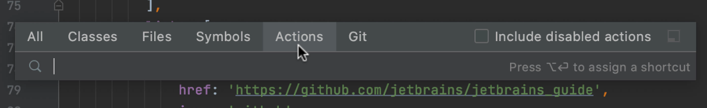
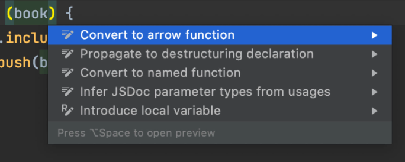
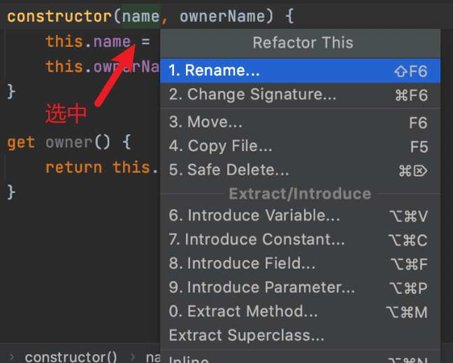

**Search Everywhere: Shift+Shift**

⇧：上下选择**搜索**结果

Tab：左右切换标签

**Show Context Actions: Alt+Enter**

上下箭头：选择**解决方案**

左右箭头：禁止提醒

**`Refactor This`:  `Ctrl+Alt+Shift+T`**

上下箭头：选择**重构**解决方案

Alt+`：VCS Operations：

编辑

Alt+Click：不停用鼠标Click可以不断**选中**

`Ctrl+/`：不用选中也可以**注释**一行，`Ctrl+Shift+/`：则在当前位置插入注释

选中后`Ctrl + Alt + T`：**生成**具有环绕性质的**代码**

`Ctrl + Shift + V`：从之前的剪切或拷贝的代码历史记录中，选择现在需要粘贴的内容

格式化

`Ctrl + Alt + L`：格式化代码

`Ctrl + Alt + I`：按照缩进的设定，自动缩进所选择的代码段

`Tab / Shift + Tab`：缩进或者不缩进一次所选择的代码段

`Ctrl + Enter`：当前代码行与下一行代码之间插入一个空行，原来所在的光标不变

Shift + Enter：当前代码行与下一行代码之间插入一个空行，原来光标现在处于新加的空上

`Ctrl + Shift + U`：所选择的内容进行大小写转换

选中

`Ctrl+W` ：不停按W可以不断**扩展选中**范围：不停按W可以不断**扩展选中**范围

`Ctrl + Shift + ]/[`：从当前光标所在位置开始，一直选择到当前光标所在代码段起始或者结束位置。

`Ctrl + L`：选中行

`Ctrl + M`：删除行

`Ctrl + D`：复制行

`Alt+ Shift + ↓`：移动行

`Ctrl + G`：跳转至某一行代码

查找或替换【Search/Replace】

`Ctrl + Shift + F`：通过路径查找

`Ctrl + Shift + R`：通过路径替换

`Ctrl + Shift + N`：快速搜索文件

 导航【Navigation】

Alt + 右箭头/左箭头：跳到下一个/上一个编辑器标签

`Ctrl + E`：打开曾经操作过的文件历史列表

选中光标所在单词，转到定义，回退，前进，删除行，移动行，快速搜索文件，快速搜索变量，展开代码，递归展开代码，折叠代码，递归折叠代码，转到行，显示提示建议，转到当前打开文件的下一个或上一个文件

Ctrl + T 通过匹配文本打开文件

CTRL + L = 选中当前行

CTRL + R = 切换工作区

Shift + Alt + rightArrow 选中切换

Shift + Alt + upArrow 选中复制

SHIFT + ALT + I = 在所选的每一行的末尾插入光标

Ctrl + Alt + F 格式化

Ctrl + Shift + F  搜索所有文件的文本

Ctrl + Shift + T 重新打开 关闭的编辑页

Ctrl + Shift + P 打开控制面板

箭头（ctrl 移动字母 shift 选中 alt操作）

ctrl + right/leftArrow 光标移动字母

alt + right/leftArrow 切换标签页

alt + up/downArrow 行数据换行

shift + right/leftArrow  往前往后选中一个字母

shift + up/downArrow  向上向下选中数据

ctrl + shift + right/leftArrow  往前往后选中一个单词

shift + alt + rightArrow 选中段落

shift + alt + up/downArrow 复制一行

ctrl + alt + up/downArrow 光标复制

Ctrl + Backspace 删除上一个单词

Ctrl + X 剪切命令删除一行

Ctrl + C 复制一行

Ctrl+V 

Ctrl+Enter 向下插入空白行

Ctrl+Shift+Enter 向上插入空白行

Ctrl + L 选中一行

Ctrl+[	Outdent Line

Ctrl+Shift+[	Fold (collapse) region	
Ctrl+H Replace	