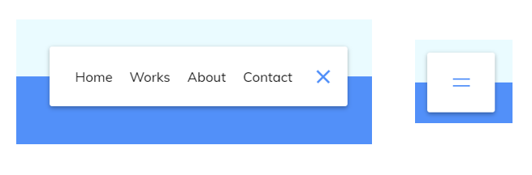

##  01 Expanding Cards


`html`

- 最外层使用`<div class="container">`包裹

`css`

- 需要给图片设置长宽

- `flex: 0;` 默认0 不放大，没有选中`flex: 1;` ，选中`flex: 10;` 

- 没有选中标题透明度是0，选中透明度100

`js`

- `querySelectorAll`：查找所有符合条件的选择器

- `addEventListener`：添加事件

- `classList`

- 点击某个卡片，遍历所有卡片把`active`选择器删除，给点击卡片增加`active`选择器

##  02 Progress Steps


`html`

- 进度条和数字圆圈用`<div>`实现

`css`

- 伪元素`::before`作为底部灰色进度条
- 蓝色进度条一开始`width: 0%;`，点击按钮改变宽度百分比
- 数字圆圈，长宽一样，`border-radius: 50%;`，`flex`布局让数字居中
- 按钮通过`:disabled`伪类给禁用设置颜色

`js`

- `currentActive`记录当前步骤数，点击`next`按钮`currentActive`加一，点击`prev`按钮`currentActive`减一，最后调用`update`
- `update`设置进度条宽度，按钮禁用，给对应数字圆圈加上`active`属性

##  03 Rotating Navigation Animation


`html`

- 顶部图标、侧边导航、正文

`css`

- `container`设置旋转原点为左上角，`.show-nav`属性`transform: rotate(-20deg);`

- 左上角按钮，`.show-nav`旋转`-70deg`，`container`整体旋转了20°了

  

- 导航，`fixed`定位，`transform: translateX(-100%);` 隐藏 ，展示时设置为`0%`；递进效果通过`margin-left`（`translateX`便宜多点隐藏）

`js`

- 给顶部带有`container`属性的 `div`增加/删除`show-nav`属性

## 04 Hidden Search Widget


`html`

- `input`，`button`

`css`

- 按钮一开始根据顶部 `div`的左上角定位，`input`宽度一开始和按钮一样
- 点击按钮后，查询按钮`transform: translateX(200px);`，`input`宽度`200px`

`js`

- 按钮点击时触发给`active`事件，给顶部 `div`增加/删除`active`属性

## 05 Blurry Loading


`html`

- 同级`div`，一个显示背景`bg`，一个显示遮罩层`loading-text`

`css`

- `width:100vw;left: -30px` 左侧会有30px空白

- filter: blur(0px) 周围会有白边，下面四个属性取消白边

  `top: -30px;left: -30px; width: calc(100vw + 60px);height: calc(100vh + 60px);`

`js`

- `let load = 0`，`setInterval`每隔一秒`load++`直到`100`，`loadText.innerHTML`显示`load`的值，并且`loadText`透明度和`bg`的`filter: blur(0px)`随着`load`变化

```js
const scale = (num, in_min, in_max, out_min, out_max) => {
    return ((num - in_min) * (out_max - out_min)) / (in_max - in_min) + out_min
}
```

## 06 Scroll Animation


`html`

- 

`css`

- 

`js`

- 

## 07 Split Landing Page


`html`

- 

`css`

- 

`js`

- 

## 08 Form Wave


`html`

- 

`css`

- 

`js`

- 

## 09 Sound Board


`html`

- 

`css`

- 

`js`

- 

## 10 Dad Jokes


`html`

- 

`css`

- 

`js`

- 

## 11 Event `Keycodes`


`html`

- 

`css`

- 

`js`

- 

## 12 `Faq` Collapse


`html`

- 

`css`

- 

`js`

- 

## 13 Random Choice Picker


`html`

- 

`css`

- 

`js`

- 

## 14 Animated Navigation



`html`

- 

`css`

- 

`js`

- 

## 15 Incrementing Counter


`html`

- 

`css`

- 

`js`

- 

## 16 Drink Water


`html`

- 

`css`

- 

`js`

- 

## 17 Movie `App`


`html`

- 

`css`

- 

`js`

- 

## 18 Background Slider


`html`

- 

`css`

- 

`js`

- 

## 19 Theme Clock


## 20 Button Ripple Effect


## 21 Drag N Drop


## 22 Drawing `App`


## 23 Kinetic Loader


## 24 Content Placeholder


## 25 Sticky `Navbar`


## 26 Double Vertical Slider


## 27 Toast Notification


## 28 `Github` Profiles


## 29 Double Click Heart


## 30 Auto Text Effect


## 31 Password Generator


## 32 Good Cheap Fast


## 33 Notes `App`


## 34 Animated Countdown


## 35 Image Carousel


## 36 `Hoverboard`


## 37 `Pokedex`


## 38 Mobile Tab Navigation


## 39 Password Strength Background


## 40 `3d` Background Boxes


## 41 Verify Account `Ui`


## 42 Live User Filter


## 43 Feedback `Ui` Design


## 44 Custom Range Slider


## 45 `Netflix` Mobile Navigation


## 46 Quiz `App`


## 47 Testimonial Box Switcher


## 48 Random Image Feed


## 49 `Todo` List


## 50 Insect Catch Game

