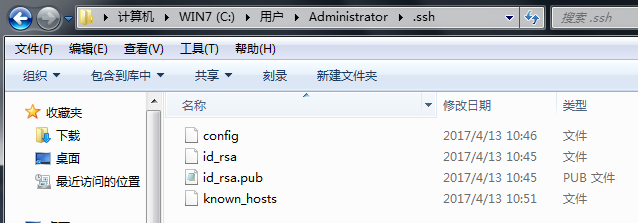
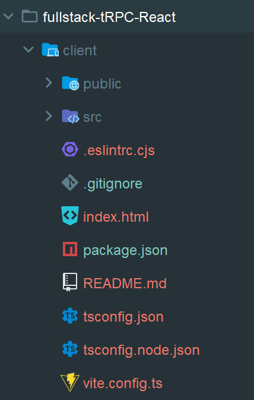

## 1、本地项目与远程仓库

[参考](https://cloud.tencent.com/developer/article/1504684)

**1.1 本地与 `github` 建立连接**

```shell
# 设置用户名和邮箱
$ git config --global user.name "这里是你github的用户名" 
$ git config --global user.email 这里是你注册github的邮箱

# 创建 SSH KEY
$ ssh-keygen -t rsa -C "youremail@example.com"
```



登录 `Github`,找到右上角的图标，打开点进里面的 `Settings`，再选中里面的 `SSH and GPG KEYS`，点击右上角的 `New SSH key`，然后 `Title` 里面随便填，再把刚才 `id_rsa.pub` 里面的内容复制到 `Title`  下面的 `Key`  内容框里面，最后点击 `Add SSH key`，这样就完成了 `SSH Key` 的加密。

**1.2 `github` 新建项目**

```shell
# 新建项目后直接clone到本地
$ git clone 
```

**1.3 本地新建项目**

```shell
# 新建本地项目
$ git init
# 在GitHub上面新建项目，然后本地仓库与远程仓库建立连接
$ git remote add origin https://github.com/guyibang/TEST2.git
```

## 2、创建 `React + Webpack 5` 工程

### 2.1 创建 `JS` 项目

```shell
# 创建并初始化项目
mkdir my-project
cd my-project
npm init -y
mkdir src
cd src
touch index.js
# npm配置
npm config list
npm set init-author-name "<Your Name>"
npm set init-author-email "you@example.com"
npm set init-author-url "https://example.com"
npm set init-license "MIT"
# 运行项目
node src/index.js

# package.json 配置命令
# "scripts": {
#     "start": "node src/index.js"
# },
```

### 2.2 `Backend Setup`

**A 使用 `Nodemon` 实现*热更新***

每次修改源代码时，都必须重新启动脚本。`nodemon` 将监视启动目录中的文件，如果有任何文件更改，`nodemon`将自动重新启动`node`应用程序。

```shell
npm install nodemon --save-dev

# package.json 配置命令
# "scripts": {
#     "start": "nodemon src/index.js"
# },
```

**B 配置 `Node` 项目** 

`Babel` 能在项目中使用 `Node.js` 中尚未引入 `JavaScript` 最新语言功能，例如 `ES` 模块（`Node.js` 使用 `CommonJS` 标准来导入模块）。也可以在 `package.json` 配置 `"type" : "module"` 使用 `ES` 模块。

```shell
npm install @babel/core @babel/node --save-dev
npm install @babel/preset-env --save-dev
# package.json 配置启动命令
# "scripts": {
# 	  "start": "nodemon --exec babel-node src/index.js",
# },

# .babelrc 配置babel
"babel": {
  "presets": [
    "@babel/preset-env"
  ]
},
# or 单独把babel配置抽取出来
touch .babelrc
# {
#   "presets": [
#     "@babel/preset-env"
#   ]
# }

npm install dotenv --save
touch .env
# MY_SECRET=mysupersecretpassword

# index.js
import 'dotenv/config';
console.log('Hello Node.js project.');
console.log(process.env.MY_SECRET);
```

参考：[The minimal Node.js with Babel Setup](https://www.robinwieruch.de/minimal-node-js-babel-setup/)

### 2.3 `Frontend Setup`

- Part 2: [How to set up Webpack 5](https://www.robinwieruch.de/webpack-setup-tutorial/)
- Part 3: [How to set up Webpack 5 with Babel](https://www.robinwieruch.de/webpack-babel-setup-tutorial/)
- Part 4: [How to React with Webpack 5](https://www.robinwieruch.de/minimal-react-webpack-babel-setup/)

**A 创建基础结构**

```shell
# dist、public或build
mkdir dist
cd dist
touch index.html

# src/index.js
# console.log('Hello Webpack Project.');
```

`src` 目录下文件会被打包到 `dist` 目录下，生产使用 `dist`，开发使用 `src` 。

```html
<!DOCTYPE html>
<html>
  <head>
    <title>Hello Webpack</title>
  </head>
  <body>
    <div>
      <h1>Hello Webpack</h1>
    </div>
    <!-- js入口 -->
    <script src="./bundle.js"></script>
  </body>
</html>
```

**B `webpack` 配置**

```shell
npm install --save-dev webpack webpack-dev-server webpack-cli
touch webpack.config.js

# webpack.config.js
const path = require('path');
module.exports = {
  entry: path.resolve(__dirname, './src/index.js'),
  output: {
    path: path.resolve(__dirname, './dist'),
    filename: 'bundle.js',
  },
  devServer: {
    static: path.resolve(__dirname, './dist'),
  },
};

# "start": "webpack serve --config ./webpack.config.js --mode development"
```

**C `babel` 配置**

```shell
npm install --save-dev @babel/core @babel/preset-env
npm install --save-dev babel-loader

# .babelrc 或 package.json 配置 babel，webpack不用修改启动命令

# webpack.config.js
module: {
  rules: [
    {
      test: /\.(js)$/,
      exclude: /node_modules/,
      use: ['babel-loader']
    }
  ]
},
resolve: {
  extensions: ['*', '.js']
},
```

**D `React` 配置**

```shell
npm install --save-dev @babel/preset-react
# 使用react
npm install --save react react-dom

# .babelrc
{
  "presets": [
    "@babel/preset-env",
    "@babel/preset-react"
  ]
}

# webpack.config.js 增加 jsx文件支持
module.exports = {
  module: {
    rules: [
      {
        test: /\.(js|jsx)$/,
        exclude: /node_modules/,
        use: ['babel-loader'],
      },
    ],
  },
  resolve: {
    extensions: ['*', '.js', '.jsx'],
  },
}

# src/index.js中，使用 React
import React from 'react';
import ReactDOM from 'react-dom';
const title = 'React with Webpack and Babel';
ReactDOM.render(
  <div>{title}</div>,
  document.getElementById('app')
);

# dist/index.html 添加挂载点 app
<!DOCTYPE html>
<html>
  <head>
    <title>Hello React</title>
  </head>
  <body>
    <div id="app"></div>
    <script src="./bundle.js"></script>
  </body>
</html>
```

**E 局部热更新**

`webpack-dev-server` 的热加载是修改了代码，代码经过打包，重新刷新了整个页面。而 `react-hot-loader` 不会刷新整个页面，它只替换了修改的代码，做到了页面的局部刷新。但它需要依赖 `webpack` 的 `HotModuleReplacement` 热加载插件。

```shell
npm install --save-dev react-hot-loader

# webpack.config.js 
const webpack = require('webpack');
module.exports = {
  plugins: [new webpack.HotModuleReplacementPlugin()],
  devServer: {
    static: path.resolve(__dirname, './dist'),
    hot: true,
  },
};

# src/index.js 最底部
module.hot.accept();
```

### 2.4 `Fullstack Setup`

**A 创建目录**

```shell
- my-project/
--- client/
--- server/
```

**B server**

**（1）初始化结构目录**

```shell
npm init -y
mkdir src
cd src
touch index.ts
```

**（2）配置 `TS`**

```shell
npm install typescript
npm install ts-node --save-dev
# 创建 tsconfig.json
npm run tsc -- --init

# 使用 tsconfig.json 的配置，把ts编译成js
$ tsc
# 只编译 index.ts
$ tsc index.ts
# 编译 src 目录的所有 .ts 文件
$ tsc src/*.ts

# 创建 index.ts
const sayHello = (subject: string): void => {
  console.log('Hello ' + subject);
};
sayHello('TypeScript');

# Node.js 的执行环境，在Node.js 环境中直接运行TypeScript 代码
npm install ts-node --save-dev
# package.json
"start": "ts-node src/index.ts",
```

(3) 文件配置

```shell
npm install @trpc/server
npm install zod
npm install express cors
npm install @types/express @types/cors --save-dev

# 构建目录
- server/
--- src/
----- index.ts
----- context.ts
----- router.ts
----- trpc.ts
----- user/
------- router.ts
------- types.ts
------- db.ts

# src/user/types.ts
export type User = {
  id: string;
  name: string;
};

# src/user/db.ts 

# src/trpc.ts

# src/context.ts

# src/router.ts

# src/index.ts
```

**C client**

```shell
# 使用 Vite 创建一个带有 TypeScript 的 React 前端应用程序
npm create vite@latest client -- --template react-ts
cd client
npm install
npm run dev
npm install @trpc/client @trpc/server
npm install @tanstack/react-query @trpc/react-query

# src/trpc.ts

# src/App.tsx

# src/main.tsx
```



参考：[Fullstack TypeScript with tRPC and React](https://www.robinwieruch.de/react-trpc/)
