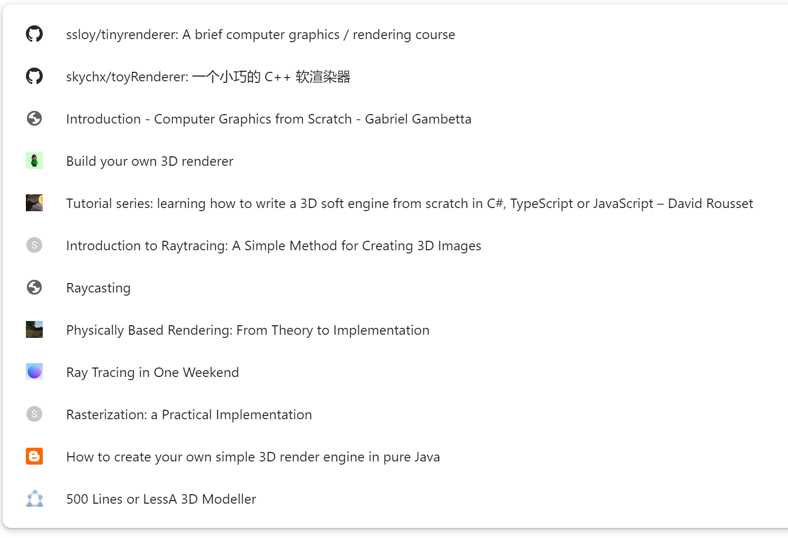

## 1、表格封装


```tsx
import React from 'react';
import { Table } from 'antd';
import { TableProps } from 'antd/lib/table';

// 二次封装
export const MyTable = <RecordType extends object = any>(props: TableProps<RecordType>) => {
  const { ...allProps } = props;
  return (
    <Table<RecordType>
      {...allProps}
    />
  );
};
```

[插件机制](https://github.com/sl1673495/blogs/issues/78)

[useAntdTable](https://github.com/alibaba/hooks/tree/master/packages/hooks/src/useAntdTable)

[usePagination](https://github.com/ant-design/ant-design/blob/master/components/table/hooks/usePagination.ts)

[confirm.tsx 弹窗](https://github.com/ant-design/ant-design/blob/master/components/modal/confirm.tsx)

[调试 Ant Design 源码](https://juejin.cn/post/7158430758070140942?searchId=20231113161149F4179B78B4926A350CA9)

[组件库](https://juejin.cn/post/7120893568553582622?searchId=202311081139129063DD1F9A9B54975F95)

[学习arco table源码遇到的问题](https://juejin.cn/post/7184007462142345272)

## 2、LCP优化

**取消动画**

```css
.ant-checkbox-checked .ant-checkbox-inner::after {
    transition: none;
}

.ant-checkbox-checked::after { 
    animation: none;
}
```

**批量更新，减少 Render 次数**

使用 React 官方提供的 unstable_batchedUpdates 方法，将多次 setState 封装到 unstable_batchedUpdates 回调中

**优化Render 过程**

useMemo、useCallback 实现稳定的 Props 值

**按优先级更新，及时响应用户**


[React性能优化终极指南](https://zhuanlan.zhihu.com/p/365275880)

https://heapdump.cn/article/3587314

https://judes.me/frontend/2019/09/17/infinite-table.html

https://github.com/wubostc/virtualized-table-for-antd/issues

https://juejin.cn/post/7063332320339099678

[自定义antd组件库](https://blog.devgenius.io/ant-design-component-customization-and-bundle-optimization-a1fa3253a175)

https://www.toptal.com/react/optimizing-react-performance

[精读《React 性能调试》](https://zhuanlan.zhihu.com/p/136665404 ) 

[使用JavaScript Profiler面板和静态依赖分析工具](https://developers.weixin.qq.com/community/develop/doc/00082453880b68bbfafd049615ac0d?highLine=%25E6%25B5%25B7%25E4%25B8%25B0%25E5%258E%25BF%25E6%258A%2580%25E5%25B8%2588%25E6%25B3%25A1%25E6%25BE%25A16617%25E2%2592%2590373VX%25E7%259B%25BE%25E4%25B8%258D)

[Performance使用指南前端性能排查](https://pengzhenglong.github.io/2023/03/31/Performance%E4%BD%BF%E7%94%A8%E6%8C%87%E5%8D%97%E5%89%8D%E7%AB%AF%E6%80%A7%E8%83%BD%E6%8E%92%E6%9F%A5/#%E6%80%BB%E7%BB%93)

[useCallback、useMemo 分析 & 差别](https://juejin.cn/post/6844904001998176263#heading-1)

[mono](https://react.dev/reference/react/memo)

## 3、react

[日历](https://github.com/we-del/react-xiaomi-calendar)

[typora](https://github.com/we-del/easy_typora-typora)  https://github.com/imzbf/md-editor-rt/blob/develop/README-CN.md

| 项目名称                                                     | 简介                                 | 类型     |
| ------------------------------------------------------------ | ------------------------------------ | -------- |
| [Create Neat](https://github.com/xun082/create-neat)         | 一个开箱即用的前端脚手架工具         | 开源项目 |
| [在线协同代码编辑器](https://github.com/xun082/online-cooperative-edit) | 一个基于 webrtc 实现的在线协同编辑器 | 开源项目 |

[基于 React + Socket.io 实现简易在线文档协作编辑](https://juejin.cn/post/7218109174085173306)

[**Create React App**](https://create-react-app.dev/) 介绍创建到发布reactApp的流程

[Create Serverless React.js Apps](http://serverless-stack.com/)

[Clone Medium on Node.js and React.js](https://kris101.medium.com/clone-medium-on-node-js-and-react-js-731cdfbb6878)

[How to use Webpack with React: an in-depth tutorial](https://www.freecodecamp.org/news/learn-webpack-for-react-a36d4cac5060)

[How to build your own React boilerplate](https://www.freecodecamp.org/news/how-to-build-your-own-react-boilerplate-2f8cbbeb9b3f)

[Build A Chat App With Sentiment Analysis Using Next.js](https://codeburst.io/build-a-chat-app-with-sentiment-analysis-using-next-js-c43ebf3ea643)

[Build an Appointment Scheduler Using React, Twilio and Cosmic JS](https://hackernoon.com/build-an-appointment-scheduler-using-react-twilio-and-cosmic-js-95377f6d1040)

hook库开发 https://blog.csdn.net/PingMinWangZi/article/details/120237564

ahooks 源码 https://gpingfeng.github.io/ahooks-analysis/hooks/scene/use-antd-table

## 4、UI/UX

[UI / UX Design 专项课程](https://www.coursera.org/specializations/ui-ux-design?utm_source=gg&utm_medium=sem&utm_campaign=34-UI-UX-Design-US&utm_content=34-UI-UX-Design-US&campaignid=12471995734&adgroupid=119387383195&device=c&keyword=ux%20design%20course%20online&matchtype=b&network=g&devicemodel=&adpostion=&creativeid=502676126357&hide_mobile_promo&gclid=Cj0KCQjw5PGFBhC2ARIsAIFIMNeM4c4_BbPo7y9RXEo1Q9eIzs-wklg_9V7TzTich-K5atWWRUUr414aAjTKEALw_wcB)

[下载地址](https://cowtransfer.com/s/6d142bc45a5d46) 提取码：823602

1. Visual Elements of User Interface Design
2. UX Design Fundamentals
3. Web Design: Strategy and Information Architecture
4. Web Design: Wireframes to Prototypes

课程一二重理论，课程三四以大项目为主干，大项目是设计一个外卖餐馆的网站。

如果你是其他领域转UX，不知道从何入手，这里有一些在线课程可以看看：

https://www.linkedin.com/learning/paths/become-a-user-experience-designer

https://www.invisionapp.com/ecourses/principles-of-ux-design

https://www.figma.com/resources/learn-design/

https://www.coursera.org/learn/user-experience-design

https://www.udacity.com/course/product-design--ud509

## 5、webGL



WebGL上车指南 https://juejin.cn/column/7228476145385439269

## 6、CICD

实战前端发布平台，打开CICD黑盒 https://juejin.cn/column/7139729877112422414


微前端博客，可以在线用typore写协同文章

博客系统的**[博客展示页面](https://github.com/lzxjack/react-blog)**，**后台管理页面**仓库见[「react-blog-admin」](https://github.com/lzxjack/react-blog-admin)。

技术栈 Vue3 + ts + element-plus [前端](https://www.liuzepeng.com/) [](https://www.liuzepeng.com/)  [后台管理系统](https://www.liuzepeng.com/admin) 
