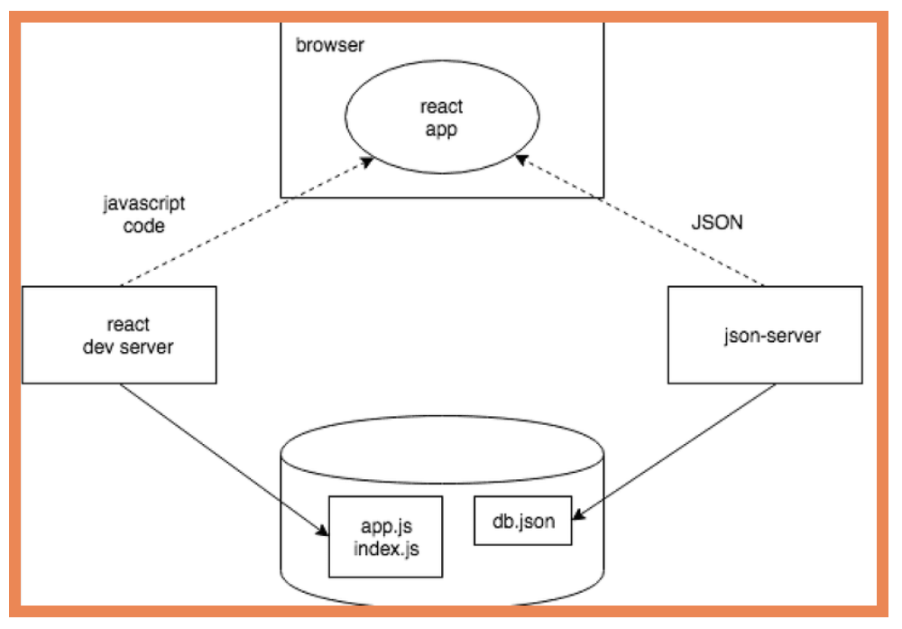

## Part 0

在AJAX时代之前，页面上显示的所有数据都是通过服务器生成的HTML代码获取的。

AJAX能够使用包含在HTML中的JavaScript来获取网页内容，而不需要重新渲染网页。

## Part 1

### a React 简介

JSX

### b JavaScript

在使用React时，经常使用函数式编程的技术。函数式编程范式的一个特点是使用[不可变的](https://en.wikipedia.org/wiki/Immutable_object)数据结构。在React代码中，最好使用[concat](https://developer.mozilla.org/en-US/docs/Web/JavaScript/Reference/Global_Objects/Array/concat)方法，该方法不会将项目添加到数组中，而是创建一个新的数组，其中同时包含旧数组和新项目的内容。

### c 组件状态，事件处理

```tsx
// App.js
import { useState } from 'react'

const App = () => {
  const [ counter, setCounter ] = useState(0)

  setTimeout(
    // 当修改状态的函数setCounter被调用时，React重新渲染组件，这意味着组件函数的函数体被重新执行
    () => setCounter(counter + 1), // 重新执行App()
    1000
  )

  return (
    <div>{counter}</div>
  )
}

export default App
```

### d 深入React 应用调试

注意点

- 禁止直接改变状态(useState)

- Do not define components inside another component

调试

- `console.log('props value is', props)`

- 在代码的任何地方写下[debugger](https://developer.mozilla.org/en-US/docs/Web/JavaScript/Reference/Statements/debugger)命令

- 在*Sources*标签中添加断点来访问调试器

**Function that returns a function**

```tsx
const App = () => {
  const [value, setValue] = useState(10)

  const hello = (who) => { // 工厂模式
    const handler = () => {
      console.log('hello', who)
    }
    return handler
  }

  return (
    <div>
      {value}
      <button onClick={hello('world')}>button</button> <!-- 当组件被渲染时，下面的函数被执行 -->
      <button onClick={hello('react')}>button</button>
      <button onClick={hello('function')}>button</button>
    </div>
  )
}
```

## Part 2

### a 从渲染集合到模块学习

todo [JavaScript中的函数式编程](https://www.youtube.com/playlist?list=PL0zVEGEvSaeEd9hlmCXrk5yUyqUag-n84)的前三部分

`console.log('props value is', props)`

### b 表单

1. Controlled component

   ```jsx
   import { useState } from 'react'
   const App = (props) => {
     const [notes, setNotes] = useState(props.notes)
     const [newNote, setNewNote] = useState('')
   
     const addNote = (event) => {
       event.preventDefault()
       const noteObject = {
         content: newNote,
         important: Math.random() > 0.5,
         id: notes.length + 1,
       }
   
       setNotes(notes.concat(noteObject))
       setNewNote('')
     }
   
     const handleNoteChange = (event) => {
       console.log(event.target.value)
       setNewNote(event.target.value)
     }
     
     return (
       <div>
         <form onSubmit={addNote}>
           <input value={newNote} onChange={handleNoteChange} />
           <button type="submit">save</button>
         </form>
       </div>
     )
   }
   ```

2. Filtering Displayed Elements

   ```jsx
   const App = (props) => {
     const [showAll, setShowAll] = useState(false)
     const notesToShow = showAll
       ? notes
       : notes.filter(note => note.important)
   
     return (
       <div>
         <div>
           <button onClick={() => setShowAll(!showAll)}>
             show {showAll ? 'important' : 'all' }
           </button>
         </div> 
         <ul>
           <ul>
             {notesToShow.map(note => 
               <Note key={note.id} note={note} />
             )}
           </ul>
         </ul>
       </div>
     )
   }  
   ```

### c 从服务器获取数据

1. The browser as a runtime environment

   todo [事件循环到底是什么？](https://www.youtube.com/watch?v=8aGhZQkoFbQ)

   - 在项目的根目录下创建一个名为`db.json`的文件

   - 安装`json-server`

     `json-server`是一个方便的工具，它能够在开发阶段使用服务器端的功能，而不需要对其进行任何编程

     [fetch](https://developer.mozilla.org/en-US/docs/Web/API/WindowOrWorkerGlobalScope/fetch)基于[promises](https://developer.mozilla.org/en-US/docs/Web/JavaScript/Reference/Global_Objects/Promise)，XHR使用的事件驱动模型

   - 启动服务

     `npx json-server --port 3001 --watch db.json`

   - 不再推荐使用XHR，浏览器已经广泛支持[fetch](https://developer.mozilla.org/en-US/docs/Web/API/WindowOrWorkerGlobalScope/fetch)方法，该方法基于所谓的[promises](https://developer.mozilla.org/en-US/docs/Web/JavaScript/Reference/Global_Objects/Promise)，而不是XHR使用的事件驱动模型。

2. npm

   ```
   npm install axios
   npm install json-server --save-dev // 被安装为开发依赖项
   
   "scripts": {
   	"server": "json-server -p3001 --watch db.json"
   },
   ```

3. Axios and promises

   为了同时运行json-server和你的react应用，你可能需要使用两个终端窗口。一个用于保持 json-server 运行，另一个用于运行 react-app。

4. Effect-hooks

   

5. The development runtime environment

   


```
render 0 notes // 定义该组件的函数主体被执行，该组件被首次渲染
effect
promise fulfilled
render 3 notes // 对状态更新函数的调用会触发组件的重新渲染
```



### d 在服务端将数据Alert出来

REST

封装请求

### e 给React应用加点样式


## Part 3

### a Node.js 与 Express

1. Simple web server

   - 在目录下运行`npm init`初始化项目，会创建`package.json`文件

   - 在项目的根部添加一个 `index.js` 文件，要运行项目可以在命令行使用`node index.js`

   - 为了方便后续运行，修改`package.json`的`scripts`对象，增加`"start": "node index.js"`属性。后续在命令行中使用 `npm run start` (**可简写`npm start`**)启动项目

     

   - 使用`http`模块响应请求

      ```js
      const http = require('http')
      let notes = [...]
      const app = http.createServer((request, response) => {
        response.writeHead(200, { 'Content-Type': 'application/json' })
        response.end(JSON.stringify(notes))
      })
      const PORT = 3001
      app.listen(PORT)
      console.log(`Server running on port ${PORT}`)
      ```

      **JSON 是一个字符串**

      

      todo

      浏览器中运行的代码都使用 ES6 模块。模块用 [export](https://developer.mozilla.org/en-US/docs/Web/JavaScript/Reference/Statements/export) 来定义，用 [import](https://developer.mozilla.org/en-US/docs/Web/JavaScript/Reference/Statements/import) 来使用。Node.js 使用 [CommonJS](https://en.wikipedia.org/wiki/CommonJS) 模块。

2. **express**

   浏览器通常不支持 JavaScript 的最新功能，在浏览器中运行的代码必须用例如 babel 进行 转写 。

   **最新版本的 Node 支持 JavaScript 的绝大部分最新特性**。

   ```js
   const express = require('express')
   const app = express()
   
   let notes = [...]
   
   // request包含 HTTP 请求的所有信息，response定义如何对请求进行响应
   app.get('/', (request, response) => {
     response.send('<h1>Hello World!</h1>')
   })
   
   app.get('/api/notes', (request, response) => {
     response.json(notes)
   })
   
   const PORT = 3001
   app.listen(PORT, () => {
     console.log(`Server running on port ${PORT}`)
   })
   ```

3. **nodemon**

   现在对应用代码的修改会导致服务器自动重新启动。即使后端服务器自动重启，浏览器仍然需要手动刷新，因为没有自动重新加载浏览器所需的 [hot reload](https://gaearon.github.io/react-hot-loader/getstarted/) 功能。

   在脚本中不需要指定 `nodemon` 的 `node/modules/.bin/nodemon` 路径，因为 `npm` 自动知道从该目录中搜索该文件。

4. REST

   | URL      | verb   | functionality                                                |
   | :------- | :----- | :----------------------------------------------------------- |
   | notes/10 | GET    | fetches a single resource                                    |
   | notes    | GET    | fetches all resources in the collection                      |
   | notes    | POST   | creates a new resource based on the request data             |
   | notes/10 | DELETE | removes the identified resource                              |
   | notes/10 | PUT    | replaces the entire identified resource with the request data |
   | notes/10 | PATCH  | replaces a part of the identified resource with the request data |

   todo Richardson 成熟度模型中的 [RESTful 成熟度第二层次](https://martinfowler.com/articles/richardsonMaturityModel.html)

5. Fetching a single resource

   ```js
   app.get('/api/notes/:id', (request, response) => {
     const id = Number(request.params.id)
     const note = notes.find(note => note.id === id)
     if (note) {
       response.json(note)
     } else {
       // 使用 status 方法来设置状态，并使用 end 方法来响应请求，而不发送任何数据。
       response.status(404).end()
     }
   })
   ```

6. Deleting resources

   ```js
   app.delete('/api/notes/:id', (request, response) => {
     const id = Number(request.params.id)
     notes = notes.filter(note => note.id !== id)
     response.status(204).end()
   })
   ```

7. Postman

   

   The Visual Studio Code REST client

   

   The WebStorm HTTP Client：HTTP请求存储在.http和.rest文件中

8. Receiving data

   ```js
   app.use(express.json()) // 将请求的 JSON 数据转化为 JavaScript 对象
   
   const generateId = () => {
     const maxId = notes.length > 0
       ? Math.max(...notes.map(n => n.id)) // 找到当前最大id
       : 0
     return maxId + 1
   }
   
   app.post('/api/notes', (request, response) => {
     const body = request.body
     if (!body.content) {
       return response.status(400).json({
         error: 'content missing'
       })
     }
     const note = {
       content: body.content,
       important: body.important || false,
       date: new Date(),
       id: generateId(),
     }
     notes = notes.concat(note)
     response.json(note)
   })
   ```

9. Middleware

   ```js
   const requestLogger = (request, response, next) => {
     console.log('Method:', request.method)
     console.log('Path:  ', request.path)
     console.log('Body:  ', request.body)
     console.log('---')
     next() // 将控制权交给下一个中间件
   }
   
   // 中间件函数的调用顺序是它们被 Express 服务器对象的 use 方法所使用的顺序
   app.use(express.json())
   app.use(requestLogger)
   ```

   todo

   [中间件](http://expressjs.com/en/guide/using-middleware.html)

### b 把应用部署到网上

1. Same origin policy and CORS

   

2. Application to the Internet

   

3. Frontend production build

   

4. Serving static files from the backend

   

5. The whole app to interne

   

6. Streamlining deploying of the frontend

   

7. Proxy

   

8. 1

### c 将数据存入MongoDB

todo [使用](https://tenderlovemaking.com/2016/02/05/i-am-a-puts-debuggerer.html)这种[方法](https://swizec.com/blog/javascript-debugging-slightly-beyond-consolelog/)

### d ESLint与代码检查

