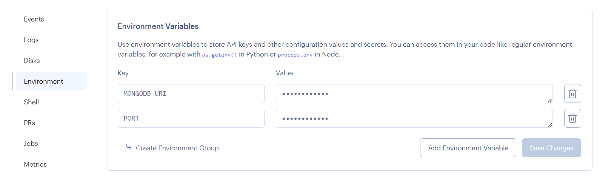

## Part 0

在AJAX时代之前，页面上显示的所有数据都是通过服务器生成的HTML代码获取的。

AJAX能够使用包含在HTML中的JavaScript来获取网页内容，而不需要重新渲染网页。

## Part 1

### a React 简介

JSX

todo [Ajax](https://developer.mozilla.org/en-US/docs/Web/Guide/AJAX)

### b JavaScript

在使用React时，经常使用函数式编程的技术。函数式编程范式的一个特点是使用[不可变的](https://en.wikipedia.org/wiki/Immutable_object)数据结构。在React代码中，最好使用[concat](https://developer.mozilla.org/en-US/docs/Web/JavaScript/Reference/Global_Objects/Array/concat)方法，该方法不会将项目添加到数组中，而是创建一个新的数组，其中同时包含旧数组和新项目的内容。

### c 组件状态，事件处理

```tsx
// App.js
import { useState } from 'react'

const App = () => {
  const [ counter, setCounter ] = useState(0)

  setTimeout(
    // 当修改状态的函数setCounter被调用时，React重新渲染组件，这意味着组件函数的函数体被重新执行
    () => setCounter(counter + 1), // 重新执行App()
    1000
  )

  return (
    <div>{counter}</div>
  )
}

export default App
```

### d 深入React 应用调试

注意点

- 禁止直接改变状态(useState)

- Do not define components inside another component

调试

- `console.log('props value is', props)`

- 在代码的任何地方写下[debugger](https://developer.mozilla.org/en-US/docs/Web/JavaScript/Reference/Statements/debugger)命令

- 在*Sources*标签中添加断点来访问调试器

**Function that returns a function**

```tsx
const App = () => {
  const [value, setValue] = useState(10)

  const hello = (who) => { // 工厂模式
    const handler = () => {
      console.log('hello', who)
    }
    return handler
  }

  return (
    <div>
      {value}
      <button onClick={hello('world')}>button</button> <!-- 当组件被渲染时，下面的函数被执行 -->
      <button onClick={hello('react')}>button</button>
      <button onClick={hello('function')}>button</button>
    </div>
  )
}
```

## Part 2

### a 从渲染集合到模块学习

todo [JavaScript中的函数式编程](https://www.youtube.com/playlist?list=PL0zVEGEvSaeEd9hlmCXrk5yUyqUag-n84)的前三部分

`console.log('props value is', props)`

### b 表单

1. Controlled component

   ```jsx
   import { useState } from 'react'
   const App = (props) => {
     const [notes, setNotes] = useState(props.notes)
     const [newNote, setNewNote] = useState('')
   
     const addNote = (event) => {
       event.preventDefault()
       const noteObject = {
         content: newNote,
         important: Math.random() > 0.5,
         id: notes.length + 1,
       }
   
       setNotes(notes.concat(noteObject))
       setNewNote('')
     }
   
     const handleNoteChange = (event) => {
       console.log(event.target.value)
       setNewNote(event.target.value)
     }
     
     return (
       <div>
         <form onSubmit={addNote}>
           <input value={newNote} onChange={handleNoteChange} />
           <button type="submit">save</button>
         </form>
       </div>
     )
   }
   ```

2. Filtering Displayed Elements

   ```jsx
   const App = (props) => {
     const [showAll, setShowAll] = useState(false)
     const notesToShow = showAll
       ? notes
       : notes.filter(note => note.important)
   
     return (
       <div>
         <div>
           <button onClick={() => setShowAll(!showAll)}>
             show {showAll ? 'important' : 'all' }
           </button>
         </div> 
         <ul>
           <ul>
             {notesToShow.map(note => 
               <Note key={note.id} note={note} />
             )}
           </ul>
         </ul>
       </div>
     )
   }  
   ```

### c 从服务器获取数据

1. The browser as a runtime environment

   todo [事件循环到底是什么？](https://www.youtube.com/watch?v=8aGhZQkoFbQ)

   - 在项目的根目录下创建一个名为`db.json`的文件

   - 安装`json-server`

     `json-server`是一个方便的工具，它能够在开发阶段使用服务器端的功能，而不需要对其进行任何编程

     [fetch](https://developer.mozilla.org/en-US/docs/Web/API/WindowOrWorkerGlobalScope/fetch)基于[promises](https://developer.mozilla.org/en-US/docs/Web/JavaScript/Reference/Global_Objects/Promise)，XHR使用的事件驱动模型

   - 启动服务

     `npx json-server --port 3001 --watch db.json`

   - 不再推荐使用XHR，浏览器已经广泛支持[fetch](https://developer.mozilla.org/en-US/docs/Web/API/WindowOrWorkerGlobalScope/fetch)方法，该方法基于所谓的[promises](https://developer.mozilla.org/en-US/docs/Web/JavaScript/Reference/Global_Objects/Promise)，而不是XHR使用的事件驱动模型。

2. Axios and promises

   为了同时运行json-server和你的react应用，你可能需要使用两个终端窗口。一个用于保持 json-server 运行，另一个用于运行 react-app。

   ```
   npm install axios
   npm install json-server --save-dev // 被安装为开发依赖项
   
   "scripts": {
   	"server": "json-server -p3001 --watch db.json"
   },
   ```

3. Effect-hooks

   ```js
   import { useState, useEffect } from 'react'
   import axios from 'axios'
   import Note from './components/Note'
   
   const App = () => {
     const [notes, setNotes] = useState([])
     const [newNote, setNewNote] = useState('')
     const [showAll, setShowAll] = useState(true)
   
     useEffect(() => {
       console.log('effect')
       axios
         .get('http://localhost:3001/notes')
         .then(response => {
           console.log('promise fulfilled')
           setNotes(response.data)
         })
     }, [])
     console.log('render', notes.length, 'notes')
   
     // ...
   }
   
   // render 0 notes // 定义该组件的函数主体被执行，该组件被首次渲染
   // effect
   // promise fulfilled
   // render 3 notes // 对状态更新函数的调用会触发组件的重新渲染
   ```

### d 在服务端将数据Alert出来

1. Sending Data to the Server

   ```js
   addNote = event => {
     event.preventDefault()
     const noteObject = {
       content: newNote,
       date: new Date(),
       important: Math.random() > 0.5,
     }
   
     // 在POST请求中发送的数据是一个JavaScript对象，axios自动知道为Content-Type头设置适当的application/json值
     axios
       .post('http://localhost:3001/notes', noteObject) // 把数据传到后台
       .then(response => {
         setNotes(notes.concat(response.data)) // 使用后台返回数据
         setNewNote('')
       })
   }
   ```

2. Changing the Importance of Notes

   在POST请求中发送的数据是一个JavaScript对象，axios自动知道为*Content-Type*头设置适当的*application/json*值

   ```js
   // App.js
   const toggleImportanceOf = id => {
     const url = `http://localhost:3001/notes/${id}`
     const note = notes.find(n => n.id === id)
     const changedNote = { ...note, important: !note.important }
   
     axios.put(url, changedNote).then(response => {
       setNotes(notes.map(note => note.id !== id ? note : response.data))
     })
   }
   
   // Note.js
   const Note = ({ note, toggleImportance }) => {
     const label = note.important
       ? 'make not important' : 'make important'
   
     return (
       <li>
         {note.content}
         <button onClick={toggleImportance}>{label}</button>
       </li>
     )
   }
   ```

3. Extracting Communication with the Backend into a Separate Module

   [单一责任原则](https://en.wikipedia.org/wiki/Single_responsibility_principle)，将这种通信提取到[模块](https://fullstackopen.com/en/part2/rendering_a_collection_modules#refactoring-modules)

   ```js
   // src/services/notes.js
   import axios from 'axios'
   const baseUrl = 'http://localhost:3001/notes'
   
   const getAll = () => {
     const request = axios.get(baseUrl)
     return request.then(response => response.data)
   }
   
   const create = newObject => {
     const request = axios.post(baseUrl, newObject)
     return request.then(response => response.data)
   }
   
   const update = (id, newObject) => {
     const request = axios.put(`${baseUrl}/${id}`, newObject)
     return request.then(response => response.data)
   }
   
   export default { getAll, create, update }
   ```

## Part 3

### a Node.js 与 Express

1. Simple web server

   - 在目录下运行`npm init`初始化项目，会创建`package.json`文件


   - 在项目的根部添加一个 `index.js` 文件，要运行项目可以在命令行使用`node index.js`


   - 为了方便后续运行，修改`package.json`的`scripts`对象，增加`"start": "node index.js"`属性。后续在命令行中使用 `npm run start` (**可简写`npm start`**)启动项目

     


   - 使用`http`模块响应请求

      ```js
      const http = require('http')
      let notes = [...]
      const app = http.createServer((request, response) => {
        response.writeHead(200, { 'Content-Type': 'application/json' })
        response.end(JSON.stringify(notes))
      })
      const PORT = 3001
      app.listen(PORT)
      console.log(`Server running on port ${PORT}`)
      ```

      **JSON 是一个字符串**

      

      todo

      浏览器中运行的代码都使用 ES6 模块。模块用 [export](https://developer.mozilla.org/en-US/docs/Web/JavaScript/Reference/Statements/export) 来定义，用 [import](https://developer.mozilla.org/en-US/docs/Web/JavaScript/Reference/Statements/import) 来使用。Node.js 使用 [CommonJS](https://en.wikipedia.org/wiki/CommonJS) 模块。

2. **express**

   浏览器通常不支持 JavaScript 的最新功能，在浏览器中运行的代码必须用例如 babel 进行 转写 。

   最新版本的 Node 支持 JavaScript 的绝大部分最新特性**。

```js
const express = require('express')
const app = express()

let notes = [...]

// request包含 HTTP 请求的所有信息，response定义如何对请求进行响应
app.get('/', (request, response) => {
  response.send('<h1>Hello World!</h1>')
})

app.get('/api/notes', (request, response) => {
  response.json(notes)
})

const PORT = 3001
app.listen(PORT, () => {
  console.log(`Server running on port ${PORT}`)
})
```

3. **nodemon**

   现在对应用代码的修改会导致服务器自动重新启动。即使后端服务器自动重启，浏览器仍然需要手动刷新，因为没有自动重新加载浏览器所需的 [hot reload](https://gaearon.github.io/react-hot-loader/getstarted/) 功能。

   在脚本中不需要指定 `nodemon` 的 `node/modules/.bin/nodemon` 路径，因为 `npm` 自动知道从该目录中搜索该文件。

4. REST

| URL      | verb   | functionality                                                |
| :------- | :----- | :----------------------------------------------------------- |
| notes/10 | GET    | fetches a single resource                                    |
| notes    | GET    | fetches all resources in the collection                      |
| notes    | POST   | creates a new resource based on the request data             |
| notes/10 | DELETE | removes the identified resource                              |
| notes/10 | PUT    | replaces the entire identified resource with the request data |
| notes/10 | PATCH  | replaces a part of the identified resource with the request data |

​	todo Richardson 成熟度模型中的 [RESTful 成熟度第二层次](https://martinfowler.com/articles/richardsonMaturityModel.html)

5. Fetching a single resource

```js
app.get('/api/notes/:id', (request, response) => {
  const id = Number(request.params.id)
  const note = notes.find(note => note.id === id)
  if (note) {
    response.json(note)
  } else {
    // 使用 status 方法来设置状态，并使用 end 方法来响应请求，而不发送任何数据。
    response.status(404).end()
  }
})
```

6. Deleting resources

```js
app.delete('/api/notes/:id', (request, response) => {
  const id = Number(request.params.id)
  notes = notes.filter(note => note.id !== id)
  response.status(204).end()
})
```

7. Postman


8. The Visual Studio Code REST client


​	The WebStorm HTTP Client：HTTP请求存储在.http和.rest文件中

9. Receiving data

```js
app.use(express.json()) // 将请求的 JSON 数据转化为 JavaScript 对象

const generateId = () => {
  const maxId = notes.length > 0
    ? Math.max(...notes.map(n => n.id)) // 找到当前最大id
    : 0
  return maxId + 1
}

app.post('/api/notes', (request, response) => {
  const body = request.body
  if (!body.content) {
    return response.status(400).json({
      error: 'content missing'
    })
  }
  const note = {
    content: body.content,
    important: body.important || false,
    date: new Date(),
    id: generateId(),
  }
  notes = notes.concat(note)
  response.json(note)
})
```

10. Middleware

*中间件*函数能够访问[请求对象](https://expressjs.com/zh-cn/4x/api.html#req) (`req`)、[响应对象](https://expressjs.com/zh-cn/4x/api.html#res) (`res`) 以及应用程序的请求/响应循环中的下一个中间件函数。下一个中间件函数通常由名为 `next` 的变量来表示。

如果当前中间件函数没有结束请求/响应循环，那么它必须调用 `next()`，以将控制权传递给下一个中间件函数。否则，请求将保持挂起状态。

中间件执行顺序和代码中app.use顺序有关。

- 应用层中间件

  使用 `app.use()` 和 `app.METHOD()` 函数将应用层中间件绑定到[应用程序对象](https://expressjs.com/zh-cn/4x/api.html#app)的实例，其中 `METHOD` 是中间件函数处理的请求的小写 HTTP 方法（例如 GET、PUT 或 POST）

  ```js
  var app = express();
  app.use('/user/:id', function (req, res, next) {
    console.log('Request Type:', req.method);
    next();
  });
  app.get('/user/:id', function (req, res, next) {
    res.end(req.params.id);
  });
  ```

- 路由器层中间件

  绑定到 `express.Router()` 的实例

  ```js
  var app = express();
  var router = express.Router();
  
  // a middleware function with no mount path. This code is executed for every request to the router
  router.use(function (req, res, next) {
    console.log('Time:', Date.now());
    next();
  });
  ```

- 错误处理中间件

  错误处理函数有四个自变量而不是三个，专门具有特征符 `(err, req, res, next)`

- 内置中间件

- 第三方中间件

```js
const requestLogger = (request, response, next) => {
  console.log('Method:', request.method)
  console.log('Path:  ', request.path)
  console.log('Body:  ', request.body)
  console.log('---')
  next() // 将控制权交给下一个中间件
}

// 中间件函数的调用顺序是它们被 Express 服务器对象的 use 方法所使用的顺序
app.use(express.json())
app.use(requestLogger)
```

todo

[中间件](http://expressjs.com/en/guide/using-middleware.html)

### b 把应用部署到网上

1. Same origin policy and [CORS](https://developer.mozilla.org/en-US/docs/Web/HTTP/CORS)

   todo [同源策略](https://developer.mozilla.org/en-US/docs/Web/Security/Same-origin_policy)和 CORS 

   通过使用 Node's [cors](https://github.com/expressjs/cors) 中间件来允许来自其他*原点*的请求

   ```js
   const cors = require('cors')
   app.use(cors())
   ```

   

2. Application to the Internet

   - 修改`index.js`，`const PORT = process.env.PORT || 3001`

   - 建立render账号

   - 创建一个render应用

     

   - 关联github项目，部署项目

     

3. Frontend production build

   - 用[npm run build](https://github.com/facebookincubator/create-react-app#npm-run-build-or-yarn-build)命令创建create-react-app的[生产构建](https://reactjs.org/docs/optimizing-performance.html#use-the-production-build)

     

4. Serving static files from the backend

   - 部署前端的一个选择是将生产构建（*build*目录）复制到后端仓库的根目录，并配置后端以显示前端的*主页*（文件*build/index.html*）作为其主页面。

     ```js
     // index.html
     // 每当express收到一个HTTP GET请求时，它将首先检查build目录中是否包含一个与请求地址相对应的文件。如果找到了正确的文件，express将返回它。
     app.use(express.static('build'))
     ```

   - 前端和后端都在同一个地址，我们可以将*baseUrl*声明为一个[相对](https://www.w3.org/TR/WD-html40-970917/htmlweb.html#h-5.1.2)URL

     ```js
     // react src\services\notes.js
     import axios from 'axios'
     const baseUrl = '/api/notes'
     ```

     **Proxy**

     本地前端的地址是*localhost:3000*，对后端的请求会进入错误的地址*localhost:3000/api/notes*。本地后台是在*localhost:3001*。

     

     需要在*package.json*配置代理，如果React应用向*[http://localhost:3000](http://localhost:3000/)*的服务器地址做HTTP请求，，该请求将被重定向到*[http://localhost:3001](http://localhost:3001/)*的服务器(只有本地react应用起作用，后台只是使用构建的`index.js`)

     ```bash
     {
       "proxy": "http://localhost:3001"
     }
     ```

5. The whole app to interne

   单页应用

   - 用浏览器进入https://fullstackopen-node.onrender.com/地址，服务器从*build*仓库返回*index.html*文件（前台生产构建）

     ```html
     <head>
       <meta charset="utf-8"/>
       <title>React App</title>
       <link href="/static/css/main.f9a47af2.chunk.css" rel="stylesheet">
     </head>
     <body>
       <div id="root"></div>
       <script src="/static/js/1.578f4ea1.chunk.js"></script>
       <script src="/static/js/main.104ca08d.chunk.js"></script>
     </body>
     </html>
     ```

   - 该文件包含获取定义应用样式的CSS样式表的指令，以及两个*script*标签，指示浏览器获取应用的JavaScript代码--实际的React应用（前台index.js文件，引用App.js——请求api/notes获取首页数据）。

   

6. Streamlining deploying of the frontend

   为了创建一个新的前端生产构建，不需要额外的手工工作，让我们在**后端仓库**的*package.json*中添加一些npm脚本。

   脚本 *npm run build:ui* 构建前端，并将生产版本复制到后端仓库下。 *npm run deploy*释放当前的后端到heroku。

   *npm run deploy:full*结合了这两者，并包含必要的*git*命令来更新后端仓库。

   还有一个脚本*npm run logs:prod*来显示heroku的日志。

   ```json
   {
     "scripts": {
       "build:ui": "rm -rf build && cd ../part2-notes/ && npm run build && cp -r build ../notes-backend",
       "deploy": "git push heroku main",
       "deploy:full": "npm run build:ui && git add . && git commit -m uibuild && npm run deploy",
       "logs:prod": "heroku logs --tail"
     }
   }
   ```

   Windows上，npm脚本在cmd.exe中执行，作为默认的shell，不支持bash命令。为了让上述bash命令发挥作用，你可以将默认的shell改为Bash	`npm config set script-shell "C:\\Program Files\\git\\bin\\bash.exe"`

### c 将数据存入MongoDB

todo [使用](https://tenderlovemaking.com/2016/02/05/i-am-a-puts-debuggerer.html)这种[方法](https://swizec.com/blog/javascript-debugging-slightly-beyond-consolelog/)

1. MongoDB
   - 创建Atlas集群

   - 建立与数据库的连接

     ```js
     const url = "mongodb+srv://SamTL:<password>@cluster0.xauoi5d.mongodb.net/?retryWrites=true&w=majority";
     
     mongoose.connect(url)
     ```

2. Schema

   为一个笔记定义[模式](http://mongoosejs.com/docs/guide.html)和匹配的[模型](http://mongoosejs.com/docs/models.html)

   ```js
   const noteSchema = new mongoose.Schema({ // 模式，告诉Mongoose如何将笔记对象存储在数据库中
     content: String,
     date: Date,
     important: Boolean,
   })
   
   const Note = mongoose.model('Note', noteSchema) // 模型，构造函数，根据提供的参数创建新的JavaScript对象
   ```

3. Creating and saving objects

   应用在*Note*[模型](http://mongoosejs.com/docs/models.html)的帮助下创建一个新的笔记对象

   ```js
   const note = new Note({ // 具有模型的所有属性，其中包括将对象保存到数据库的方法
     content: 'HTML is Easy',
     date: new Date(),
     important: false,
   })
   
   note.save().then(result => {
     console.log('note saved!')
     mongoose.connection.close() // 关闭数据库连接
   })
   ```

4. Fetching objects from the database

   todo 查询[语法](https://docs.mongodb.com/manual/reference/operator/)

   ```js
   // 全部笔记
   Note.find({}).then(result => {
     result.forEach(note => {
       console.log(note)
     })
     mongoose.connection.close()
   })
   
   // 只包括重要的笔记
   Note.find({ important: true }).then(result => {
     // ...
   })
   
   ```

5. Backend connected to a database

   格式化Mongoose返回的对象的一种方法是[修改](https://stackoverflow.com/questions/7034848/mongodb-output-id-instead-of-id)模式的*toJSON*方法

   ```js
   noteSchema.set('toJSON', {
     transform: (document, returnedObject) => {
       returnedObject.id = returnedObject._id.toString()
       delete returnedObject._id
       delete returnedObject.__v
     }
   })
   ```

6. Database configuration into its own module

   创建一个名为*models*的新目录，并添加一个名为*note.js*的文件，用来连接数据库并创建模型

   ```js
   // note.js
   module.exports = mongoose.model('Note', noteSchema)
   
   // index.js 导入该模块
   const Note = require('./models/note')
   ```

   **定义环境变量**

   - 在应用启动时定义它

   - 使用dotenv库

     根部创建一个*.env*文件

     ```js
     // .env
     MONGODB_URI=mongodb+srv://fullstack:<password>@cluster0.o1opl.mongodb.net/noteApp?retryWrites=true&w=majority
     PORT=3001
     
     // note.js
     const url = process.env.MONGODB_URI
     ```

     .env文件被gitignored，render就不会从版本库中获得数据库的网址，所以你必须自己设置它。
     
     

7. Using database in route handlers

   ```js
   // 获取一个单独的笔记——findById
   app.get('/api/notes/:id', (request, response) => {
     Note.findById(request.params.id).then(note => {
       response.json(note)
     })
   })
   ```

8. Error handling

   如果在数据库中没有找到匹配的对象，*note*的值将是*null*，*else*块被执行。这将导致一个状态代码为*404 not found*的响应。如果由*findById*方法返回的承诺被拒绝（例如id是空对象，不符合findById传参规范），那么响应的状态码将是*500 internal server error*。

   ```js
   app.get('/api/notes/:id', (request, response) => {
     Note.findById(request.params.id)
       .then(note => {
         if (note) {
           response.json(note)
         } else {
           response.status(404).end()
         }
       })
       .catch(error => {
         console.log(error)
         response.status(500).end()
       })
   })
   ```

   

9. Moving error handling into middleware

   在一个地方实现所有的错误处理会更好

   ```js
   app.get('/api/notes/:id', (request, response, next) => {
     Note.findById(request.params.id)
       .then(note => {
         if (note) {
           response.json(note)
         } else {
           response.status(404).end()
         }
       })
       .catch(error => next(error)) // passes the error forward with the next function
   })
   ```

   Express [error handlers](https://expressjs.com/en/guide/error-handling.html) are middleware 

   ```js
   const errorHandler = (error, request, response, next) => {
     console.error(error.message)
   
     if (error.name === 'CastError') {
       return response.status(400).send({ error: 'malformatted id' })
     }
   
     next(error)
   }
   
   // this has to be the last loaded middleware.
   app.use(errorHandler)
   ```

10. Other operations

     [findByIdAndRemove](https://mongoosejs.com/docs/api.html#model_Model.findByIdAndRemove) 

    ```js
    app.delete('/api/notes/:id', (request, response, next) => {
      Note.findByIdAndRemove(request.params.id)
        .then(result => {
          response.status(204).end()
        })
        .catch(error => next(error))
    })
    ```

    [findByIdAndUpdate](https://mongoosejs.com/docs/api.html#model_Model.findByIdAndUpdate) 

    ```js
    app.put('/api/notes/:id', (request, response, next) => {
      const body = request.body
    
      const note = {
        content: body.content,
        important: body.important,
      }
    
      Note.findByIdAndUpdate(request.params.id, note, { new: true })
        .then(updatedNote => {
          response.json(updatedNote)
        })
        .catch(error => next(error))
    })
    ```

### d ESLint与代码检查

数据库校验

为模式中的每个字段定义特定的验证规则。

*minLength*和*required*验证器是[内置](https://mongoosejs.com/docs/validation.html#built-in-validators)，由Mongoose提供。Mongoose的[自定义验证器](https://mongoosejs.com/docs/validation.html#custom-validators)功能允许我们创建新的验证器，如果内置的验证器都不能满足我们的需求。

```js
const noteSchema = new mongoose.Schema({
  content: {    
      type: String,    
      minLength: 5,    
      required: true  
  },  
    date: {    
        type: Date,    
        required: true  
    },  
    important: Boolean
})
```

扩展错误处理程序来处理这些验证错误。

```js
const errorHandler = (error, request, response, next) => {
  if (error.name === 'CastError') {
    return response.status(400).send({ error: 'malformatted id' })
  } else if (error.name === 'ValidationError') {    
    return response.status(400).json({ error: error.message })  
  }
  next(error)
}
```

当*findOneAndUpdate*被执行时，默认不运行验证，重新制定一下路由代码。

```js
app.put('/api/notes/:id', (request, response, next) => {
  const { content, important } = request.body
  Note.findByIdAndUpdate(
    request.params.id,
    { content, important },
    { new: true, runValidators: true, context: 'query' }
  ).then(updatedNote => {
     response.json(updatedNote)
  }).catch(error => next(error))
})
```

Lint

初始化一个默认的ESlint配置。

```bash
npx eslint --init
```


创建一个单独的*npm脚本*来进行linting，将检查项目中的每个文件。

```json
{
  "scripts": {
    "lint": "eslint ."
  },
}
```

当命令运行时，*build*目录中的文件也会被检查，创建一个[.eslintignore](https://eslint.org/docs/user-guide/configuring#ignoring-files-and-directories)文件来实现忽略build文件的检查

```js
build
```

更好的选择是在编辑器中配置一个*eslint-plugin*，持续运行linter。

ESlint有大量的[规则](https://eslint.org/docs/rules/)，通过编辑*.eslintrc.js*文件可以自定义规则。Airbnb的[Javascript style guide](https://github.com/airbnb/javascript)，将Airbnb的[ESlint](https://github.com/airbnb/javascript/tree/master/packages/eslint-config-airbnb)配置运用到了其中。

## Part 4

### a 从后端结构到测试入门

1. Project structure

   优化目录结构

   Express应用提取到*app.js*文件中，*index.js*文件的作用被改变为在指定端口用Node的内置*http*对象启动该应用

   ```protobuf
   ├── index.js // index.js文件只从app.js文件中导入实际应用
   ├── app.js // 路由处理notes.js，中间件调用middleware.js
   ├── build
   │   └── ...
   ├── controllers
   │   └── notes.js // 调用数据库模型note.js
   ├── models
   │   └── note.js
   ├── package-lock.json
   ├── package.json
   ├── utils
   │   ├── config.js // 环境变量的处理
   │   ├── logger.js // 打印到控制台
   │   └── middleware.js
   ```

   **info**用于打印正常的日志信息，**error**用于所有的错误信息，如果我们想开始将日志写入文件或将它们发送到外部日志服务，如 [graylog](https://www.graylog.org/) 或 [papertrail](https://papertrailapp.com/) 我们只需要在一个地方进行修改

   ```js
   // utils/logger.js
   const info = (...params) => {
     console.log(...params)
   }
   
   const error = (...params) => {
     console.error(...params)
   }
   
   module.exports = {
     info, error
   }
   
   // 使用
   const logger = require('./utils/logger')
   logger.info('message')
   logger.error('error message')
   
   const { info, error } = require('./utils/logger')
   info('message')
   error('error message')
   ```

   环境变量的处理被提取到一个单独的*utils/config.js*文件中。

   ```js
   require('dotenv').config()
   
   const PORT = process.env.PORT
   const MONGODB_URI = process.env.MONGODB_URI
   
   module.exports = {
     MONGODB_URI,
     PORT
   }
   ```

   路由的事件处理程序通常被称为controllers，创建*controllers/notes.js*

2. Testing Node applications

   - 测试库：[jest](https://jestjs.io/)，[Mocha](https://mochajs.org/)，test脚本，用Jest执行测试并以*verbose*风格报告测试的执行情况，Jest默认期望测试文件的名称包含*.test*

     ```JSON
     {
       "scripts": {
         "test": "jest --verbose"  
       },
       //Jest需要指定执行环境为Node
       "jest": {
        "testEnvironment": "node"
       }
       // 或者，Jest可以寻找一个默认名为jest.config.js的配置文件，配置文件可以这样定义执行环境
       /*module.exports = {
         testEnvironment: 'node',
       } */
     }
     
     ```

   - 创建被测试文件*utils/for_testing.js*

     ```js
     const reverse = (string) => {
       return string
         .split('')
         .reverse()
         .join('')
     }
     
     const average = (array) => {
       const reducer = (sum, item) => {
         return sum + item
       }
     
       return array.reduce(reducer, 0) / array.length
     }
     
     module.exports = {
       reverse,
       average,
     }
     ```

   - 创建测试文件*tests/reverse.test.js*

     ```js
     const reverse = require('../utils/for_testing').reverse
     
     test('reverse of a', () => {
       const result = reverse('a')
     
       expect(result).toBe('a')
     })
     
     test('reverse of react', () => {
       const result = reverse('react')
     
       expect(result).toBe('tcaer')
     })
     
     test('reverse of releveler', () => {
       const result = reverse('releveler')
     
       expect(result).toBe('releveler')
     })
     ```

### b 测试后端应用

1. Test environment

   通过模拟数据库而不是使用真正的数据库来实现一些后端测试是有益的

   将系统的多个组件作为一个整体进行测试的测试，被称为[集成测试](https://en.wikipedia.org/wiki/Integration_testing)

   用*NODE_ENV*环境变量来定义应用的执行模式

   ```json
   {
     "scripts": {
       "start": "cross-env NODE_ENV=production node index.js",
       "dev": "cross-env NODE_ENV=development nodemon index.js",
       "test": "cross-env NODE_ENV=test jest --verbose --runInBand"
     },
   }
   ```

   --verbose：Display individual test **results** with the test suite hierarchy.

   --runInBand：Alias: -i. Run all tests **serially** in the current process, rather than creating a worker pool of child processes that run tests. This can be useful for debugging.

   cross-env：在自定义配置环境变量的时候，由于在不同的环境下（window和linux），配置方式也是不同。使用 cross-env命令，就不必担心平台设置。

   - 新建测试 MongoDB Atlas 数据库

   - 配置数据库连接

     ```js
     // utils/config.js
     const MONGODB_URI = process.env.NODE_ENV === 'test'
       ? process.env.TEST_MONGODB_URI
       : process.env.MONGODB_URI
     
     // .env 部署项目需要更新
     TEST_MONGODB_URI=
     ```

2. supertest

   测试 HTTP 

   ```js
   const mongoose = require('mongoose')
   const supertest = require('supertest')
   const app = require('../app')
   
   const api = supertest(app) // 从app.js模块中导入Express应用，并将其与supertest函数包装成一个所谓的superagent对象
   
   // api对象的方法调用前面有await关键字
   // Jest默认的5000ms的测试超时，第三个参数将超时设置为100000毫秒。确保测试不会因为运行时间而失败
   test('notes are returned as json', async () => {
     await api
       .get('/api/notes')
       .expect(200)
       .expect('Content-Type', /application\/json/)
   }, 100000)
   
   // 所有的测试都运行完毕，须关闭Mongoose使用的数据库连接
   afterAll(() => {
     mongoose.connection.close()
   })
   ```

3. Initializing the database before tests

   ```js
   // 初始化数据库
   const Note = require('../models/note')
   const initialNotes = [
     {content: 'HTML is easy',date: new Date(), important: false,},
     {content: 'Browser can execute only Javascript',date: new Date(),important: true,},
   ]
   beforeEach(async () => {
     await Note.deleteMany({})
     let noteObject = new Note(initialNotes[0])
     await noteObject.save()
     noteObject = new Note(initialNotes[1])
     await noteObject.save()
   })
   
   test('there are two notes', async () => {
     const response = await api.get('/api/notes')
     expect(response.body).toHaveLength(initialNotes.length)
   })
   ```

4. Running tests one by one

   ```shell
   ## 运行在tests/note_api.test.js文件中的测试
   npm test -- tests/note_api.test.js
   ## -t选项可用于运行具有特定名称的测试
   npm test -- -t "a specific note is within the returned notes"
   ## 运行所有名称中包含notes的测试
   npm test -- -t 'notes'
   ```

5. async/await in the backend

   todo [回调地狱](http://callbackhell.com/)  [链式承诺](https://javascript.info/promise-chaining)

   ```js
   // 获取数据可以采取异步模式
   notesRouter.get('/', async (request, response) => {
     const notes = await Note.find({})
     response.json(notes)
   })
   ```

7. More tests and refactoring the backend

   抽象通用测试到`tests\test_helper.js`

7. Error handling and async/await

   ```js
   notesRouter.post('/', async (request, response, next) => {
     const body = request.body
   
     const note = new Note({
       content: body.content,
       important: body.important || false,
       date: new Date(),
     })
     try {
       const savedNote = await note.save()
       response.status(201).json(savedNote)
     } catch(exception) {
       next(exception)
     }
   })
   ```

   

9. Eliminating the try-catch

   

10. Optimizing the beforeEach function

    

11. Refactoring tests

    

12. Exercises 4.13.-4.14.

### c 用户管理

1. References across collections

   

2. Mongoose schema for users

   

3. Creating users

   

4. Creating a new note

   

5. Populate

### d 密钥认证

1. Limiting creating new notes to logged in users

   

2. Error handling

   

3. Problems of Token-based authentication

   

4. End notes

   

5. Exercises 4.15.-4.23.

