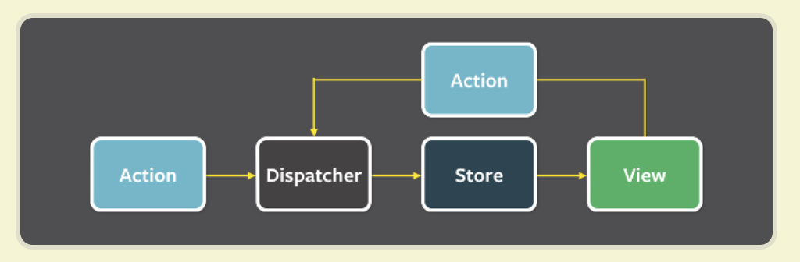
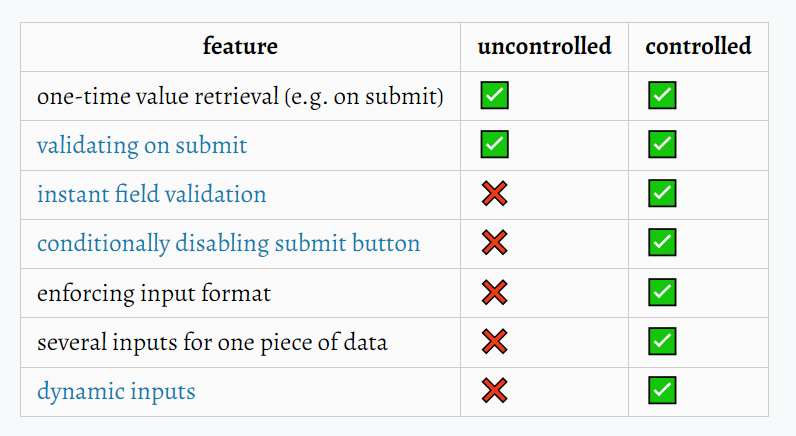

## Part 6

### a Flux架构与Redux

1. Flux-architecture

   Flux 是一种架构思想，专门解决软件的结构问题，就像MVC，[Flux存在多种实现](https://github.com/voronianski/flux-comparison)。

   Flux 的最大特点，就是数据的"单向流动"

   1. 用户访问 View

   2. View 发出用户的 Action

   3. Dispatcher 收到 Action，要求 Store 进行相应的更新

   4. Store 更新后，发出一个"change"事件

   5. View 收到"change"事件后，更新页面

      

   `\components\MyButton.jsx`：纯组件（即不含有任何状态），从而方便了测试和复用

   `\components\MyButtonController.jsx`："controller view"组件只用来保存状态，然后将其转发给子组件MyButton，将MyButton点击事件派发给dispatcher，并且响应store改变事件

   `\actions\ButtonActions.js`：

   `\dispatcher\AppDispatcher.js`：将 Action 派发到 Store，可以看作一个路由器，负责在 View 和 Store 之间，建立 Action 的正确传递路线

   `\stores\ListStore.js`：更新状态，并将变化传递给MyButtonController

2. Redux

   Reducers：`(state, action) => newState`

   Reducers example

   ```js
   const initialState = { value: 0 }
   
   function counterReducer(state = initialState, action) {
     // Check to see if the reducer cares about this action
     if (action.type === 'counter/increment') {
       // If so, make a copy of `state`
       return {
         ...state,
         // and update the copy with the new value
         value: state.value + 1
       }
     }
     // otherwise return the existing state unchanged
     return state
   }
   ```

3. Pure functions, immutable

   Reducers建议使用纯函数

   纯函数的定义是：

   1.   如果函数的调用参数相同，则永远返回相同的结果。它**不依赖于程序执行期间函数外部任何状态或数据的变化**，必须只依赖于其输入参数。

   2.   **该函数不会产生任何可观察的副作用**，例如网络请求，输入和输出设备或数据突变（mutation）。

   测试Reducers的state不会被改变插件：`deep-freeze`

4. Uncontrolled form

   controlled components：推荐使用，表单状态由react管理

   uncontrolled components：表单状态由dom管理

   

   ```jsx
   // controlled 
   <input type="text" value={this.state.value} onChange={this.handleChange} />
   
   // uncontrolled 
   <input defaultValue="Bob" type="text" ref={this.input} />
   ```

5. More components

   使用了redux，组件的状态改变处理由reducer负责，组件本身和状态处理分离

### b 再来点 reducers

1. Combined reducers

   ```js
   const reducer = combineReducers({
     notes: noteReducer,
     filter: filterReducer
   })
   
   const store = createStore(reducer)
   ```

2. Finishing the filters

3. Redux Toolkit

4. Redux DevTools

5. Exercises 6.9.-6.12.

### c 在Redux应用中与后端通信

1. Asynchronous actions and redux thunk
2. Exercises 6.15.-6.18.

### d React Query, useReducer and the context

1. Managing data on the server with the React Query library
2. Synchronizing data to the server using React Query
3. Optimizing the performance
4. useReducer
5. Using context for passing the state to components
6. Defining the counter context in a separate file
7. Which state management solution to choose?
8. Exercises 6.23.-6.24.

### d connect方法(old)

1. Using the connect-function to share the redux store to components
2. mapDispatchToProps
3. Referencing action creators passed as props
4. Alternative way of using mapDispatchToProps
5. Presentational/Container revisited
6. Redux and the component state
7. Exercises 6.19.-6.21.