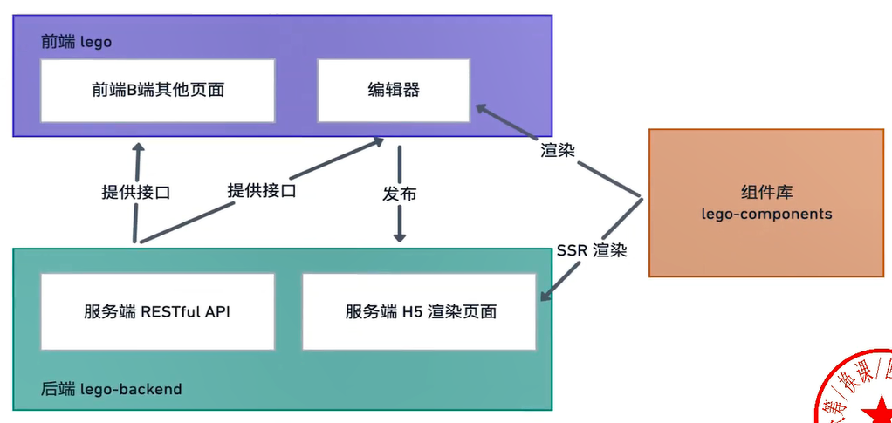
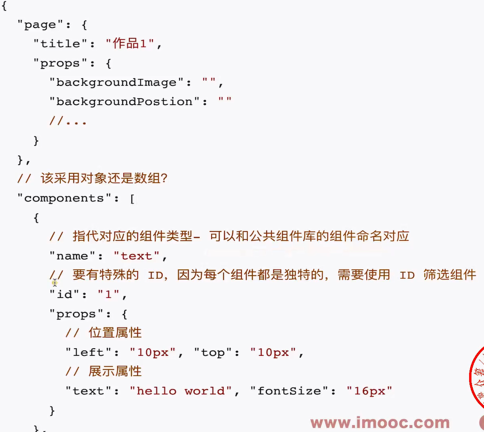

1、需求分析

1.1 项目结构

- 前端 (SPA 项目，使用 Vue 或者 React) --> lego
  - 编辑器(lego-editor)
  - 其他页面(lego-pages)
- 后端 --> lego-backend
  - RESTful API
  - H5 页面 SSR(Server side rendering)
- 组件库 --> lego-components

==其他页面 nest ssr==

1.2 项目难点

海报的组成

- 背景，由图片或者纯色组成
- 元素
  - 由各种不同的元素(组件) 组成
  - 一部分属性界定它的位置 (position)
  - 一部分属性界定它的展示 (looks)

数据结构设计

- 向画布添加组件或者删除组件(向components 数组添加或者删除特定的组件）

- 更新组件的某个属性(找到对应的 component，然后更新它的 props

- 渲染画布或者作品(循环保存的作品信息，使用每个组件特定的属性进行渲染)

扩展性-场景设计，不要关注细节，技术方案设计，为的就是寻找一个方向，论证:可行性、扩展性、复杂度高低

- 海报添加对应的背景音乐
- 新的组件类型-比如说当前日期

1.3 研发流程优化

