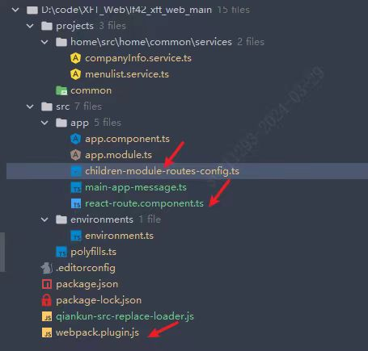

## 1、首页


组件化搭建页面，recoil管理公共数据


弹窗管理


页面结构


JSX使用函数


判断也用函数封装


## 2、设置

首页只有用到和修改数据，不涉及后台接口请求保存每一次修改

设置页面修改数据之后，发送请求，封装方法


整体结构


具体某一项配置——只有开关


具体配置——有参数配置


## 3、申请

### 3.1 代发协议

==todo== 请求协议封装成hook，可以给组件用或者外部调用、useReducer管理数据


### 3.2 网点选择

```js
const test = [                        
{
    FIRBRN: '100593',
    SECBRN: '',
    BRNNAM: '广州分行',
    BRNTYP: 'D',
    BRNNBR: '120',
    YSTNBR: '100593',
},
{
    FIRBRN: '100593',
    SECBRN: '',
    BRNNAM: '湛江分行',
    BRNTYP: 'O',
    BRNNBR: '759',
    YSTNBR: '109853',
},
{
    FIRBRN: '100593',
    SECBRN: '109853',
    BRNNAM: '湛江霞山支行',
    BRNTYP: 'S',
    BRNNBR: '759521',
    YSTNBR: '114619',
},
{
    FIRBRN: '100593',
    SECBRN: '',
    BRNNAM: '广州分行白云支行',
    BRNTYP: 'S',
    BRNNBR: '120504',
    YSTNBR: '100715',
},
{
    FIRBRN: '100314',
    SECBRN: '',
    BRNNAM: '北京分行',
    BRNTYP: 'D',
    BRNNBR: '110',
    YSTNBR: '100314',
},
{
    FIRBRN: '100314',
    SECBRN: '',
    BRNNAM: '北京分行长安街支行',
    BRNTYP: 'S',
    BRNNBR: '110505',
    YSTNBR: '100404',
},
];
```


### 3.3 `useTable`


### 3.4 异步轮询


另一种


使用


### 3.5 导入组件


### 3.6 表单拆分


## 4、付款


实现

短信


扫码


具体实现

支付组件


身份校验组件


短信


扫码


短信+扫码


## 5、微前端





## 6、Node

### 6.1 angular表格转column

输入


输出


实现


### 6.2 后台接口`Api`生产TS


```js
{
    "tags": [
        {
            "name": "OpenApi代发资金交易业务接口",
            "description": "Agent Special Account Pdf Controller"
        },
    ],
    "paths": {
        "/api/agent-specical-account/transaction/generate-pdf": {
            "post": {
                "tags": [
                    "OpenApi代发资金交易业务接口"
                ],
                "summary": "OpenApi生成代发资金交易清单记账凭证",
                "operationId": "generateAgentReceiptPdfUsingPOST",
                "consumes": [
                    "application/json"
                ],
                "produces": [
                    "*/*"
                ],
                "parameters": [
                    {
                        "in": "body",
                        "name": "agentSpecialAccountPdfDTO",
                        "description": "agentSpecialAccountPdfDTO",
                        "required": true,
                        "schema": {
                            "originalRef": "api生成代发资金交易清单记账凭证请求参数",
                            "$ref": "#/definitions/api生成代发资金交易清单记账凭证请求参数"
                        }
                    }
                ],
                "responses": {
                    "200": {
                        "description": "OK",
                        "schema": {
                            "originalRef": "api生成代发资金交易清单记账凭证响应参数",
                            "$ref": "#/definitions/api生成代发资金交易清单记账凭证响应参数"
                        }
                    },
                },
                "deprecated": false
            }
        },
    },
    "definitions": {
        "api生成代发资金交易清单记账凭证响应参数": {
            "type": "object",
            "properties": {
                "redisKeyList": {
                    "type": "array",
                    "description": "REDIS的key",
                    "items": {
                        "type": "string"
                    }
                }
            },
            "title": "api生成代发资金交易清单记账凭证响应参数"
        },
        "api生成代发资金交易清单记账凭证请求参数": {
            "type": "object",
            "properties": {
                "beginDate": {
                    "type": "string",
                    "format": "date",
                    "description": "起始交易日期"
                },
                "endDate": {
                    "type": "string",
                    "format": "date",
                    "description": "截止交易日期"
                },
                "usage": {
                    "type": "string",
                    "description": "用途"
                }
            },
            "title": "api生成代发资金交易清单记账凭证请求参数"
        },
    }
}
```


实现


### 6.3 other

基于 meow 和 cli-meow-help 的脚手架工具，通过命令行快速创建 react 中的 class/函数式组件


使用Webpack分析工具webpack-bundle-analyzer对Chunk文件进一步分析

Ahooks提供了两个性能分析钩子：useTrackedEffect和useWhyDidYouUpdate可以帮助我们定位到状态的变更，从而让我们判断如何去减少组件的更新次数，实际工作中useWhyDidYouUpdate我使用的比较多。

## 7、代发业务


