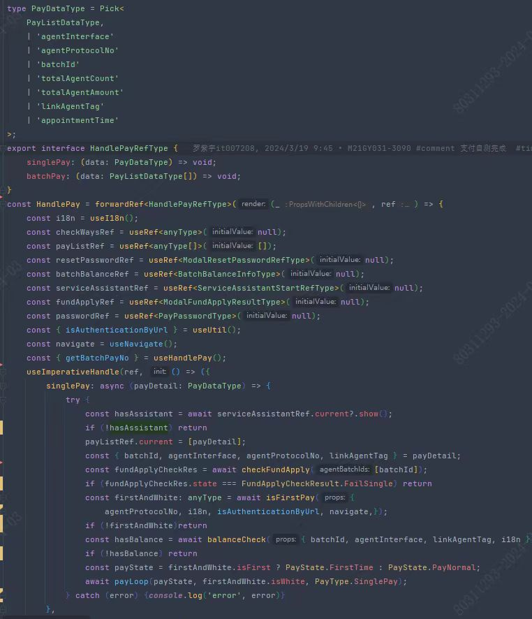
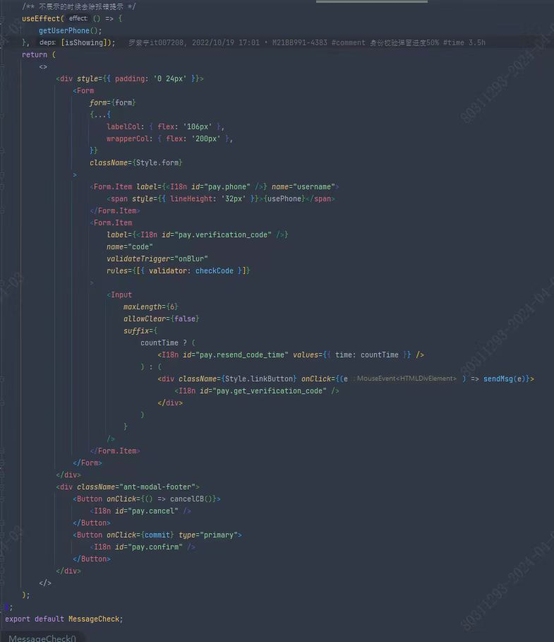

## 1、首页


组件化搭建页面，recoil管理公共数据


弹窗管理


页面结构


JSX使用函数


判断也用函数封装


## 2、设置

首页只有用到和修改数据，不涉及后台接口请求保存每一次修改

设置页面修改数据之后，发送请求，封装方法


整体结构


具体某一项配置——只有开关


具体配置——有参数配置


## 3、申请

### 3.1 代发协议

==todo== 请求协议封装成hook，可以给组件用或者外部调用、useReducer管理数据


### 3.2 网点选择

```js
const test = [                        
{
    FIRBRN: '100593',
    SECBRN: '',
    BRNNAM: '广州分行',
    BRNTYP: 'D',
    BRNNBR: '120',
    YSTNBR: '100593',
},
{
    FIRBRN: '100593',
    SECBRN: '',
    BRNNAM: '湛江分行',
    BRNTYP: 'O',
    BRNNBR: '759',
    YSTNBR: '109853',
},
{
    FIRBRN: '100593',
    SECBRN: '109853',
    BRNNAM: '湛江霞山支行',
    BRNTYP: 'S',
    BRNNBR: '759521',
    YSTNBR: '114619',
},
{
    FIRBRN: '100593',
    SECBRN: '',
    BRNNAM: '广州分行白云支行',
    BRNTYP: 'S',
    BRNNBR: '120504',
    YSTNBR: '100715',
},
{
    FIRBRN: '100314',
    SECBRN: '',
    BRNNAM: '北京分行',
    BRNTYP: 'D',
    BRNNBR: '110',
    YSTNBR: '100314',
},
{
    FIRBRN: '100314',
    SECBRN: '',
    BRNNAM: '北京分行长安街支行',
    BRNTYP: 'S',
    BRNNBR: '110505',
    YSTNBR: '100404',
},
];
```


### 3.3 `useTable`


### 3.4 异步轮询


另一种


使用


### 3.5 导入组件


### 3.6 表单拆分


## 4、付款


实现

短信


扫码


具体实现

支付组件




身份校验组件


短信




扫码


短信+扫码


## 5、微前端


## 6、Node

### 6.1 angular表格转column

输入


输出


实现


### 6.2 后台接口`Api`生产TS


```js
{
    "tags": [
        {
            "name": "OpenApi代发资金交易业务接口",
            "description": "Agent Special Account Pdf Controller"
        },
    ],
    "paths": {
        "/api/agent-specical-account/transaction/generate-pdf": {
            "post": {
                "tags": [
                    "OpenApi代发资金交易业务接口"
                ],
                "summary": "OpenApi生成代发资金交易清单记账凭证",
                "operationId": "generateAgentReceiptPdfUsingPOST",
                "consumes": [
                    "application/json"
                ],
                "produces": [
                    "*/*"
                ],
                "parameters": [
                    {
                        "in": "body",
                        "name": "agentSpecialAccountPdfDTO",
                        "description": "agentSpecialAccountPdfDTO",
                        "required": true,
                        "schema": {
                            "originalRef": "api生成代发资金交易清单记账凭证请求参数",
                            "$ref": "#/definitions/api生成代发资金交易清单记账凭证请求参数"
                        }
                    }
                ],
                "responses": {
                    "200": {
                        "description": "OK",
                        "schema": {
                            "originalRef": "api生成代发资金交易清单记账凭证响应参数",
                            "$ref": "#/definitions/api生成代发资金交易清单记账凭证响应参数"
                        }
                    },
                },
                "deprecated": false
            }
        },
    },
    "definitions": {
        "api生成代发资金交易清单记账凭证响应参数": {
            "type": "object",
            "properties": {
                "redisKeyList": {
                    "type": "array",
                    "description": "REDIS的key",
                    "items": {
                        "type": "string"
                    }
                }
            },
            "title": "api生成代发资金交易清单记账凭证响应参数"
        },
        "api生成代发资金交易清单记账凭证请求参数": {
            "type": "object",
            "properties": {
                "beginDate": {
                    "type": "string",
                    "format": "date",
                    "description": "起始交易日期"
                },
                "endDate": {
                    "type": "string",
                    "format": "date",
                    "description": "截止交易日期"
                },
                "usage": {
                    "type": "string",
                    "description": "用途"
                }
            },
            "title": "api生成代发资金交易清单记账凭证请求参数"
        },
    }
}
```


实现


### 6.3 other

基于 meow 和 cli-meow-help 的脚手架工具，通过命令行快速创建 react 中的 class/函数式组件


使用Webpack分析工具webpack-bundle-analyzer对Chunk文件进一步分析

Ahooks提供了两个性能分析钩子：useTrackedEffect和useWhyDidYouUpdate可以帮助我们定位到状态的变更，从而让我们判断如何去减少组件的更新次数，实际工作中useWhyDidYouUpdate我使用的比较多。

## 7、代发业务


**系统与版本**
 - 薪福通PC客户端 
 - 掌上薪福通APP 
 - 薪福通Web端

**数据**
- 注册企业数90w
- 月活企业数10w
- 代发月活企业数6w
- 工资卡月活企业数1w
 - 
**五步入门薪福通**
1. 实名认证
	- 招商银行手机银行App
	- 人工审核
2. 创建并认证企业
	- 具有营业执照的企业需要提供18位统一社会信用代码、营业执照、法定代表人身份证件
	- 创建企业的账号默认成为该企业的管理员
	- 默认拥有所有的功能权限、数据权限，并可配置普通用户的功能权限、数据权限
	- “我的企业-变更管理员”主动提交变更管理员申请，不用提交任何资料
3. 企业初始化设置
	- 【创建组织架构】
	- 【邀请成员加入企业】手机号/二维码
4. 完成权限配置
	- 功能权限
	- 数据权限
5. 导入员工信息

**薪福通代发是什么**
 - 从员工角度看，代发就是工资、报销、补贴入账了
 - 从企业角度看，代发就是把员工工资、报销、补贴从企业对公户（专户、对公钱包）转到了个人账户/数字人民币钱包

**薪资代发前准备**
柜面侧准备
 - 签订代发协议，**代发协议包括有对公户协议、客户号协议、母子协议等**。
 	- 母子授权：母公司把协议分配给子公司用。每个子公司不用签订代发协议。
 	- 协议授权：子公司把协议授权给母公司，母公司进行代发。
 - 申请资金用户，签订代发协议之后，由企业经办人携带加盖单位公章的《“薪福通薪资代发”服务申请表》以及有效身份证件在柜面申请薪福通薪资代发资金用户，**资金用户是代发过程中走付款流程用户**。
系统侧准备
 - 注册薪福通完成企业认证
 - 通用审批流程设置
 - 薪资代发基础设置
	- 开户白名单校验
	- 自动开户
	- 代发申请Ukey校验
	- 薪资代发明细验重设置
	- 薪资代发审批有效期
	- 薪资代发审批Ukey校验
	- 员工信息校验
	- 薪资代发付款校验方式
	- 付款账号加密（脱敏）显示
	- 通知设置
	- 修改关联模块推送代发明细
	- 网点打印对账单审批
- 其他设置
	- 在「薪资代发-设置-代发资金退款设置」可设置针对唯一资金来源的协议立账内部户资金的退款规则
	- 在「薪资代发-设置-代发限额设置」，开启对代发金额进行的限制
	- 付款安全设置是资金用户才有的功能，可以在此进行关闭权限、修改密码、重置密码
	- 可在「薪资代发-设置-基础设置」中的员工信息校验中设置来自“收款账户管理”的校验。设置后在代发申请时，将比对收款账户管理中记录的数据。
	- 代发用户是在招行柜台开通了付款或领取代发明细对账单权限的用户。若新增企业用户，需前往招行柜台办理。

**代发申请**
用户可在此页面中进行代发申请。在此页面可查询到本人提交的代发申请及待提交、已撤销等状态的代发业务，可对相关业务进行修改、作废、重新申请、经办等操作。可对列表进行导出操作。
系统支持按用户、按账号、按来源、代发明细、用途、按协议六个维度，限制用户查看明细对账单的数据权限，可在「管理后台-通用权限管理-用户授权」中进行设置。
通过薪福通智能费控、智能算薪、电子工资单等关联模块推送的代发数据，需要在「薪资代发-代发申请」中对相关数据进行经办，以发起代发申请业务。

 - 进入新增申请流程
 	- 当企业申请超过一万笔明细的代发时，建议使用大量代发提高代发效率。大量代发现支持最多10万笔明细的代发申请
 	- 多批次代发，即一次同时申请多个批次代发。在进行多批次代发时，所用的代发协议需均由同一公司签署。
 	- 商务卡代发功能提供给使用招行商务卡的企业向商务卡发放报销款，企业无需收集员工个人商务卡号只需使用商务卡账户号即可代发。该功能现需申请白名单使用。
 	- 企业可根据实际情况签订相应协议申请在薪福通进行数字人民币代发。具体详见《薪资代发操作手册-数字人民币版》
 - 填写代发信息
 	- 当对公账户存在终止非柜面、中止所有、开户初期不允许线上办理业务、监管户、久悬户等管控措施，将无法进行代发。对公户签约的代发协议做了协议立账，但对公户本身存在上述情况，也将受到影响
 	- 上传文件智能匹配字段
 - 核对代发明细
 - 提交
 - 查询及后续操作
 	- 代发明细对账单功能可根据协议查询一段时间内的代发明细，并打印/下载带有招行电子印章的明细对账单。
 	- 代发资金查询：通过协议立账的代发专户（下称“代发专户”）进行代发的客户，可在本功能中查询、导出代发专户的可用余额、交易明细、退款记录，亦可再次进行线上退款（仅支持资金来源唯一的账户，若有多个资金来源需要到柜台办理退款）。

一般户可以用薪福通薪资代发吗？
1.招商银行一般户使用薪福通代发其它，只用约定资金用户；
2.**招商银行一般户代发工资/奖金，需要协议立账，约定资金来源必须是基本户**；
3.非招商银行一般户使用薪福通代发，需要协议立账。
注：当协议类型为代发工资/奖金时，资金来源户口仅可为企业基本户

银企互联
- 企业网银
- 云直联是轻量级的银企直联方案，摆脱对物理UKey的依赖。
- CBS为集团企业提供资金管理、财资管理、现金管理系统、提供**跨行账户**管理服务

通用能力
- 人
	- 薪资代发
		- 银行卡管理
		- 薪资代发
		- 智能算薪
		- 个税服务
		- 电子工资单
	- 人事服务
		- 组织管理
		- 员工管理
		- 假勤管理
	- 团体福利
		- 企业红包
		- 企业福利
		- 企业团险
- 财
	- 智能财务
		- 智能记账
		- 会计引擎
		- 资产管理
	- 智能费控
		- 员工报销
		- 对公报账
		- 费用管控
		- 发票管理
- 事
	- 协同办公
		- OA审批
		- 智能报表

1、代发协议
梳理使用场景，建立功能脑图，按照功能拆分组件，不同场景组合不同组件 ==todo==
- 代发协议父组件
- 用途
- 付款账号
- 协议详情
- 账号限额

企业需要代发需要和银行签订代发协议
对于集团代发，有母子协议、协议授权

 - 代发协议是按照公司分层的树结构 
 - 代发协议会带出用途和付款账号选择，如果用途和付款账号只有一项，选择协议时默认选中
 - 代发协议会带出协议详情和账号限额
 - 代发协议刷新
 - 监管户控制

getAgreement
- 局部loading设置为true
- 过期/关闭、未授权协议打标，后台返回对应标志
- 如果协议只有一个用途，则将用途加到协议类型后面，判断后台返回用途数组长度
- 代发申请不显示过期的协议
- 有授权有子协议的需要分组，没有的直接平铺，后台返回对应标志。
```js
const com = [];
agreeList.forEach((item) => {
  const {info} = item;
  let hasCom = com.find((ele) => {info.name === ele.title});
  if (!hasCom) {
    hasCom = {
       title: info.name,
       value: info.name,
       children: [],
       disabled: true,
    }
    com.push(hasCom);
  }
  hasCom.push(item);
})
```
- 第一次初始化时（外部传入），若传入协议号，则在协议列表中找到相应协议号才赋值
- 如果只有一个协议，则自动选择
```js
// 第一次初始化时，若传入协议号，则在协议列表中找到相应协议号才赋值
 if (init && number) {
     if (agreeList.some((item: any) => item.No === number)) {
         form.setFieldsValue({ agree: number});
         agreeChange(number, use, account);
     }
 } else if (agreementList.length === 1) {
     // 如果只有一个协议，则自动选择
     form.setFieldsValue({ agree: agreeList[0].value });
     // 主动触发选择事件
     handleAgreementChange(agreeList[0].value);
 }
```
- 局部loading设置为