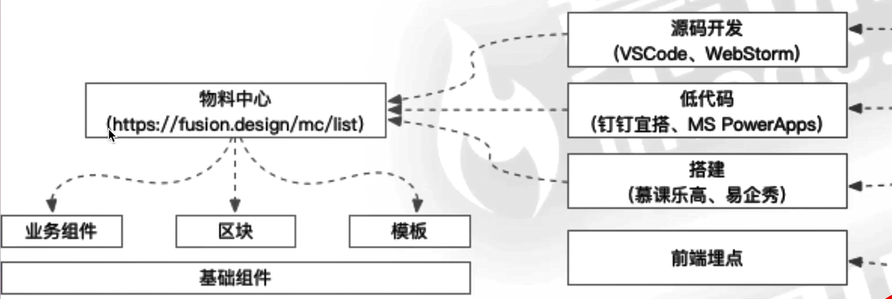
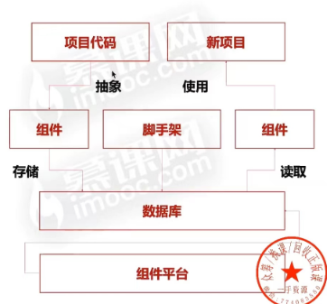

# 1、项目结构

1. **前端** (`SPA` 项目，使用 `Vue` 或者 `React`) --> `lego`

     - 编辑器(`lego-editor`)
     - 其他页面(`lego-pages`)

2. **后端** --> `lego-backend`

     - `RESTful API`
     - `H5` 页面 `SSR`(`Server side rendering`)
3. **组件库** --> `lego-components`

# 2、项目难点

**海报的组成**

- 背景，由图片或者纯色组成
- 元素
  - 由各种不同的元素(组件) 组成
  - 一部分属性界定它的位置 (`position`)
  - 一部分属性界定它的展示 (`looks`)

**数据结构设计**

- 向画布添加组件或者删除组件(向 `components` 数组添加或者删除特定的组件）

- 更新组件的某个属性(找到对应的 `component`，然后更新它的 `props`

- 渲染画布或者作品(循环保存的作品信息，使用每个组件特定的属性进行渲染)

**扩展性**

场景设计，不要关注细节，技术方案设计，为的就是寻找一个方向，论证:可行性、扩展性、复杂度高低

- 海报添加对应的背景音乐
- 新的组件类型-比如说当前日期

# 3、研发流程优化

**开发模式**

**前端监控体系**

前端监控的三个阶段

- 初阶：使用第三方平台，百度、友盟、阿里云 `ARMS` 等
- 中阶：自研前端监控库，缺乏完整的监控体系
- 高阶：自研前端监控平台，具备完整的监控体系

前端监控的数据作用

- 流量数据监控，如：`PV`、`UV`、点击率、页面停留时长等
- 自定义事件监控，如：曝光事件、滑动事件、请求事件等
- 交易指标监控，如：成交额、转化率等
- 其他综合分析，如：用户画像分析、流量漏斗、销量预测等

**项目测试体系**

前端项目测试

- 测试同学：功能测试，性能测试，测试用例
- 前端同学：单元测试，常用于组件库、`API` 等(`Jest`、`Mocha`)

上线项目测试

- 测试同学回归
- 利用前端监控，进行监控项目稳定性和性能，并上报前端日志
  - 稳定性：如 `iserror`、白屏检测等
  - 性能：如秒开率、首屏渲染时长、接口请求时长等
  - 前端日志：如 `console.log`、`API` 请求记录等

**前端发布体系**

利用脚手架统一管理发布阶段

- 利用脚手架做发布的优势
  - 规范：利用统一发布规范，如 `commit` 记录、分支名称、代码规范等
  - 效率：避免大量重复操作，浪费开发时间
  - 安全：构建和发布全部在云端操作，避免个人发布时带来的安全隐患
- 脚手架发布的流程
  - `GitFlow` 自动化代码提交
  - 远程代码自动检查
  - 云端完成构建与发布操作

