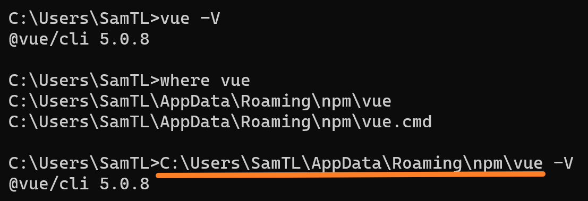
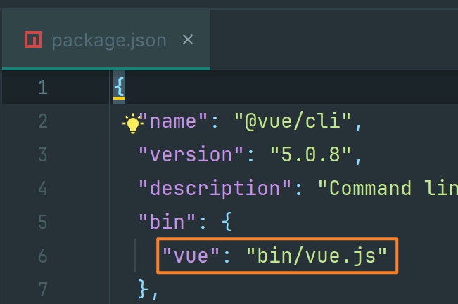
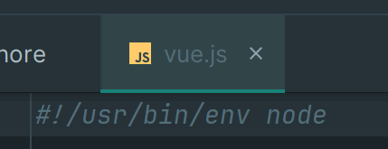
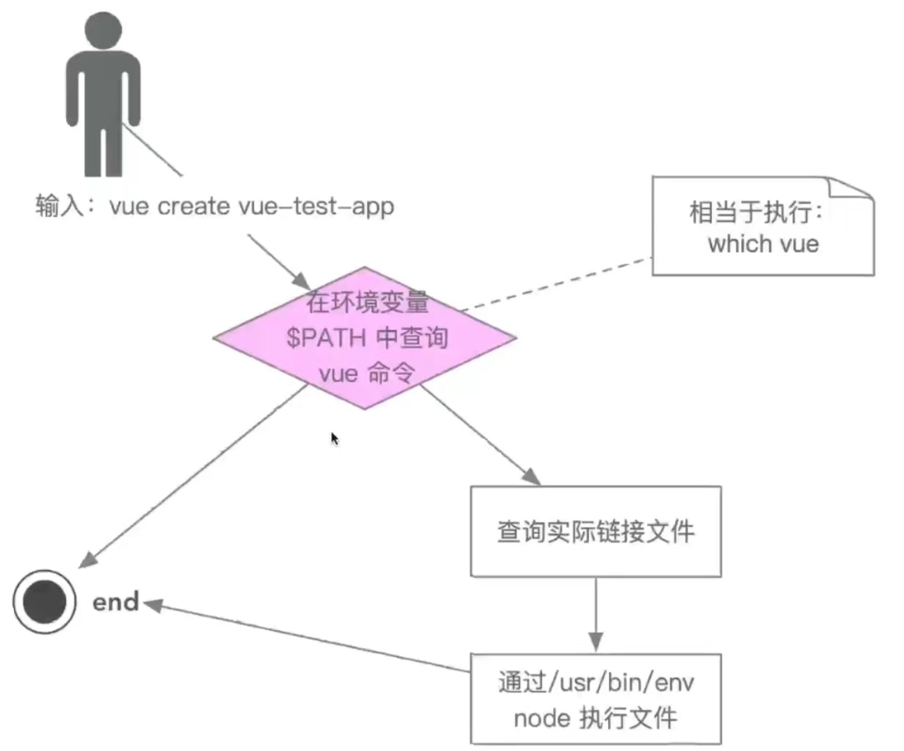
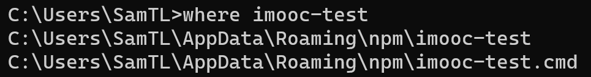
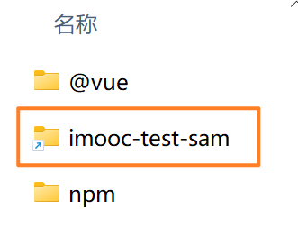
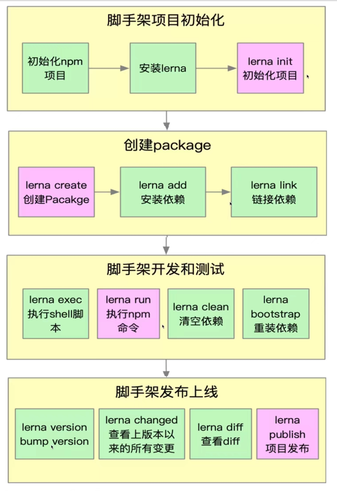
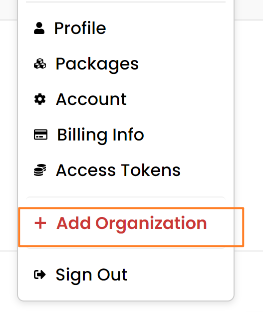

将收获什么
。脚手架的实现原理
。`Lerna` 的常见用法
。架构设计技巧和架构图绘制方法
主要内容
。学习如何以架构师的角度思考基础架构问题
。多 `Package` 项目管理痛点和解决方案，基于`Lerna` 脚手架框架搭建
。`imooc-cli` 脚手架需求分析和架构设计，架构设计图
附赠内容
。脚手架调试技巧
。`Lerna` 源码分析
。`Node` 的 `module` 模块分析
。`yargs` 使用方法
。剖析 `Lerna` 架构设计
关键词
。脚手架：掌握脚手架原理和开发全流程
。`Lerna`：解决多 `Package`项目管理痛点
。架构设计：学习大厂基础架构设计思路
学习方法
。架构三部曲: 掌握原理 -> 独立思考 -> 总结反思
。深度剖析优秀开源项目，由表及里，由浅入深
。视角切换：多切换到架构师视角，从全局思考问题

# 1 脚手架开发入门

## 1.1 脚手架的必要性

脚手架核心价值：提升前端研发效能，将研发过程：

- 自动化：项目重复代码拷贝/ `git` 操作/发布上线操作

- 标准化：项目创建/ `gitflow` /发布流程/回滚流程
- 数据化：研发过程系统化、数据化，使得研发过程可量化

和自动化构建工具区别

问题：`jenkins`、`travis` 等自动化构建工具已经比较成熟了，为什么还需要自研脚手架?

- 不满足需求：`jenkins`、`travis` 通常在 `git hooks` 中触发，需要在服务端执行，无法覆盖研发人员本地的功能如:创建项目自动化、本地git操作自动化等
- 定制复杂：`jenkins`、`travis` 定制过程需要开发插件，其过程较为复杂，需要使用Java语言，对前端同学不够友好


## 1.2 理解脚手架

脚手架本质是一个操作系统的客户端，它通过命令行执行

`vue create vue-test-app`，表示创建一个 `vue` 项目，项目的名称为 `vue-test-app`，命令由 3个部分组成:

- 主命令: `vue`
- `command`: `create`
- `command`的`param`: `vue-test-app`

`vue create vue-test-app --force`，表示当前目录已经有文件了，需要覆盖当前目录下的文件

- `--force` 是 `option`，用来辅助脚手架确认在特定场景下用户的选择(可以理解为配置)

`vue create vue-test-app --force -r https://registry.npm.taobao.org`，表示安装依赖使用淘宝源

-  `-r` 也是  `option`，它与 `--force` 不同的是它使用 `-`，表示使用简写，这里的 `-r` 也可以替换成 `--registry`
-  `https://reqistry.npm.taobao.org` 成为`option` 的`param`
-  `--force` 可以理解为：`--force true`，简写为：`--force` 或 `-f`

**脚手架的执行原理**


**脚手架的执行源理如下:**

- 在终端输入 `vue create vue-test-app`

- 终端解析出 `vue` 命令

- 终端在环境变量中找到 `vue` 命令（`where vue`）

  

- 终端根据 `vue` 命令链接到实际文件 `vue.js`（上图）

- 终端利用 `node` 执行 `vue.js`

- `vue.js` 解析 `command/options`

- `vue.js` 执行 `command`

- 执行完毕，退出执行

**从应用的角度看开发脚手架**

- 开发 `npm` 项目，该项目中应包含一个 `bin/vue.js` 文件，并将这个项目发布到 `npm`
- 将 `npm` 项目安装到 `node` 的 `lib/node modules`
- 在 `node` 的 `bin` 目录下配置 `vue` 软链接指向 `lib/node modules/@vue/cli/bin/vue.js`，在执行 `vue` 命令的时候就可以找到 `vue.js` 进行执行

## 1.3 脚手架的实现原理

**脚手架实现原理**

如果你能回答以下3个问题，就掌握了脚手架的实现原理:

1. 为什么全局安装 `@vue/cli` 后会添加的命令为 `vue`? 

   `bin/vue` 软链接指定了 `vue` 命令

   

   项目中 `bin` 配置了 软连接名称以及实际运行文件的位置

   

2. 全局安装 `@vue/cli` 时发生了什么?

   安装包到 `node/lib/node modules`

   在`node/bin` 中按照 `package.json` 文件中 `bin` 配置软链接

3. 执行 `vue` 命令时发生了什么?为什么 `vue` 指向一个 `js` 文件，我们却可以直接通过 `vue` 命令去执行它?

   在环境变量中找 `node` 命令，找到后使用  `node`  执行文件

   

   

4. 为什么说脚手架本质是操作系统的客户端?它和我们在PC上安装的应用/软件有什么区别?

   `node` 是客户端，编写的代码在 `node`  环境中执行

5. 如何为 `node` 脚手架命令创建别名?

   在 `node/bin`  目录下创建软链接

6. 脚手架命令执行的全过程

   

## 1.4 脚手架的开发流程

**开发流程**

- 创建 `npm` 项目
- 创建脚手架入口文件，最上方添加: `#!/usr/bin/env node`
- 配置 `package.json`，添加 `bin` 属性
- 编写脚手架代码
- 将脚手架发布到 `npm`

**使用流程**

- 安装脚手架 `npm install -g your-own-cli`
- 使用脚手架 `your-own-cli`

**脚手架开发难点解析**

- 分包：将复杂的系统拆分成若干个模块

- 命令注册：`vue create`  `vue add`  `vue invoke`

- 参数解析：`vue command [options]<params>`

  - `options `全称：`--version`、`--help`
  - `options` 简写：`-v`、`-h`
  - 带 `params` 的 `options`：`--path /Users/sam/Desktop/vue-test`

- 帮助文档：

  - `global help`：`Usage`、`Options`、`Commands`
  - `commands  help`：`Usage`、`Options`


- 命令行交互
- 日志打印
- 命令行文字变色
- 网络通信：`HTTP/WebSocket`
- 文件处理

## 1.5 第一个脚手架

`npm init -y` 初始化项目后，创建下面目录结构


```js
// bin/index.js
#!/usr/bin/env node
console.log('welcome imooc-test');

// package.json 添加命令
{
  "bin": {
    "imooc-test": "bin/index.js"
  }
}
```

`npm publish` 发布包

## 1.6 调试脚手架

在项目路径下输入`npm link` ，在 `node/bin` 创建命令，将项目创建快捷方式放到`node/lib/node modules`目录下，命令行执行`imooc-test`，最终执行到项目






**本地项目之间调试**

1. 创建一个新项目如下

   

2. `imooc-test-lib` 文件内容

   ```js
   // index.js
   module.exports = {
     sam(a, b) {
       return a + b;
     }
   }
   
   // package.json 配置入口文件
   "main": "lib/index.js",
   ```

3. `imooc-test`  使用  `imooc-test-lib` ，本地调试

   - 此时在 `imooc-test` 目录下 `npm link imooc-test-lib-sam` 会报错因为 `imooc-test-lib` 没有发布到 `npm`
   - `imooc-test-lib`  目录下 `npm link` 
   - `imooc-test` 目录下 `npm link imooc-test-lib-sam` 

4. `imooc-test`  的 `package.json` 手动添加  `imooc-test-lib` 防止项目上线依赖报错

**脚手架本地 `link` 标准流程**

```shell
# 链接本地脚手架:
cd your-cli-dir
npm link

# 链接本地库文件:
cd your-lib-dir
npm link
cd your-cli-dir
npm link your-lib

# 取消链接本地库文件
cd your-lib-dir
npm unlink
cd your-cli-dir
npm unlink your-lib
rm -rf node modules
npm install -S your-lib
```

理解 `npm link`

- `npm link your-lib`：将当前项目中 `node_modules` 下指定的库文件链接到 `node` 全局 `node modules` 下的库文件
- `npm link`：将当前项目链接到 `node` 全局 `node modules` 中作为一个库文件并解析 `bin` 配置创建可执行文件（全局 `node modules` 已经下载会被覆盖）

理解 `npm unlink`

- `npm unlink`：将当前项目从 `node` 全局 `node modules` 中移除
- `npm unlink your-lib`：将当前项目中的库文件依赖移除

## 1.7 命令注册和参数解析

```js
const argv = require('process').argv;
// console.log(argv);
/*$ imooc-test init --name vue-test
[
  'C:\\Program Files\\nodejs\\node.exe',
  'D:\\Web\\nodejs\\node_global\\node_modules\\imooc-test-sam\\bin\\index.js',
  'init',
  '--name',
  'vue-test'
]*/

// 获取命令行参数
const command = argv[2]; // init or --version
const options = argv.slice(3);

// 解析 imooc-test init --name vue-test
if (options.length > 1) {
  const [option, param] = options; // 数组的解构赋值
  if (command) {
    if (lib[command]) {
      lib[command]({option, param});
    } else {
      console.log('无效的命令');
    }
  } else {
    console.log('请输入命令');
  }
}

// 解析全局命令 imooc-test --version
if (command.startsWith('-')) {
  const globalOption = command.replace(/-|--/g, '');
  if (globalOption === 'version' || globalOption === 'V') {
    console.log('1.0.0');
  }
}
```

## 1.8 发布脚手架

先发布 `imooc-test-lib` 

- `npm unlink` 取消本地 `node` 目录下的链接
- `npm publish`

脚手架 `imooc-test`

- `npm unlink imooc-test-lib`  取消对库文件的依赖
- `npm unlink` 取消本地 `node` 目录下的链接
- `npm publish`
- `npm i -g imooc-test`


# 2 脚手架框架搭建

## 2.1 `Lerna` 简介

原生脚手架开发痛点分析，`package` 越多，管理复杂度越高

- 痛点一:重复操作
  - 多 `package` 本地 `link`

  - 多 `package` 依赖安装

  - 多 `package` 单元测试

  - 多 `package` 代码提交

  - 多 `package` 代码发布

- 痛点二:版本一致性

  - 发布时版本一致性

  - 发布后相互依赖版本升级

**`Lerna` 简介**

`Lerna` 是一个优化基于 `git+npm` 的多 `package` 项目的管理工具

> `Lerna is a tool that optimizes the workflow around managing multi-package repositories with git andnpm.`

优势

- 大幅减少重复操作
- 提升操作的标准化

> `Lerna` 是架构优化的产物，它揭示了一个架构真理：项目复杂度提升后，就需要对项目进行架构优化。架构优化的主要目标往往都是以效能为核心。

`lerna` 开发脚手架流程(划重点)



## 2.2 创建 `lerna` 项目

**A 脚手架项目初始化**

```shell
npm init -y
npm i -D lerna
lerna init --packages="packages/*"
lerna create core
lerna create utils
```


目录结构如下


注册 `group`，因为 `core/utils` 名称很常见



```shell
# 在所有package中安装依赖
lerna add 包名 
# 在指定package中安装依赖
lerna add 包名 packages/core/
lerna clean 清除package里面安装的依赖，然后删除dependencies
```

## 2.3 `Lerna` 源码分析

**A 入口**

`core/lerna/cli.js`

**B 配置**

Node内置库支持跳转


关闭默认不进入库文件


**C 调试**


绿色箭头：到达下一个断点的位置

橙框：步过，一步步执行

黄框：步入，进入别的模块

篮框：步出，跳出别的模块

紫框：高级选项，还有表达式求值


D `Lerna`初始化过程分析

看源码先缩进看主流程

```js
// core/lerna/cli.js
// require(".") ==> require("./index.js")
// process.argv.slice(2) 截取命令行参数
require(".")(process.argv.slice(2))

// core/lerna/index.js
// 折叠所有代码 ctrl + shift + '+'，发现导出main函数
module.exports = main;
```

具体执行流程

> main
>
> -- `cli`
>
> ---- `yargs`
>
> ---- `globalOptions`

导入本地包

```
"dependencies": {
    "@lerna/global-options": "file:../global-options",
}
```

正式发布包的时候调用publish下面的方法，处理 `file`，把本地包处理成线上文件，这样就不用使用 `npm link` 调试本地包


# 3 脚手架架构设计

