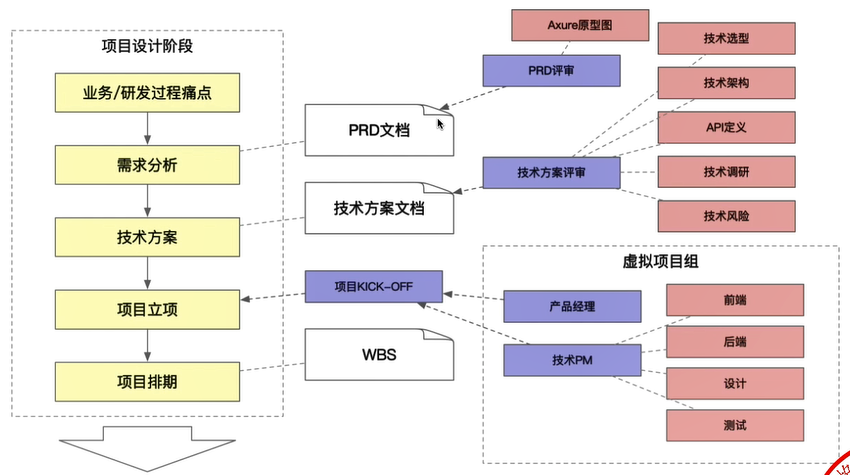
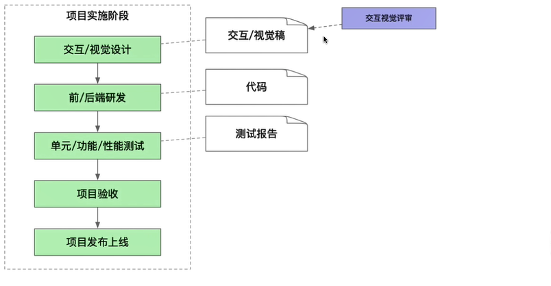
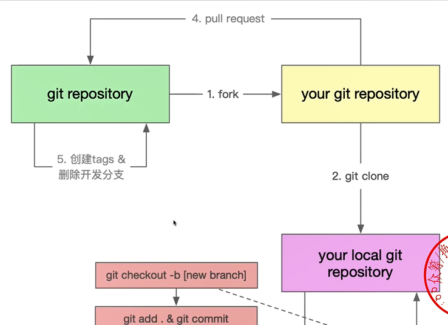
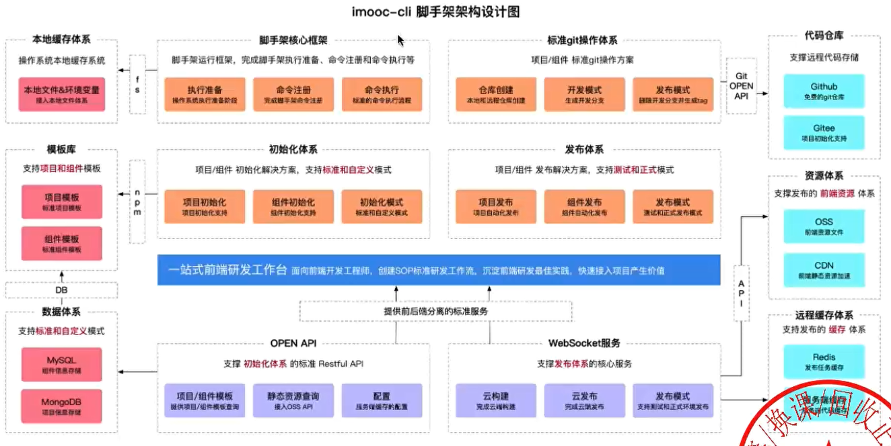
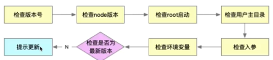
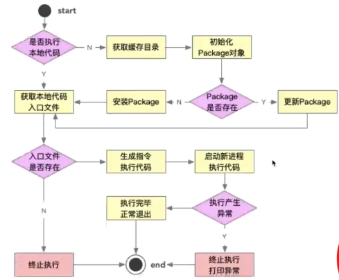

# 1、脚手架需求分析和架构设计

## 1.1 项目流程

## 1.2 需求分析

**痛点分析**

- 创建项目/组件时，存在大量重复代码拷贝 --> 快速复用已有沉淀
- 协同开发时，由于 `git` 操作不规范，导致分支混乱，操作耗时 --> 制定标准的 `git` 操作规范并集成到脚手架
- 发布上线耗时，而且容易出现各种错误 --> 制定标准的上线流程和规范并集成到脚手架

**需求分析**

- 通用的研发脚手架
- 通用的项目/组件创建能力
  - 模板支持定制，定制后能够快速生效
  - 模板支持快速接入，极低的接入成本
- 通用的项目/组件发布能力
  - 发面过程自动完成标准的git操作
  - 发布成功后自动删除开发分支并创建 `tag`
  - 发布后自动完成云构建、`CDN`、域名绑定。
  - 发布过程支持测试/正式两种模式

## 1.3 架构设计

# 2、模块拆分和core技术

## 2.1 拆包策略

**核心流程**：`core`
**命令**：`commands`

- 初始化
- 发布
- 清除缓存

**模型层**：`models`

- `Command` 命令
- `Project` 项目
- `Component` 组件
- `Npm` 模块
- `Git` 仓库

**支撑模块**：`utils`

- `Git` 操作
- 云构建
- 工具方法
- `API` 请求
- `Git API`

## 2.2 core模块

**(1) 命令执行流程**

- 准备阶段

- 命令注册

  

- 命令执行

  

**(2) 涉及技术点**

- 核心库

  - `import-local`

  - `commander`

- 工具库

  - `npmlog`

  - `fs-extra`

  - `semver`

  - `colors`

  - `user-home`

  - `dotenv`

  - `root-check`

# 3、脚手架执行准备过程实现

# 4、脚手架命令注册实现

# 5、Node项目如何支持ES Module