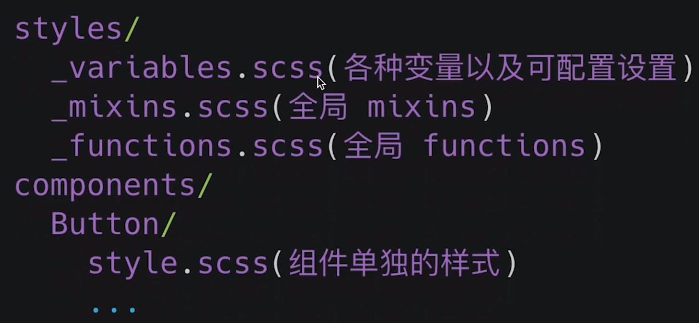

# 1、`Typescript`

`npx` 想要解决的主要问题，就是调用项目内部安装的模块。

比如，项目内部安装了测试工具 [Mocha](https://www.ruanyifeng.com/blog/2015/12/a-mocha-tutorial-of-examples.html)。

```bash
$ npm install -D mocha
```

一般来说，调用 `Mocha`，只能在项目脚本和 `package.json` 的 [`scripts`](https://www.ruanyifeng.com/blog/2016/10/npm_scripts.html) 字段里面， 如果想在命令行下调用，必须像下面这样。

```bash
# 项目的根目录下执行
$ node-modules/.bin/mocha --version
```

`npx` 就是想解决这个问题，让项目内部安装的模块用起来更方便，只要像下面这样调用就行了。

```bash
$ npx mocha --version
```

`npx` 的原理很简单，就是运行的时候，会到 `node_modules/.bin` 路径和环境变量 `$PATH` 里面，检查命令是否存在。由于 `npx` 会检查环境变量 `$PATH`，所以系统命令也可以调用。

**参考**：[`npx` 使用教程](https://www.ruanyifeng.com/blog/2019/02/npx.html)

# 2、`React`

`FunctionComponent`

```ts
const Hello: React.FunctionComponent<IHelloProps> = (props) => {
    // props.children
    // Hello.defaultProps
    // React.FunctionComponent 简写 React.FC
}
```

# 3、`Button`

**组件库组成**

- 代码结构
- 样式解决方案
- 组件需求分析和编码
- 组件测试用例分析和编码
- 代码打包输出和发布
- CI/CD，文档生成

## 3.1 初始化项目

```shell
# --template typescript 增加ts依赖
npx create-react-app my-app --template typescript
```

**项目结构**


## 3.2 样式

**解决方案**

- Inline CSS
- CSS in JS
- Styled Component
- Sass / Less

```tsx
// Inline CSS
<h1 style="color:red;font-size:46px;"  onclick="alert('Hi')">
  Hello World
</h1>

// CSS in JS
const style = {
  'color': 'red',
  'fontSize': '46px'
};
const clickHandler = () => alert('hi'); 
ReactDOM.render(
  <h1 style={style} onclick={clickHandler}>
     Hello, world!
  </h1>,
  document.getElementById('example')
);

// Styled Component
import styled from "styled-components";
const StyledButton = styled.button`
  min-width: 200px;
  border: none;
  font-size: 18px;
  padding: 7px 10px;
  /* The resulting background color will be based on the bg props. */
  background-color: ${props => props.bg === "black" ? "black" : "blue";
`;
function Profile() {
  return (
    <div>
      <StyledButton bg="black">Button A</StyledButton>
      <StyledButton bg="blue">Button B</StyledButton>
    </div>
  )
}

// $ npm install sass
// 将src/App.css重命名为src/App.scss并更新src/App.js以导入src/App.scss 。如果使用扩展名.scss或.sass导入，此文件和任何其他文件将被自动编译。
```

**样式系统文件结构**



**变量分类**

- 基础色彩系统

  - 系统色板：基础色板 + 中性色板（在基础色板上面明暗度变化）

  - 产品色板：品牌色 + 功能色板

- 字体系统：字体样式、字体大小、字重、行高、标题大小、链接、body

  

- 表单

- 按钮

- 边框和阴影

- 可配置开关

> 越多变量定义代表后面越高可配置化

**重置样式**

`_reboot.scss`

参考 [normalize.css](https://github.com/necolas/normalize.css)

作用

- 保护有用浏览器样式
- 标准化各种元素的样式
- 保持浏览器一致性

**导入样式**

`index.scss`

- css @import happens at runtime, Sass @import at build time

- Unlike plain CSS imports, which require the browser to make **multiple HTTP** requests as it renders your page, Sass imports are handled entirely **during compilation**.

**引用样式**

```shell
# /src/index.tsx
- import './index.css';
+ import './style/index.scss';

# /src/App.tsx
import React from 'react';
function App() {
  return (
    <div>
      test
    </div>
  );
}
export default App;

# 删除App.css、index.css、logo.svg
```

**Sass简单语法**

- 变量：以 `$` 开头的名称。Sass 变量全部由 Sass 编译掉，CSS变量包含在CSS输出中。可以使用 JS 访问和更改 CSS 自定义属性。Sass 变量是*命令式的*，这意味着如果你使用一个变量然后更改它的值，之前的使用将保持不变。 CSS变量是*声明性的*，这意味着如果您更改值，它将影响早期使用和以后使用。

==todo==

```css
$variable: value 1;
.rule-1 {
  value: $variable;
}

$variable: value 2;
.rule-2 {
  value: $variable;
}

.rule-1 {
  value: value 1;
}

.rule-2 {
  value: value 2;
}
```

- 使用 `!default` 定义的变量可以在使用 [`@use`规则](https://sass-lang.com/documentation/at-rules/use) 加载模块时进行配置。

```css
$base-color: #c6538c;
$border-dark: rgba($base-color, 0.88);
.alert {
  border: 1px solid $border-dark;
}

# _library.scss
$black: #000 !default;
$border-radius: 0.25rem !default;
$box-shadow: 0 0.5rem 1rem rgba($black, 0.15) !default;
code {
  border-radius: $border-radius;
  box-shadow: $box-shadow;
}
# style.scss
@use 'library' with (
  $black: #222,
  $border-radius: 0.1rem
);
# style.css
code {
  border-radius: 0.1rem;
  box-shadow: 0 0.5rem 1rem rgba(34, 34, 34, 0.15);
}
```

- 样式名称最前面有下划线，该文件只能导入，不能直接使用，导入时不需要下划线。不能被编译成 `css` 文件。These are called *partials*, and they tell Sass tools **not to try to compile** those files on their own. You can leave off the `_` when importing a partial.
- Sass 团队不鼓励继续使用`@import`规则，推荐 [`@use`规则](https://sass-lang.com/documentation/at-rules/use)。 
- `@extend` 一个类应该具有另一个类的所有样式，以及它自己的特定样式。
- `&` 父选择器

**`CSS` 相对单位**

- `Em`：却决于父元素字体宽度，不推荐作为响应式布局单位，计算复杂
- `Rem`：`html` 元素 `font-size` 为 `1rem`
- `hVH`：`viewport` 的宽度，**10vh** 相当于占据整个可见屏幕高度的 10%
- `VW`：`viewport` 的搞得，**10vw **相当于占据整个可见屏幕宽度的 10%

```css
# 使用rem实现响应式布局
# large screen 
@media (max-width: 1400px) {
  html {
    font-size: 25px;
  }
}

# Tablet screen 
@media (max-width: 768px) {
  html {
    font-size: 18px;
  }
}

# Mobile screen 
@media (max-width: 450px) {
  html {
    font-size: 12px;
  }
}
```

参考：[What is the difference between CSS variables and preprocessor variables?](https://css-tricks.com/difference-between-types-of-css-variables/)

[Learn CSS Units – Em, Rem, VH, and VW with Code Examples](https://www.freecodecamp.org/news/learn-css-units-em-rem-vh-vw-with-code-examples/#heading-what-are-rem-units)

## 3.3 Button

**需求分析**

- `Type`：primary、default、danger、link
- `Size`：normal、small、large
- `Disable`


**组件编码**

```tsx
// classnames：方便拼接className字符串，接受字符串或者对象，对象值为返回布尔值的表达式
// npm install classnames--save

import React from "react";
import classNames from "classnames";

export enum ButtonSize {
    Large = 'lg',
    Small = 'sm'
}

export enum ButtonType {
    Primary = 'primary',
    Default = 'default',
    Danger = 'danger',
    Link = 'link',
}

interface BaseButtonProps {
    className?: string;
    disabled?: boolean;
    size?: ButtonSize;
    btnType?: ButtonType;
    children: React.ReactNode;
    href?: string;
}

const Button: React.FC<BaseButtonProps> = (props) => {
    const {
        className,
        disabled = false,
        size = ButtonSize.Small,
        btnType = ButtonType.Default,
        children,
        href,
    } = props;
    // btn btn-lg btn-primary
    const classes = classNames('btn', {
        [`btn-${btnType}`]: btnType,
        [`btn-${size}`]: size,
        'disabled': (btnType === ButtonType.Link) && disabled // button本身就有disable属性不用样式禁用
    });
    if (btnType === ButtonType.Link && href) {
        return (
            <a
                className={classes}
                href={href}
            >
                {children}
            </a>
        )
    } else {
        return (
            <button
                className={classes}
                disabled={disabled}
            >
                {children}
            </button>
        )
    }
}

export default Button;
```

# 4、组件测试

React组件适合单元测试

- Component 组件：互不影响
- Function 函数：纯函数方便写测试
- 单向数据流：只要测试是否触发相应回调


# 5、`Menu`

# 6、`Icon` 和 `Transtion`

# 7、`Stroybook`

# 8、`Input` 和 `AutoComplete`

# 9、`Upload`

# 10、`From`

# 11、模块打包

# 12、`CICD`

# 13、`Rollup`


