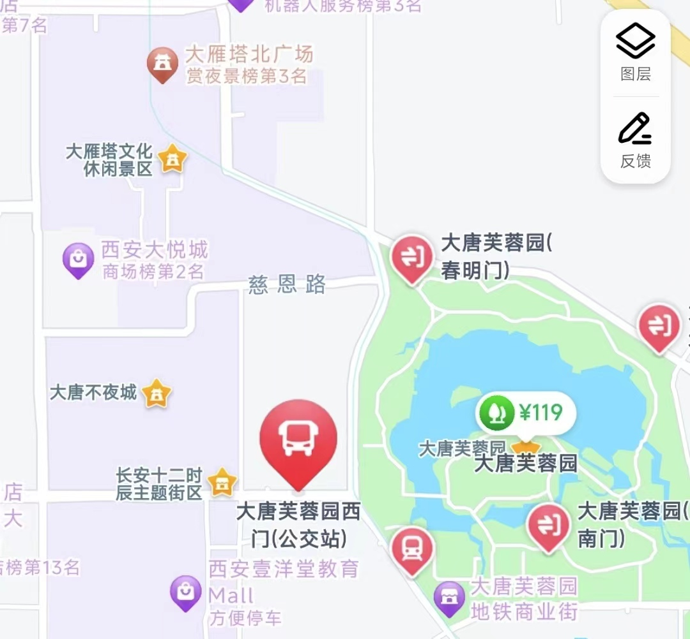
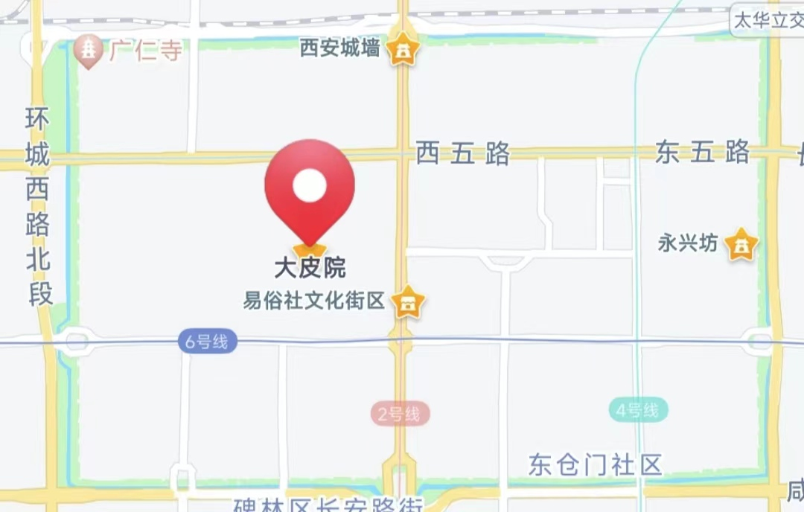
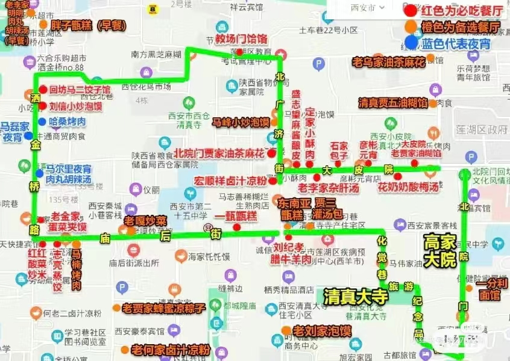
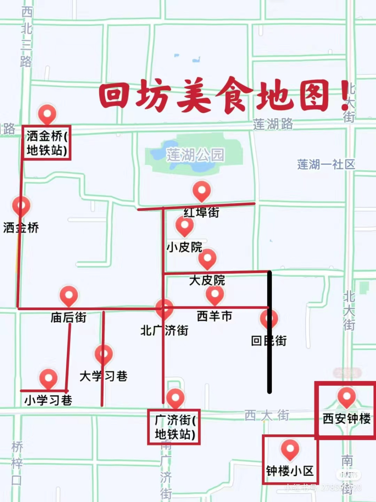
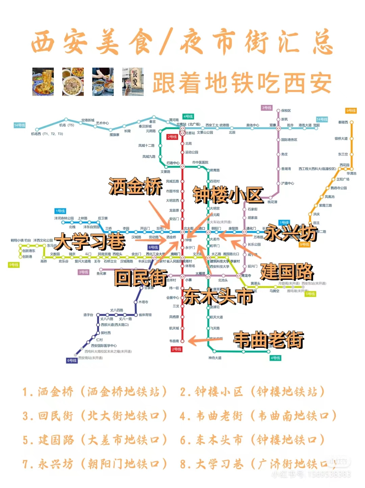
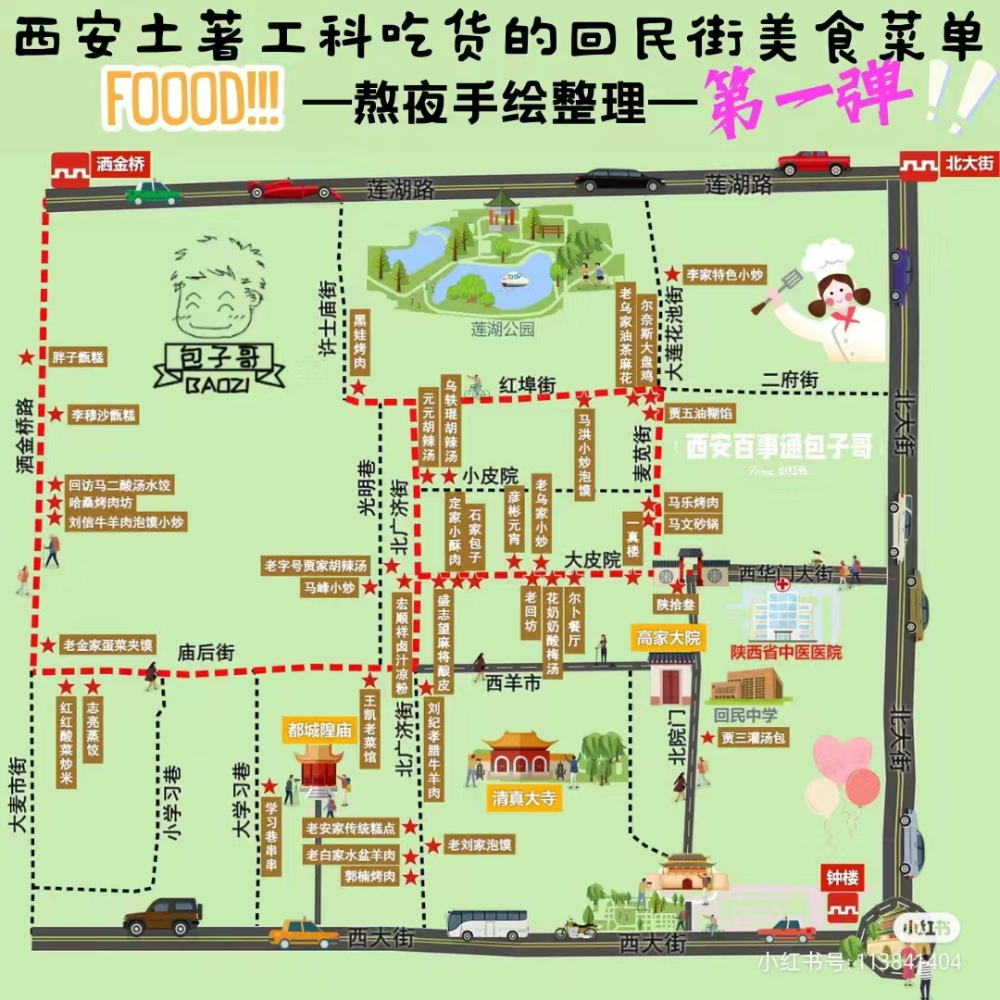

## 6.9 周日

16:50 到达机场

17:00--19:30 机场到市区，入住酒店，==住宿推荐：洒金桥地铁口附近==

- 机场大巴 25  1h20min
- 地铁 8 1h10min
- 出租车 85--100 45min

19：30--21:00 洒金桥逛吃 / 烧烤 /陕菜

## 6.10 周一

### PLAN A

**早餐：**小南门早市

**上午：**西安博物馆+ 小雁塔--绣球花（周二闭馆）（==门票  免费==）

**午餐：**美食街逛吃

**下午：**大唐芙蓉园（==门票 120==） --> 汉服妆造

**晚餐：**陕菜馆

**晚上：**大唐不夜城 -->大雁塔--音乐喷泉（==门票 30==）

### PLAN B

**早午餐：**美食街逛吃

**下午：**西安博物馆+ 小雁塔--绣球花 --> 汉服妆造

**晚餐：**陕菜馆

**晚上：**大唐不夜城 -->大雁塔--音乐喷泉

## 6.11 周二

**早午餐：**永兴坊逛吃，

**下午：**骊山园-->摆渡车-->兵马俑博物馆（==门票 120==）

**晚餐：**陕菜馆

**晚上：**长恨歌（==门票 238==）

## 6.12 周三

**早餐：**早市

**上午：**陕西历史博物馆（周一闭馆）（==门票 免费==）

**午餐：**陕菜馆

**下午：**城墙（==门票 54==）+大皮院+易俗文化街区

**晚餐：**烧烤

**晚上：**去华山

## 6.13 周四

华山（==门票和缆车：440==）

晚上：回西安

## 美食

### 美食街

东举院巷 大麦市街 顺城巷车家巷 西羊市 五星街 小南门 东木头市 建国路 秋林食府

### 必吃

油茶麻花
腊牛肉夹馍
小炒泡馍
牛肉饼
胡辣汤
豆花泡馍
混拼麦饭

## 参考

### 参考1

https://www.bilibili.com/video/BV1Aw411M743/?spm_id_from=333.337.search-card.all.click&vd_source=b5b283bd017e45e7dba6778a3208e4d7

### 参考2

https://mp.weixin.qq.com/s/uc5JzbrX3jjORg3PPc6ccQ

### 参考3

https://bbs.qyer.com/thread-3355798-1.html

**陕西历史博物馆**的展览主题是，陕西古代文明史，从蓝田人讲到清。**西安博物院**的布展主题，则是西安的建都史。两家博物馆互为补充，强烈建议都看。

今天的**西市**，则在唐长安城西市的遗址上，建成了一个以文化为主线，以丝路风情和旅游会展为特色的文化产业项目。旅游、酒店、古玩、商业……

**陕历博是“线”，西安市博是“面”，大唐西市是“点”。**

忘掉回民街之**永兴坊、大皮院**
